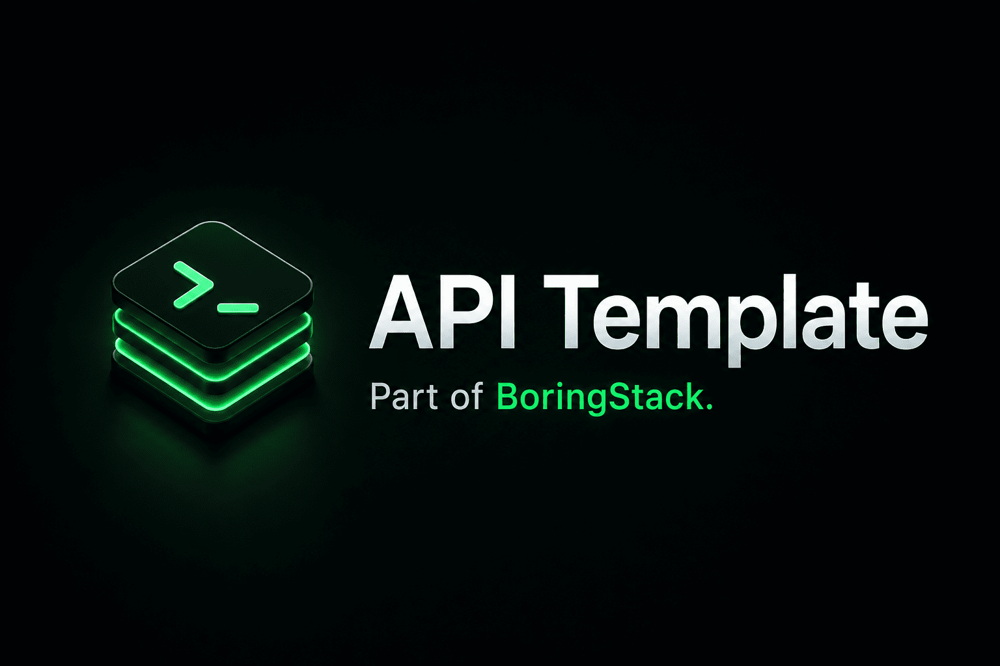

  

  
  
  

  
  
  
  
  

# apps/api

Part of [BoringStack](https://boringstack.xyz).

For documentation on how to run, configure, and extend the API app, see the [API docs](https://boringstack.xyz/api/overview/).

## License

MIT
