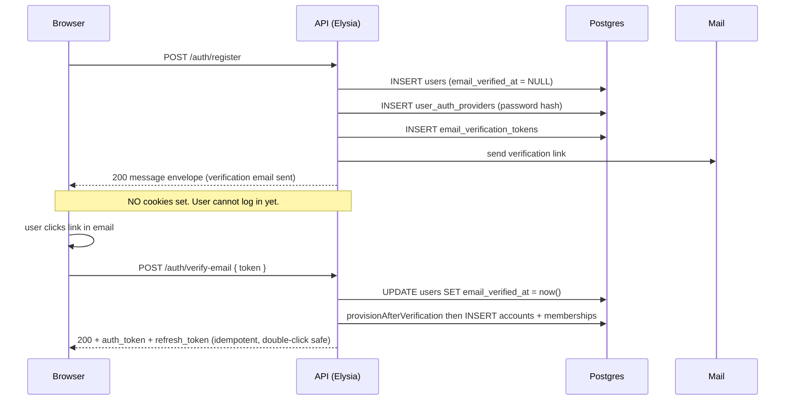
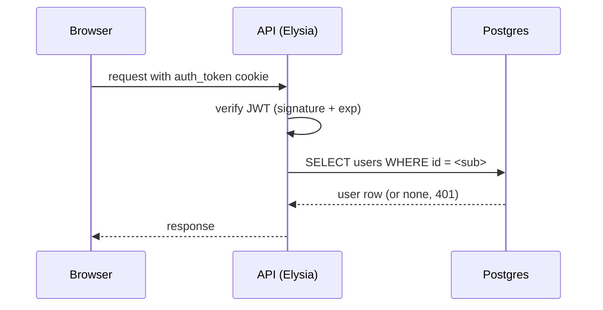
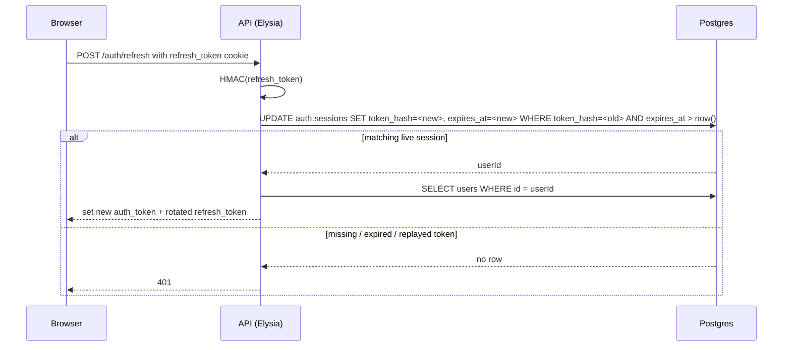
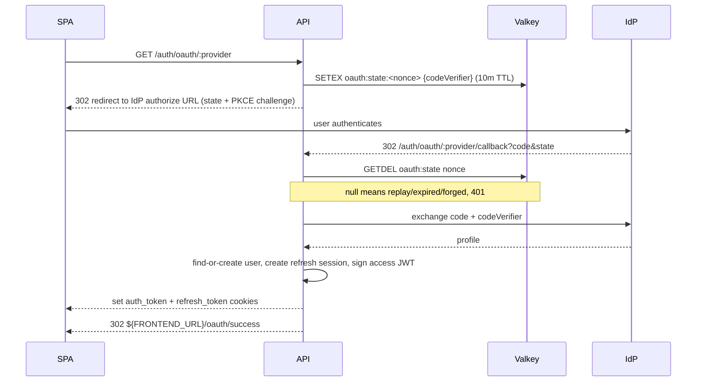

import { Aside } from "@astrojs/starlight/components";

Authentication follows one browser contract: HttpOnly cookies, server-side OAuth, verify-before-account signup, and DB-backed refresh sessions that can be rotated or revoked without exposing tokens to the UI.

Two login flows share this contract: password (register, verify-email, login, forgot-password, reset-password) and OAuth (Google, GitHub, LinkedIn). Both converge at one place: `accountsService.provisionAfterVerification`, which creates the personal account and owner membership. Without verification, there is no account.

Once verified, the session uses two tokens. An `auth_token` is a 15-minute stateless JWT in an HttpOnly cookie (frontend never reads it). A `refresh_token` is a 30-day opaque HttpOnly cookie; the API stores only its HMAC hash in `auth.sessions`, rotates it on every refresh, and can revoke it on logout or password reset. The model is hybrid: fast stateless access checks, stateful refresh sessions for revocation.

## Verify-before-account

Password signup splits across two endpoints. `POST /auth/register` writes only the pending user row, the argon2id hash, and a single-use verification token. No `app.accounts` row, no membership, no session cookies. The response is a `{ message }` envelope so the SPA can render "check your inbox at user@example.com." `POST /auth/verify-email` flips `users.email_verified_at`, atomically calls `provisionAfterVerification`, and _then_ issues the auth + refresh cookies. That's where the user gets their account.



The OAuth flow lands at the same `provisionAfterVerification` call. Branches that converge there:

- Brand-new OAuth signup with a provider-verified email: user created, provisioned, session issued.
- Existing pending password-signup signing in with OAuth: user gets promoted to verified, the OAuth link is added, the account is provisioned. (This branch quietly fixed a pre-VBA bug where pending users could get OAuth-linked but never end up with an account.)
- Existing already-verified user adding another OAuth provider: link added; `provisionAfterVerification` is idempotent (returns the existing account and membership).

OAuth refuses to issue a session when the IdP says `emailVerified: false`. The transaction rolls back with no user row, no provider link, and no half-state. The caller has to verify through the password flow first.

`POST /auth/login` with a still-pending user (correct password, `email_verified_at` is null) returns **403 `EMAIL_NOT_VERIFIED`**. The check fires after the password verify so an attacker who doesn't already know the password can't enumerate which addresses are pending versus unknown. The UI surfaces a resend-verification CTA pinned to the email the user typed.

A daily `cleanStalePendingUsersJob` hard-deletes pending users older than 30 days (configurable). FK cascades drop the auth provider + verification token; `audit.audit_log` survives so the registration attempt remains traceable.

## How a request gets authenticated



`createAuthMiddleware` mounts this on protected route groups. Every handler in that group gets a typed `user` on its context. Token errors are categorized so the SPA can react cleanly (expired != malformed != missing).

## How refresh works



Refresh-token rotation means a replayed old refresh token no longer matches a row. Logout deletes the current refresh session. Password reset deletes all refresh sessions for that user.

## Key decisions

JWT lives in HttpOnly cookies, not localStorage, so XSS cannot read the access token. SameSite is strict in prod, lax in dev, for CSRF protection without breaking same-origin dev. The access JWT is short-lived (15 minutes), keeping normal API requests cheap. Refresh is stateful, living in `auth.sessions` keyed by a hash of an opaque token; the API can revoke one session or all sessions for a user.

One user can hold a password and N OAuth links (two tables: `users` and `user_auth_providers`), no nullable password column. OAuth state lives in Valkey, not a cookie, since state must survive the cross-origin redirect. State is read-and-deleted, so replay attacks fail by construction.

No account exists without a verified email. `/register` writes only the pending user row. The personal account and owner membership are created only at verify-email time, or inline at the OAuth callback when the IdP asserts verified email. Abandoned signups don't leave orphan tenant rows.

On `/login`, the password check order is: dummy-verify on lookup miss, then argon2id verify, then check `email_verified_at`. Legacy bcrypt hashes still verify (so existing users aren't locked out) and get rehashed into argon2id transparently on the next successful login. Constant-shape work on every attempt means an attacker who doesn't know the password can't enumerate pending users by trying to login with unverified addresses.

## The OAuth round-trip



The state record holds the PKCE code verifier. Reading it consumes it; a second callback with the same `state` finds nothing. The 10-minute TTL accommodates a slow IdP without leaving stale state lying around.

## Using auth in routes

A protected route uses `createAuthMiddleware()` to get a typed `user` on the context:

```ts
new Elysia().use(createAuthMiddleware()).get("/me", ({ user }) => ({ user }));
```

Unauthenticated callers get a categorized 401 (`tokenExpired`, `invalidToken`, `missingCookie`). The UI client retries with a guarded `/auth/refresh` when it sees a 401, then retries the original request. If refresh fails, the SPA redirects to login.

The `auth.sessions` table stores `user_id`, `token_hash` (HMAC-SHA256 of the opaque refresh token, never the raw token), `expires_at`, and timestamps. Email-verification and password-reset tokens follow the same rule: raw token only goes to the user, hash goes to Postgres.

## Adding an OAuth provider

1. Add it to `OAUTH_PROVIDERS` and the env-key map in [`oauth.manifest.ts`](https://github.com/boringstack-xyz/boringstack/blob/main/apps/api/src/lib/oauth/oauth.manifest.ts).
2. Drop a provider module in `src/lib/oauth/providers/` using Arctic's class for that IdP.
3. Add the client-id/secret pair to the env schema with a cross-field invariant ("required when provider enabled").

The lint plugins refuse to merge a provider that skips the state-consume or PKCE wire-up.

## Lint coverage

[`@boring-stack-pkg/eslint-plugin-jwt-cookies`](https://www.npmjs.com/package/@boring-stack-pkg/eslint-plugin-jwt-cookies) checks cookie attributes and JWT verify call sites. [`@boring-stack-pkg/eslint-plugin-oauth-security`](https://www.npmjs.com/package/@boring-stack-pkg/eslint-plugin-oauth-security) enforces state and PKCE invariants on the callback path. See [Lint as the contract](/architecture/lint-as-contract/) for why these matter.

<Aside type="caution" title="Rotating JWT_SECRET">
Rotating `JWT_SECRET` invalidates access cookies and makes existing refresh token hashes impossible to match. That's the right behavior after a suspected leak; don't rotate casually.
</Aside>

## Source

[`src/api/auth/`](https://github.com/boringstack-xyz/boringstack/tree/main/apps/api/src/api/auth) and [`src/lib/oauth/`](https://github.com/boringstack-xyz/boringstack/tree/main/apps/api/src/lib/oauth): routes, services, OAuth state store, and providers.

## Related

- [Env validator](/api/env-validator/); enforces the OAuth-credentials-when-enabled invariant.
- [Audit log](/api/audit-log/); every auth event writes an audit row.
