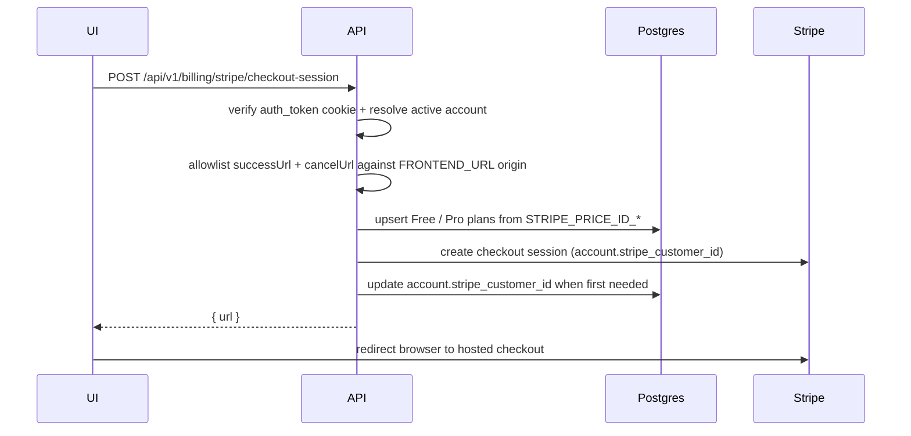
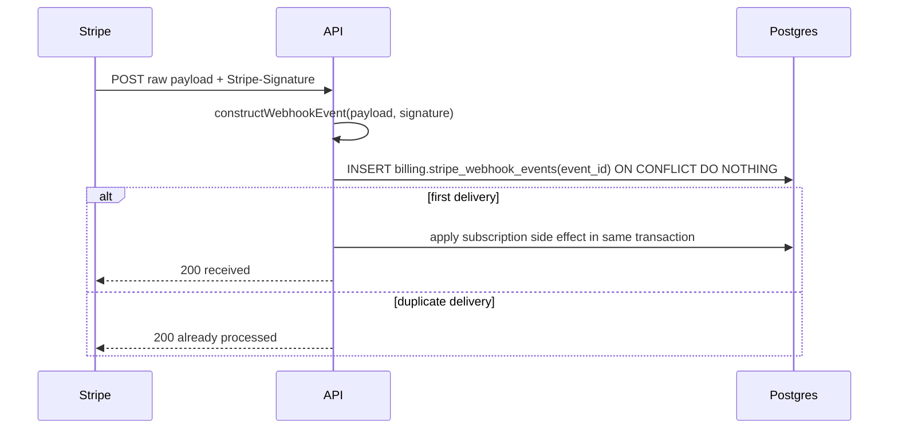

import { Aside } from "@astrojs/starlight/components";

Billing is optional. When `BILLING_ENABLED=false`, the billing route group returns 404 and the API does not instantiate Stripe. When true, the env validator requires the Stripe secret key, webhook secret, and price IDs before the app listens.

The template ships the subscription spine: Stripe Checkout, Stripe Customer Portal, plan persistence, webhooks, audit events, and redirect safety. Forks can rename plans or add tiers once the product shape is real.

## Checkout and portal flow



The customer portal follows the same pattern: authenticated user, `returnUrl` allowlisted against `FRONTEND_URL`, Stripe returns a hosted URL.

## Design

Billing is feature-flagged so local apps boot without Stripe credentials. Plans come from env (`STRIPE_PRICE_ID_FREE` and `STRIPE_PRICE_ID_PRO`) and upsert default plan rows without manual SQL. Customer routes (checkout, portal, plan reads) use the same cookie-auth OpenAPI contract as the rest of the API. Stripe-hosted flows may only return to the configured `FRONTEND_URL` origin.

The webhook route passes the exact request payload to Stripe signature verification (raw body verification). Every Stripe event ID is claimed in the same transaction as the side effect, providing Postgres-backed idempotency.

## Webhook flow



Handled events:

- `checkout.session.completed`: creates or updates `billing.account_plans` for the account and plan in session metadata.
- `customer.subscription.updated`: maps the active Stripe price id back to a local plan and updates the account plan; also tracks `past_due`, `unpaid`, `paused`, `canceled`, `incomplete`, `trialing`, and `active` for the [feature resolver](/api/acl/#feature-gates).
- `customer.subscription.deleted`: handles deletion only for the matching subscription; an older subscription cannot revoke its replacement. Effective access follows the resulting status and period.
- `invoice.paid` / `invoice.payment_failed`: status transitions for the active plan row.

Unknown event types are logged at debug level and ignored. Event identity prevents duplicate processing; ordering checks and subscription identity prevent stale deliveries from overwriting the current subscription. A deletion for an older subscription must not revoke its replacement. Same-second checkout and subscription updates preserve identity, status and period in either tested delivery order; a delayed checkout must not restore a delinquent subscription. These cases do not establish correctness for every possible provider event sequence.

## Entitlement behavior

Server-side feature resolution requires an unrevoked plan whose status and expiry entitle it:

| Plan state | Plan features |
| --- | --- |
| `active`, `trialing` | Available unless an administrative grant has expired. |
| `canceled` | Available only while `currentPeriodEnd` is in the future and any grant expiry has not elapsed. |
| `past_due`, `unpaid`, `paused`, `incomplete`, unknown status | Not granted by this plan. |

Active overrides still precede plan features; absent a grant, catalog defaults apply. `past_due` has no implicit grace period. An account without an entitling plan or override defaults to one seat and cannot invite a team. Configure plans/features for the intended product even when Stripe is disabled.

Invitation creation requires `can_invite_team`; invitation acceptance and join-request approval enforce `max_seats` against active memberships in their write transaction. Existing invitations cannot bypass a later cap. Pending invitations do not reserve seats.

Sensitive subscription reads recheck membership and return 403 for a revoked member. See [ACL](/api/acl/) for the enforcement helpers and [security rollout](/runbooks/security-upgrade/) before upgrading existing accounts.

## Env configuration

- `BILLING_ENABLED`: Turns the route group on; false means all billing paths return 404.
- `STRIPE_SECRET_KEY`: Used by the Stripe SDK for Checkout, Portal, and webhook construction.
- `STRIPE_WEBHOOK_SECRET`: Used to verify Stripe-Signature on raw webhook payloads.
- `STRIPE_PRICE_ID_FREE` / `STRIPE_PRICE_ID_PRO`: Seeds and keeps the built-in plan rows aligned with Stripe.

<Aside type="tip" title="Local webhook testing">
  Keep billing off unless you are actively testing Stripe. When billing is on
  locally, use the Stripe CLI to forward events to
  `/api/v1/billing/stripe/webhooks` and paste the generated webhook secret into
  `.env`.
</Aside>

## Source

[`src/api/billing/`](https://github.com/boringstack-xyz/boringstack/tree/main/apps/api/src/api/billing) and [`src/clients/postgres/schema/billing.schema.ts`](https://github.com/boringstack-xyz/boringstack/blob/main/apps/api/src/clients/postgres/schema/billing.schema.ts) on GitHub.

## Operator queries

Read-only psql snippets for "what's the subscription state right now?" questions. Run inside the app database (`docker compose exec postgres psql -U app -d app`).

```sql
-- Active subscriptions grouped by plan.
SELECT plan_id, status, count(*)
FROM billing.account_plans
WHERE revoked_at IS NULL
GROUP BY 1, 2
ORDER BY 1, 2;
```

```sql
-- Accounts on the Pro plan, with when each started + last status transition.
SELECT a.name, ap.status, ap.created_at, ap.updated_at
FROM billing.account_plans ap
JOIN app.accounts a ON a.id = ap.account_id
WHERE ap.plan_id = 'pro'
  AND ap.revoked_at IS NULL
ORDER BY ap.updated_at DESC;
```

```sql
-- Webhook deliveries in the last 24 hours by event type.
SELECT event_type, count(*)
FROM billing.stripe_webhook_events
WHERE created_at > now() - interval '24 hours'
GROUP BY 1
ORDER BY 2 DESC;
```

```sql
-- Failed-payment accounts that need attention.
SELECT a.name, ap.plan_id, ap.status, ap.updated_at
FROM billing.account_plans ap
JOIN app.accounts a ON a.id = ap.account_id
WHERE ap.status IN ('past_due', 'unpaid', 'incomplete')
  AND ap.revoked_at IS NULL
ORDER BY ap.updated_at;
```

```sql
-- Confirm idempotency works: every webhook event_id should appear exactly once.
SELECT event_id, count(*)
FROM billing.stripe_webhook_events
GROUP BY 1
HAVING count(*) > 1;
```

## Related

- [Authentication](/api/auth/); customer billing routes use cookie auth.
- [ACL & feature resolution](/api/acl/); Stripe plan status drives the feature flags surfaced via `/me`.
- [Multi-tenant model](/api/multi-tenant/); Stripe customer id and active plan live on `accounts`, not `users`.
- [Audit log](/api/audit-log/); checkout and portal session creation write audit rows.
- [Env validator](/api/env-validator/); Stripe keys and price IDs are enforced when billing is enabled.
