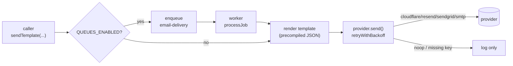

Email has a delivery spine without forcing one vendor. Providers, templates, and dispatch are independently swappable, while request handlers keep calling the same function.

The default is Cloudflare Email Service because it's the cheapest at scale. Resend, SendGrid, a plain SMTP provider, and a noop fallback ship alongside. Swapping is a one-environment-variable change. Three layers compose the system: providers (the wire to the mail service), templates (Handlebars `.hbs` files precompiled to JSON at build time), and dispatch (`sendTemplate(...)` chooses queue or inline based on env).

## How a send flows



Two retry layers stack when queues are on: the inner `retryWithBackoff` handles flickery HTTP responses, the outer BullMQ retry handles the case where the whole provider is down for minutes.

## Design

Every provider implements a single `IEmailService` interface, so adding Postmark or SES later is one file plus one selector branch. Dev boots without credentials via a noop provider fallback. Templates are precompiled to JSON at build time, eliminating any Handlebars parser in the hot path and preventing template injection from user data. `sendTemplate` is queue-aware: workers skip the queue and run inline, while request handlers go through it when queues are enabled. Email addresses are masked in logs before they reach the pipeline. Cloudflare is the default provider because it's cheap at scale, but the contract stays provider-agnostic.

## The provider contract

Every concrete provider implements one shape:

```ts
interface IEmailService {
  send: (msg: { to; subject; html; text? }) => Promise<{ id; provider }>;
  readonly providerName: "cloudflare" | "resend" | "sendgrid" | "smtp" | "noop";
}
```

The selector reads `EMAIL_PROVIDER`. If the matching key is empty, it returns the noop provider; dev never crashes, prod boot fails earlier at the env validator.

## Templates

Authors write `.hbs` files in `src/templates/email/templates/{auth,notifications}/`. The build script (`bun run build:templates`) compiles them to JSON. At runtime the template service reads the JSON and invokes the precompiled function. Net effect: zero parse cost per send, no template-injection surface.

Shared layout partials live in `components/`. `baseTemplateVariables()` injects common context (product name, support URL, current year) so templates don't repeat it.

## Calling sendTemplate

```ts
import { sendTemplate } from "../lib/email";

await sendTemplate({
  to: user.email,
  subject: "Verify your email",
  templatePath: "auth/verify-email",
  variables: { token, confirmationUrl },
});
```

Switch providers by changing `EMAIL_PROVIDER` in env (cloudflare, resend, sendgrid, smtp). Do not branch on queue vs inline in the handler; that decision lives in env config and the `sendTemplate` / `sendTemplateNow` helpers decide which path to take.

## Adding a provider

1. Create `src/lib/email/providers/<name>.ts` implementing `IEmailService`.
2. Add it to the `EmailProviderName` union and the switch in `buildEmailService()`.
3. Add the API-key env var to the schema with the matching cross-field invariant.

The HTTP call should be wrapped in `retryWithBackoff` so transient 5xx responses get retried inside the call, not just at the queue level.

## Adding a template

1. Drop a `.hbs` file in the right subfolder.
2. Run `bun run build:templates` (or the watcher in dev).
3. Reference it: `templatePath: "<subfolder>/<name>"`.

## Lint coverage

[`@boring-stack-pkg/eslint-plugin-structured-logging`](https://www.npmjs.com/package/@boring-stack-pkg/eslint-plugin-structured-logging) fails the build on unmasked email addresses in log calls or `console.log`-style leaks.

## Source

[`src/lib/email/`](https://github.com/boringstack-xyz/boringstack/tree/main/apps/api/src/lib/email): providers, dispatch, template service. [`src/templates/email/`](https://github.com/boringstack-xyz/boringstack/tree/main/apps/api/src/templates/email): Handlebars sources and build pipeline.

## Bounce handling

Bounces and spam complaints feed a local `email_suppression` table that
`sendTemplateNow` consults before every send. Cloudflare manages its
own list and the API mirrors the verdict on send-time errors;
Resend and SendGrid push their verdicts in over signed webhooks. See
[Bounce handling](/api/bounce-handling/) for the per-provider model
and webhook wire-up.

## Related

- [Bounce handling](/api/bounce-handling/); per-provider suppression + webhooks.
- [Cloudflare Email Service](/topics/cloudflare-email/); why it's the default.
- [Setup runbook](/runbooks/cloudflare-email-setup/); domain + token wire-up.
- [Queues](/api/queues/); the `email-delivery` queue on the worker side.
