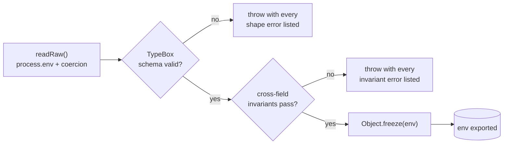

Env is deploy-time configuration, not runtime state. The validator runs once at boot, lists every problem it finds, freezes the result, and exposes a typed env object to the rest of the app.

Two principles drive the design: no silent fallbacks in production (a missing or malformed var fails the boot with a readable error listing every problem), and one place to read `process.env`. Direct `process.env.FOO` outside the validator is a lint error.

## How validation works



The two-pass split matters: running invariants on an already-shape-validated object means errors read _"STRIPE_SECRET_KEY required when BILLING_ENABLED=true"_, not _"property STRIPE_SECRET_KEY should be string"_.

## Design

TypeBox handles field shape validation (the same library Elysia uses; no extra validation DSL to learn). Predicates handle cross-field rules: "if A then B" stays readable as hand-written checks. All errors aggregate, so one failed boot lists every missing var instead of one redeploy per problem. The frozen config object at runtime reads like `env.isProduction`, not repeated `NODE_ENV` string checks. Empty integration keys are allowed when a feature is off; shape passes while invariants enforce keys when enabled. Test fallbacks are explicit via `nonEmpty(value, testFallback)` and never leak to production.

## Shape vs. invariant

A shape rule expresses "this field must be a positive int between 1 and 65535." TypeBox does that:

```ts
PORT: t.Integer({ minimum: 1, maximum: 65535, default: 7330 }),
PUBLIC_API_URL: t.String({ minLength: 1 }),
JWT_SECRET: t.String({ minLength: 32 }),
EMAIL_PROVIDER: t.Union([t.Literal("cloudflare"), t.Literal("resend"), t.Literal("sendgrid"), t.Literal("smtp")]),
```

An invariant rule expresses "if A is true, B must be set." TypeBox can't say that cleanly. A predicate can:

```ts
if (env.BILLING_ENABLED && env.STRIPE_SECRET_KEY === "") {
  errors.push("STRIPE_SECRET_KEY required when BILLING_ENABLED=true");
}
```

Predicates each return `string[]` and fan into one aggregated check, so every problem surfaces in one boot attempt.

## Invariant rules

- **CORS**: Non-empty ALLOWED_ORIGINS entries must be https and wildcard-free.
- **Email**: Production requires the matching email-provider credentials.
- **URLs**: FRONTEND_URL, PUBLIC_API_URL, and notification settings URLs must be valid http(s) URLs.
- **OAuth**: Google, GitHub, and LinkedIn credentials must be supplied as client-id/client-secret pairs.
- **AI**: AI_ENABLED=true requires the matching OpenAI or Anthropic key.
- **Stripe**: BILLING_ENABLED=true requires Stripe secret, webhook secret, and price IDs.
- **Valkey**: Queues, cache, notification SSE, or OAuth require VALKEY_PASSWORD in production.

`NODE_ENV=test` skips most of these so integration tests don't need real provider credentials.

When boot fails, every problem is listed at once:

```
JWT_SECRET: Expected string length greater or equal to 32
STRIPE_SECRET_KEY required when BILLING_ENABLED=true
STRIPE_WEBHOOK_SECRET required when BILLING_ENABLED=true
STRIPE_PRICE_ID_FREE required when BILLING_ENABLED=true
Google OAuth requires both client id and client secret
```

Several problems, one redeploy to fix all of them.

## Adding a new env var

1. Add the field to the TypeBox schema with the right type + default.
2. Add it to `readRaw()` with a parser helper (`toInt`, `toBool`, `toCsv`, `nonEmpty`, `toFloat`).
3. If it has a cross-field rule, write a `check*` predicate and add it to `checkInvariants()`.
4. Document it in `.env.example` (and in `compose/.env.example` if it flows through the prod profile).
5. Use `env.MY_VAR` everywhere. Don't touch `process.env` directly; the lint plugin will catch it.

## Lint contract

[`@boring-stack-pkg/eslint-plugin-env-access`](https://www.npmjs.com/package/@boring-stack-pkg/eslint-plugin-env-access) enforces the validator:

- `process.env.X` is only allowed inside `src/config/env/`.
- The matching rule applies to `import.meta.env` on the UI side.

Without this rule, code eventually gets written like `const x = process.env.FEATURE_FLAG ?? "default"` deep in a handler; undocumented, untyped, unvalidated. The lint catches it on first try.

## Source

[`src/config/env/`](https://github.com/boringstack-xyz/boringstack/tree/main/apps/api/src/config/env); schema, validator, parsers. [`.env.example`](https://github.com/boringstack-xyz/boringstack/blob/main/apps/api/.env.example) is the per-var reference with comments.

## Related

- [Authentication](/api/auth/), [Email](/api/email/), [Queues](/api/queues/); per-feature env requirements.
- [Environment variables](/reference/env-vars/); cross-repo index.
- [Lint as the contract](/architecture/lint-as-contract/).
