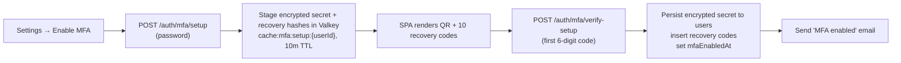
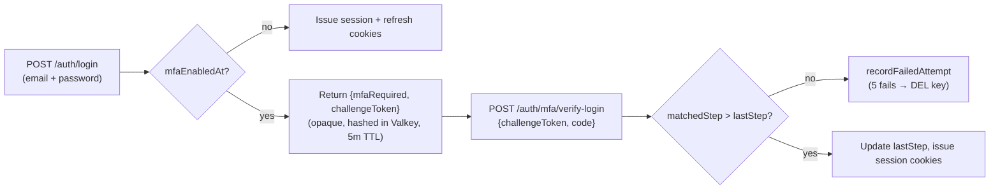

import CommandRun from "../../../components/docs-kit/CommandRun";
import DataMatrix from "../../../components/docs-kit/DataMatrix";
import PageIntro from "../../../components/docs-kit/PageIntro";
import SignalGrid from "../../../components/docs-kit/SignalGrid";

<PageIntro
  eyebrow="Security"
  actions={[
    { label: "Enrollment flow", href: "#enrollment-flow" },
    { label: "Login flow", href: "#login-flow" },
  ]}
  facts={[
    { value: "TOTP", label: "RFC 6238, 30s step" },
    { value: "10 codes", label: "argon2id-hashed recovery" },
    { value: "AES-256-GCM", label: "secret at rest" },
  ]}
>
  Users opt into a second factor. A 32-byte TOTP secret lives encrypted in
  Postgres, the matched step counter blocks replay, and ten single-use recovery
  codes get the user back in if their authenticator dies. Login detours through
  an opaque, hashed, single-use challenge token in Valkey.
</PageIntro>

## Threat model

<DataMatrix
  caption="What MFA defends against"
  columns={["Threat", "Coverage"]}
  rows={[
    {
      label: "Stolen password",
      cells: [
        "Phished or reused on a breached site",
        "TOTP step + replay guard block sign-in without the second factor",
      ],
    },
    {
      label: "Stolen session cookie",
      cells: [
        "Browser session token extracted client-side",
        "Out of scope — already authenticated. Mitigated separately by session rotation, 15-minute access JWT, and the JTI revocation cache",
      ],
    },
    {
      label: "Stolen DB snapshot",
      cells: [
        "Encrypted secret column + argon2id recovery hashes",
        "Attacker cannot enrol a clone without `MFA_ENCRYPTION_KEY`",
      ],
    },
    {
      label: "Replay of a captured TOTP code",
      cells: [
        "Code reuse inside the verification window",
        "`users.mfa_last_totp_step` blocks any step the user has already consumed",
      ],
    },
    {
      label: "Recovery-code brute force",
      cells: [
        "Attacker hammers `/auth/mfa/verify-recovery`",
        "Each challenge token allows 5 attempts then self-destructs; codes are argon2id-hashed",
      ],
    },
  ]}
/>

## Enrollment flow



Mid-enrollment state lives in Valkey, not Postgres. An abandoned setup
self-cleans after 10 minutes. The first valid code is required before
the secret moves to the durable column, so a half-finished QR scan
cannot lock the user out.

## Login flow



The challenge token is **opaque** — only its HMAC hash sits in Valkey,
so a Valkey snapshot leak cannot be replayed against the API.
`mfa_last_totp_step` rises monotonically; a code that already
authenticated a session cannot authenticate another one inside the
same 30-second window.

## Schema

Three additive columns on `auth.users`, plus one new table for recovery
codes. The migration is baked into `0000_modern_chameleon.sql`, so this
is reference for what the model holds at runtime — not something you
apply by hand.

<DataMatrix
  caption="auth.users — MFA columns"
  columns={["Column", "Type", "Purpose"]}
  rows={[
    {
      cells: [
        "mfa_enabled_at",
        "timestamptz",
        "NULL until the user finishes enrollment; the single source of truth for 'MFA is on'",
      ],
    },
    {
      cells: [
        "mfa_secret_encrypted",
        "text",
        "AES-256-GCM ciphertext as v1$<iv>$<ct>$<tag>. The v1$ prefix is the rotation handle so a future v2$ decrypter can dispatch without a column migration",
      ],
    },
    {
      cells: [
        "mfa_last_totp_step",
        "bigint",
        "Highest 30-second step that has already authenticated a session. Rises monotonically and blocks replay inside the same window",
      ],
    },
  ]}
/>

<DataMatrix
  caption="auth.mfa_recovery_codes"
  columns={["Column", "Type", "Purpose"]}
  rows={[
    {
      cells: [
        "user_id",
        "uuid",
        "Owning user. ON DELETE CASCADE so account deletion sweeps the codes",
      ],
    },
    {
      cells: [
        "code_hash",
        "text",
        "argon2id hash of the plaintext recovery code. Plaintext is shown to the user once at enrollment and never persisted",
      ],
    },
    {
      cells: [
        "used_at",
        "timestamptz",
        "Set when a code redeems a login. A used code can never authenticate again; the row stays for audit",
      ],
    },
  ]}
/>

## Endpoints

<DataMatrix
  caption="The seven MFA endpoints under /api/v1/auth/mfa"
  columns={["Endpoint", "Auth", "Body", "On success"]}
  rows={[
    {
      cells: [
        "POST /mfa/setup",
        "session + step-up password",
        "{ password }",
        "Returns otpauthUri + secretBase32 + recoveryCodes (plaintext, once)",
      ],
    },
    {
      cells: [
        "POST /mfa/verify-setup",
        "session",
        "{ code }",
        "Persists encrypted secret + recovery code hashes; sets mfaEnabledAt",
      ],
    },
    {
      cells: [
        "POST /mfa/verify-login",
        "challenge token in body",
        "{ challengeToken, code }",
        "Issues session + refresh cookies",
      ],
    },
    {
      cells: [
        "POST /mfa/verify-recovery",
        "challenge token in body",
        "{ challengeToken, code }",
        "Marks the recovery row used; issues session cookies",
      ],
    },
    {
      cells: [
        "POST /mfa/regenerate-recovery-codes",
        "session + step-up password",
        "{ password }",
        "Returns 10 fresh codes; invalidates every previous one",
      ],
    },
    {
      cells: [
        "POST /mfa/disable",
        "session + step-up password",
        "{ password }",
        "Clears MFA columns + recovery rows; sends 'MFA disabled' email",
      ],
    },
    {
      cells: [
        "GET /mfa/status",
        "session",
        "—",
        "`{ enabled }` for SPA state",
      ],
    },
  ]}
/>

## Lifecycle signals

<SignalGrid
  columns={3}
  items={[
    {
      label: "enrolled",
      title: "Enabling MFA fires an email",
      body: "The user sees the QR + recovery codes once in the SPA; a separate notification email lands so a stolen session that quietly enrolled a new device is still visible to the legitimate user.",
    },
    {
      label: "disabled",
      title: "Disabling MFA fires an email too",
      body: "Same threat shape inverted. A 'MFA disabled' confirmation reaches the user out-of-band so the legitimate operator notices if someone else stripped their second factor.",
    },
    {
      label: "locked out",
      title: "Five failures destroys the challenge",
      body: "Each verify-login / verify-recovery attempt increments a counter on the cached challenge. The fifth failure DELETEs the key — the user goes back to /auth/login and starts a fresh challenge. The account is never locked.",
    },
  ]}
/>

## Configuration

<CommandRun
  title="Generate the encryption key"
  caption="32 random bytes, base64. Required once any user enables MFA."
  command={[
    "openssl rand -base64 32",
    "# add to compose/.env or your secrets manager",
    "echo 'MFA_ENCRYPTION_KEY=<paste>' >> compose/.env",
  ]}
/>

`MFA_ENCRYPTION_KEY` is allowed to be empty at boot — a fresh deploy
with no enrolled users keeps running. The first `encryptString` /
`decryptString` call raises a 500 with a loud "regenerate with
`openssl rand -base64 32`" hint, which catches the missing-config case
without taking down a deploy that doesn't use MFA yet.

## Manual operations

For a one-off account lockout reset (lost phone, no recovery codes
left, support ticket), the operator can wipe the user's MFA state and
email them a password reset:

```sql
UPDATE auth.users
SET mfa_enabled_at       = NULL,
    mfa_secret_encrypted = NULL,
    mfa_last_totp_step   = NULL
WHERE id = '<user-id>';

DELETE FROM auth.mfa_recovery_codes
WHERE user_id = '<user-id>';
```

The audit log records every lifecycle action (`auth.mfa_enabled`,
`auth.mfa_disabled`, `auth.mfa_login_success`, `auth.mfa_login_failed`,
`auth.mfa_login_locked_out`, `auth.mfa_recovery_used`,
`auth.mfa_recovery_codes_regenerated`) so a follow-up "who turned this
off?" investigation has a paper trail.

## Source

[`src/api/auth/services/mfa.service.ts`](https://github.com/boringstack-xyz/boringstack/tree/main/apps/api/src/api/auth/services/mfa.service.ts); the service.
[`src/api/auth/mfa.routes.ts`](https://github.com/boringstack-xyz/boringstack/tree/main/apps/api/src/api/auth/mfa.routes.ts); the HTTP layer.
[`src/lib/crypto/aes-gcm.utils.ts`](https://github.com/boringstack-xyz/boringstack/tree/main/apps/api/src/lib/crypto/aes-gcm.utils.ts); the
secret encryption.
[`src/features/accounts/components/SettingsPage/MfaSection/`](https://github.com/boringstack-xyz/boringstack/tree/main/apps/ui/src/features/accounts/components/SettingsPage/MfaSection); the
SPA settings card.

## Related

- [Auth](/api/auth/); the password-login flow that MFA detours through.
- [Email](/api/email/); the dispatch path for "MFA enabled / disabled".
- [Audit log](/api/audit-log/); the trail for MFA lifecycle events.
