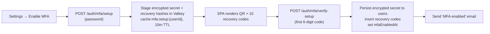
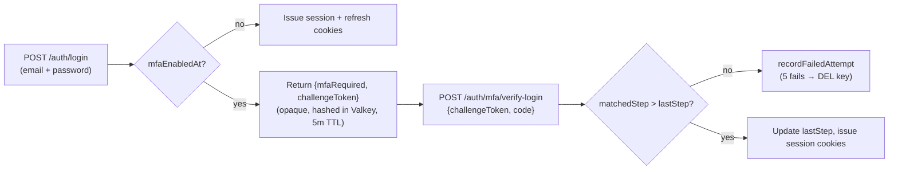

import { Aside } from "@astrojs/starlight/components";

Users opt into a second factor. A 32-byte TOTP secret lives encrypted
in Postgres, a step counter blocks replay, and ten single-use
recovery codes get the user back in if their authenticator dies.
Login detours through an opaque, hashed, single-use challenge token
in Valkey.

## Threat model

| Threat | Vector | Coverage |
|---|---|---|
| Stolen password | Phished or reused on a breached site | TOTP step plus replay guard block sign-in without the second factor. |
| Stolen session cookie | Browser token extracted client-side | Out of scope: already authenticated. Mitigated separately by session rotation, the 15-minute access JWT, and the JTI revocation cache. |
| Stolen DB snapshot | Encrypted secret column plus argon2id recovery hashes | Attacker cannot enrol a clone without `MFA_ENCRYPTION_KEY`. |
| Replay of a captured TOTP code | Code reuse inside the verification window | `users.mfa_last_totp_step` blocks any step the user has already consumed. |
| Recovery-code brute force | Attacker hammers `/auth/mfa/verify-recovery` | Each challenge token allows five attempts then self-destructs; codes are argon2id-hashed. |

## Enrollment flow



Mid-enrollment state lives in Valkey, not Postgres. An abandoned
setup self-cleans after 10 minutes. The first valid code is required
before the secret moves to the durable column, so a half-finished QR
scan cannot lock the user out.

## Login flow



The challenge token is opaque: only its HMAC hash sits in Valkey, so
a Valkey snapshot leak cannot be replayed against the API.
`mfa_last_totp_step` rises monotonically; a code that already
authenticated a session cannot authenticate another one inside the
same 30-second window.

## Schema

Three additive columns on `auth.users` plus one new table for
recovery codes. See
[`apps/api/src/clients/postgres/schema/auth.schema.ts`](https://github.com/boringstack-xyz/boringstack/tree/main/apps/api/src/clients/postgres/schema/auth.schema.ts)
for the column definitions and types; the migration is baked into
`0000_modern_chameleon.sql`.

The columns worth knowing by name when reading code or debugging:

- `mfa_enabled_at`: NULL until enrollment completes. The runtime
  signal for "MFA is on".
- `mfa_secret_encrypted`: AES-256-GCM ciphertext prefixed with `v1$`.
  The version prefix is the rotation handle for a future `v2$`
  decrypter without a column migration.
- `mfa_last_totp_step`: the highest 30-second TOTP step that has
  already authenticated a session. Rises monotonically; blocks
  replay inside the same window.

The recovery-code table stores argon2id hashes only. Plaintext codes
are shown to the user once at enrollment and never persisted.

## Lifecycle signals

**Enabling MFA emails the user.** Beyond the QR plus codes shown
once in the SPA, a notification email lands too. A stolen session
that quietly enrolled a new device stays visible to the real user.

**Disabling MFA emails the user too.** Same threat shape inverted.
An out-of-band confirmation reaches the user so a stripped second
factor doesn't go unnoticed.

**Five failures destroys the challenge.** Each verify-login or
verify-recovery attempt increments a counter on the cached
challenge. The fifth failure deletes the key; the user goes back to
`/auth/login` and starts a fresh challenge. The account itself is
never locked.

## Configuration

Generate the encryption key once, before any user enrols:

```bash
openssl rand -base64 32
# Add to compose/.env or your secrets manager:
echo 'MFA_ENCRYPTION_KEY=<paste>' >> compose/.env
```

`MFA_ENCRYPTION_KEY` is allowed to be empty at boot. A fresh deploy
with no enrolled users keeps running. The first `encryptString` or
`decryptString` call raises a 500 with a "regenerate with
`openssl rand -base64 32`" hint, so the missing-config case surfaces
without taking down a deploy that doesn't use MFA yet.

<Aside type="caution" title="The encryption key cannot be rotated">
Once users enrol TOTP, their secrets are AES-256-GCM encrypted with
this key. Losing it means every MFA user re-enrols from scratch.
Back the secret-manager entry up to a hardware key or printed paper.
</Aside>

## Manual operations

For a one-off account lockout reset (lost phone, no recovery codes
left, support ticket), wipe the user's MFA state and email them a
password reset:

```sql
UPDATE auth.users
SET mfa_enabled_at       = NULL,
    mfa_secret_encrypted = NULL,
    mfa_last_totp_step   = NULL
WHERE id = '<user-id>';

DELETE FROM auth.mfa_recovery_codes
WHERE user_id = '<user-id>';
```

The audit log records every lifecycle action (`auth.mfa_enabled`,
`auth.mfa_disabled`, `auth.mfa_login_success`,
`auth.mfa_login_failed`, `auth.mfa_login_locked_out`,
`auth.mfa_recovery_used`, `auth.mfa_recovery_codes_regenerated`), so
a follow-up "who turned this off?" investigation has a paper trail.

## Source

- [`apps/api/src/api/auth/services/mfa.service.ts`](https://github.com/boringstack-xyz/boringstack/tree/main/apps/api/src/api/auth/services/mfa.service.ts), the service.
- [`apps/api/src/api/auth/mfa.routes.ts`](https://github.com/boringstack-xyz/boringstack/tree/main/apps/api/src/api/auth/mfa.routes.ts), the HTTP layer.
- [`apps/api/src/lib/crypto/aes-gcm.utils.ts`](https://github.com/boringstack-xyz/boringstack/tree/main/apps/api/src/lib/crypto/aes-gcm.utils.ts), the secret encryption.
- [`apps/ui/src/features/accounts/components/SettingsPage/MfaSection/`](https://github.com/boringstack-xyz/boringstack/tree/main/apps/ui/src/features/accounts/components/SettingsPage/MfaSection), the SPA settings card.

## Related

- [Auth](/api/auth/), the password-login flow MFA detours through.
- [Email](/api/email/), the dispatch path for the lifecycle emails.
- [Audit log](/api/audit-log/), the trail for MFA lifecycle events.
