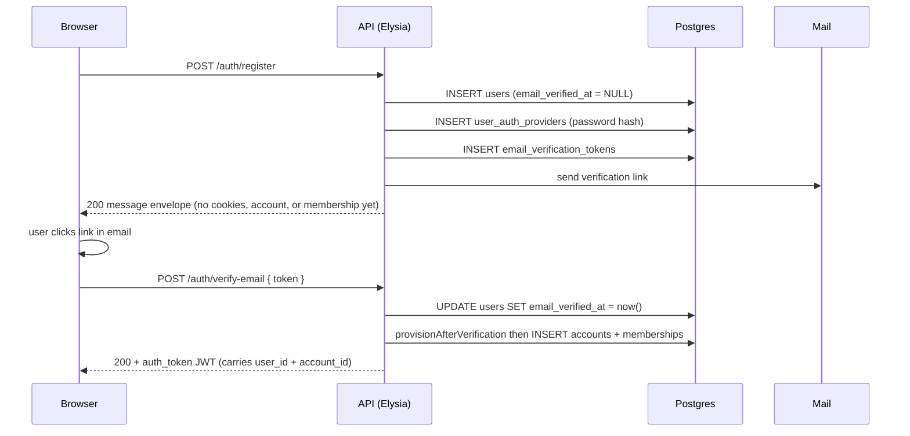
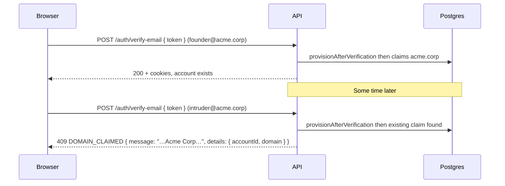

Accounts, memberships, invitations, and billing plans ship as product infrastructure. A solo user is just one user with one account, so the app can grow into teams without a second data model. This is the tenant boundary and how isolation is enforced.

User identity lives in `auth.users` and `auth.user_auth_providers`. The `auth.account_memberships` table is the join between users and accounts, carrying role and revocation state. `app.accounts` is the tenant boundary itself. Every account-scoped product table carries `account_id` explicitly. Routes derive that ID from the JWT (the `aid` claim, populated at login, refresh, register, or OAuth callback), never from URL params.

A partial unique index prevents each account from ever having two active owners. Soft-delete (via `revoked_at` and `deleted_at`) preserves history so audit trails and grace windows survive.

## Signup

Account creation is deliberately deferred until the email is verified, so abandoned signups never leave orphan tenant rows. The flow splits across two endpoints, both converging on a single function (`accountsService.provisionAfterVerification`) that creates the `accounts` row + owner membership atomically.



`provisionAfterVerification` is idempotent: a doubled-up verify click or an OAuth-then-password collision can call it twice, and only one active owner membership per user exists. The `buildPersonalAccountName({ firstName, lastName, email })` util produces the account name; if both names are empty it falls back to the email.

The OAuth callback uses the same provision function inline at the end of the callback transaction, so an OAuth user with a provider-verified email lands fully provisioned in one round-trip. OAuth refuses to issue a session when the IdP says the email is unverified; the transaction rolls back, and the caller has to verify through the password flow first. See [Authentication](/api/auth/#verify-before-account) for the full state machine.

## Memberships

`auth.account_memberships` is the (user, account, role) join. Two partial unique indexes enforce the invariants:

- `uniq_account_memberships_active_user`: `(account_id, user_id) WHERE revoked_at IS NULL`. At most one active membership per `(user, account)`.
- `uniq_account_memberships_active_owner`: `(account_id) WHERE role = 'owner' AND revoked_at IS NULL`. At most one active owner per account.

Revoked memberships keep their row (soft-delete via `revoked_at`) so the audit trail survives.

## Invitations

Invitation tokens are opaque, single-use, and hashed at rest. The route response carries the raw token exactly once (so the caller can hand it to email). The database stores only `sha256(token + pepper)`. Resending rotates the token, invalidating any leaked old links. The daily `cleanExpiredInvitationsJob` background sweep also soft-revokes unaccepted invitations past their TTL.

Revoke is a soft-delete via `revoked_at`; subsequent accept attempts fail with `invitation_revoked`. Seat-limit checks fire twice (at creation and acceptance), so if an admin revokes a seat between create and accept, the second check catches it.

Routes:
- `POST /api/v1/accounts/:id/invitations` (owner | admin)
- `POST /api/v1/invitations/accept` (any authenticated user holding the raw token)
- `POST /api/v1/accounts/:id/invitations/:iid/resend`
- `DELETE /api/v1/accounts/:id/invitations/:iid`

## Owner lifecycle

**Transfer ownership**: `POST /api/v1/accounts/:id/transfer-ownership` (owner-only, cache-bypassing). Atomically demotes the current owner to `admin`, promotes the target to `owner`. The partial unique index is never violated mid-transaction because `accountsService.transferOwnership` demotes the outgoing owner FIRST.

**Cannot leave without transferring**: An owner cannot leave their account; they must transfer first or delete the account. An owner cannot be removed by an admin.

**Soft-delete with 30-day grace**: `DELETE /api/v1/accounts/:id` (owner-only) sets `accounts.deleted_at = now()`. The `hardDeleteSoftDeletedAccountsJob` background sweep hard-deletes rows past the grace window, cascading to memberships, invitations, feature overrides, account_plans, and every account-scoped table. `audit.audit_log` survives by design. GDPR redaction (hash the user id, keep the row) is a separate path.

## Domain claiming (optional, B2B mode)

Off by default. Flip `ACCOUNT_DOMAIN_CLAIMING=true` and the first verified signup with a non-public email domain claims that domain on its personal account. Subsequent verified signups from the same domain fail with `DOMAIN_CLAIMED` (409) and return the existing account's name and accountId. The blocked user can still be invited via standard `account_invitations`.

This flag suits B2B products where one email domain maps to one workspace (Linear, Vercel, Dreamdata). For consumer products, leave it off.

Email verification is the proof of ownership: clicking the link demonstrates control of an inbox at the domain. That's enough for a starter template; harder evidence (DNS TXT records, SAML/SCIM) can layer on without changing the claim mechanism.

Public domains never claim. A 51-entry allowlist (`src/lib/email-domain/public-domains.ts`) covers gmail.com, outlook.com, proton.me, and others. Signups from those addresses always get a fresh personal account.

The partial unique index `uniq_accounts_claimed_domain_active` is the database-level safety net. Soft-deleted accounts (`deleted_at IS NOT NULL`) release their claim, so a successor signup after deletion gets the domain back. Two live accounts can never share a claim.

The `app.account_join_requests` table and the request/approve/deny endpoints are scaffolded but not wired. Operators flipping the flag on can wire that surface to whatever notification model suits their product (Slack ping, in-app inbox, email approval).



The decision lives entirely inside `provisionAfterVerification`: read the flag, extract the domain via `extractDomain(email)`, bail if `isPublicEmailDomain(domain)`, otherwise look up an active claim and either reuse / claim / throw.

## Account switch

`POST /api/v1/accounts/switch` with a target `accountId` re-issues the JWT with the new active account in the `aid` claim. The client re-fetches `/me`. Old JWTs continue to work against the old account until their 15-minute access TTL expires; the refresh-time membership recheck blocks renewal if the user no longer has an active membership on that account.

## Cross-account isolation

The guarantee is mechanical, not anecdotal. The `drizzle-conventions/account-scoped-tables-require-where` ESLint rule reads the `@account-scoped` marker on every account-scoped table and refuses to merge any `db.query.<table>.findX` that omits the scope column from its `WHERE`. The CASL ability matrix in `tests/lib/acl/ability.test.ts` exercises every role × subject × action combination across two accounts so a regression surfaces immediately. When you add a new account-scoped resource, the lint rule enforces scoping for free; copy the ability matrix's "owner cannot touch resources in a different account" test for your new subject.

## Source

[`src/api/accounts/`](https://github.com/boringstack-xyz/boringstack/tree/main/apps/api/src/api/accounts), [`src/clients/postgres/schema/app.schema.ts`](https://github.com/boringstack-xyz/boringstack/blob/main/apps/api/src/clients/postgres/schema/app.schema.ts), and [`src/clients/postgres/schema/memberships.schema.ts`](https://github.com/boringstack-xyz/boringstack/blob/main/apps/api/src/clients/postgres/schema/memberships.schema.ts).

## Operator queries

Read-only psql snippets for tenant-shape questions. Run inside the app database (`docker compose exec postgres psql -U app -d app`).

```sql
-- All active memberships for one account.
SELECT m.role, u.email, m.created_at
FROM auth.account_memberships m
JOIN auth.users u ON u.id = m.user_id
WHERE m.account_id = '<account-uuid>'
  AND m.revoked_at IS NULL
ORDER BY m.role, m.created_at;
```

```sql
-- Members per role per account (top 20 accounts by size).
SELECT a.id AS account_id, a.name, m.role, count(*) AS members
FROM auth.account_memberships m
JOIN app.accounts a ON a.id = m.account_id
WHERE m.revoked_at IS NULL
GROUP BY 1, 2, 3
ORDER BY members DESC
LIMIT 20;
```

```sql
-- Accounts with NO active owner. Should always return zero rows.
-- If it doesn't, something bypassed the owner-transfer flow.
SELECT a.id, a.name, a.created_at
FROM app.accounts a
WHERE NOT EXISTS (
  SELECT 1 FROM auth.account_memberships m
  WHERE m.account_id = a.id
    AND m.role = 'owner'
    AND m.revoked_at IS NULL
);
```

```sql
-- Users who belong to more than one active account (team members or operators).
SELECT u.email, count(*) AS accounts
FROM auth.users u
JOIN auth.account_memberships m ON m.user_id = u.id AND m.revoked_at IS NULL
GROUP BY 1
HAVING count(*) > 1
ORDER BY 2 DESC;
```

```sql
-- Pending invitations older than 14 days, by account.
SELECT i.account_id, i.email, i.created_at
FROM app.account_invitations i
WHERE i.accepted_at IS NULL
  AND i.revoked_at IS NULL
  AND i.created_at < now() - interval '14 days'
ORDER BY i.created_at;
```

## Related

- [ACL & feature resolution](/api/acl/): how role rules, feature gates, and the resolved feature set compose into a CASL ability.
- [Authentication](/api/auth/): JWT issuance carries `aid` (active account); session refresh re-validates membership.
