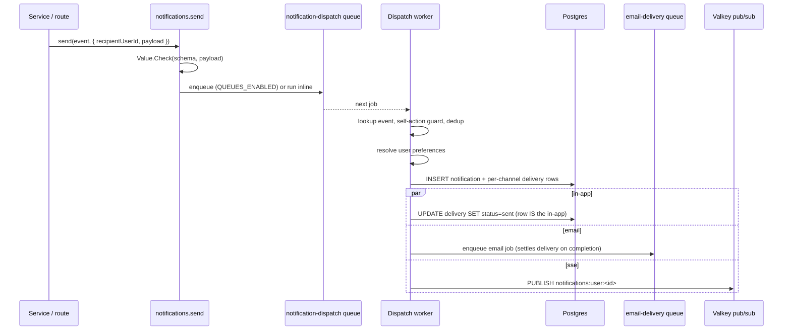
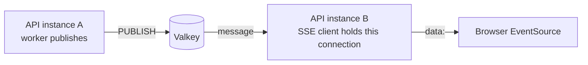

A `notifications.send(event, args)` call validates the payload, enqueues a BullMQ job, and returns. A worker resolves the event definition, runs dedup and self-action guards, checks per-user preferences, persists the notification row and per-channel delivery rows, then fans out to channel handlers.

The framework ships in-app and email channels by default. SSE is opt-in. New channels implement `INotificationChannel` and register at boot. The framework ships zero example events; forks define their own (removing example product code on adoption is friction).

## How a notification flows



## Design

Fire-and-forget at the call site: `void notifications.send(...)`. Delivery never blocks the originating request. `runNotificationDispatch` runs identically in the worker and inline fallback, so dev and tests don't need a worker process.

Events are typed via TypeBox. Authors receive a `payload` typed by the event's schema. The dispatcher validates with `Value.Check` before enqueuing; the worker re-validates before any handler runs.

Dedup is opt-in per event. Events declare `dedup: { key, windowSeconds }`. A unique index on `notification_dedup.dedup_key` short-circuits duplicates inside the window. Cleanup runs hourly.

Preferences apply per (user, eventType, channel). Disabled channels still record a `notification_delivery` row with `status: suppressed`, making it easier to debug "why didn't I get an email?"

## Authoring an event

Run `bun run new:notification-event -- comment.replied` to scaffold the event file and append to the registry.

Generates `src/api/notifications/events/comment-replied.event.ts` and appends to the registry barrel. Edit the schema + render functions to match the domain:

```ts
import { t } from "elysia";
import { defineNotificationEvent } from "../../../lib/notifications";

export const commentRepliedEvent = defineNotificationEvent({
  type: "comment.replied",
  schema: t.Object({
    actorId: t.String({ format: "uuid" }),
    actorName: t.String(),
    parentCommentId: t.String({ format: "uuid" }),
    excerpt: t.String({ maxLength: 200 }),
  }),
  defaultChannels: ["in-app", "email"],
  dedup: {
    key: ({ recipientUserId, payload }) =>
      `comment.replied:${recipientUserId}:${payload.parentCommentId}`,
    windowSeconds: 3_600,
  },
  selfActionGuard: ({ recipientUserId, payload }) =>
    recipientUserId === payload.actorId,
  render: {
    inApp: ({ payload }) => ({
      title: `${payload.actorName} replied to your comment`,
      body: payload.excerpt,
      ctaUrl: `/comments/${payload.parentCommentId}`,
      ctaLabel: "View reply",
    }),
    email: {
      subject: ({ payload }) => `${payload.actorName} replied to your comment`,
      templatePath: "notifications/comment-replied",
      variables: ({ payload }) => ({
        actor: payload.actorName,
        excerpt: payload.excerpt,
      }),
    },
  },
});
```

## Sending one

```ts
import { notifications } from "@/lib/notifications";
import { commentRepliedEvent } from "@/api/notifications/events/comment-replied.event";

void notifications.send(commentRepliedEvent, {
  recipientUserId: parentComment.userId,
  payload: {
    actorId: currentUser.id,
    actorName: currentUser.displayName,
    parentCommentId: parentComment.id,
    excerpt: reply.body.slice(0, 200),
  },
});
```

The `payload` is TypeScript-checked at the call site against `commentRepliedEvent.schema`. A bad shape fails to compile.

## Realtime: SSE + Valkey pub/sub

SSE is disabled unless `NOTIFICATIONS_SSE_ENABLED=true`. When enabled, the SSE endpoint subscribes to `notifications:user:<userId>` on Valkey. When the SSE channel implementation publishes after persistence, the message is forwarded to every connected client of that user, including clients on different API instances.



The SSE handler hooks the request's `AbortSignal`: when the tab closes, the generator's `finally` block disconnects the Valkey subscriber. No connection leak. If SSE is disabled, the endpoint returns 404 so the feature cannot accidentally look half-on.

Messages use a stable JSON envelope:

```json
{
  "type": "notification.created",
  "notification": {
    "id": "...",
    "eventType": "comment.replied",
    "title": "Someone replied",
    "body": "...",
    "ctaUrl": "/comments/...",
    "ctaLabel": "View reply",
    "status": "unread",
    "readAt": null,
    "createdAt": "2026-05-15T12:00:00.000Z"
  }
}
```

## Web Push channel (v1.1)

Browser push notifications via the W3C Push API and VAPID. The channel registers itself conditionally when the VAPID environment variables are configured.

**Setup**: Generate a fresh VAPID keypair with `bun run vapid:generate`. Paste the three lines into `.env.local` (server) and put the public key into the UI's `VITE_VAPID_PUBLIC_KEY`. All three server vars must be set together.

**Endpoints**:
- `POST /api/v1/notifications/push/subscribe`: Upserts a subscription keyed on `(userId, endpoint)`. Re-subscribing rotates keys instead of creating duplicates.
- `DELETE /api/v1/notifications/push/subscribe`: Removes by endpoint.
- `GET /api/v1/notifications/push/subscriptions`: Lists the user's own devices for a "Devices" panel.
All three require the standard auth cookie.

**Storage**: One Drizzle table, `notifications.push_subscription`, with `(userId, endpoint, p256dhKey, authKey, userAgent?, expiresAt?, createdAt, lastUsedAt)`. Unique on `(userId, endpoint)`.

**Delivery**: The channel resolves all live subscriptions for the recipient at delivery time and enqueues one `web-push-delivery` job. The worker fans out per-subscription POSTs in parallel and settles the `notification_delivery` row: `sent` if any subscription accepted, `failed` if every attempt errored, `suppressed` if no live subscriptions exist.

**410 cleanup**: A 410 Gone (or 404) from the push service means the browser invalidated the subscription. The worker deletes the row eagerly and logs `notifications.web_push.subscription_expired` to prevent orphans.

**Conditional registration**: `setup-notifications.ts` only registers the web push channel when all three `WEB_PUSH_VAPID_*` env vars are set. A fork that doesn't ship Web Push never sees it.

## Out of scope (v1)

Auth transactional emails (verification, password reset) stay on the direct `sendTemplate(...)` path. Transactional is not subscription; preferences shouldn't be able to silence them. Notification digest emails ("you have 5 new") and per-user throttling beyond dedup are future work.

## Related

- [Queues](/api/queues/): the BullMQ shape this builds on.
- [Email](/api/email/): the email channel uses the same dispatch.
- [Audit log](/api/audit-log/): the ergonomic pattern this notification dispatcher mirrors.
