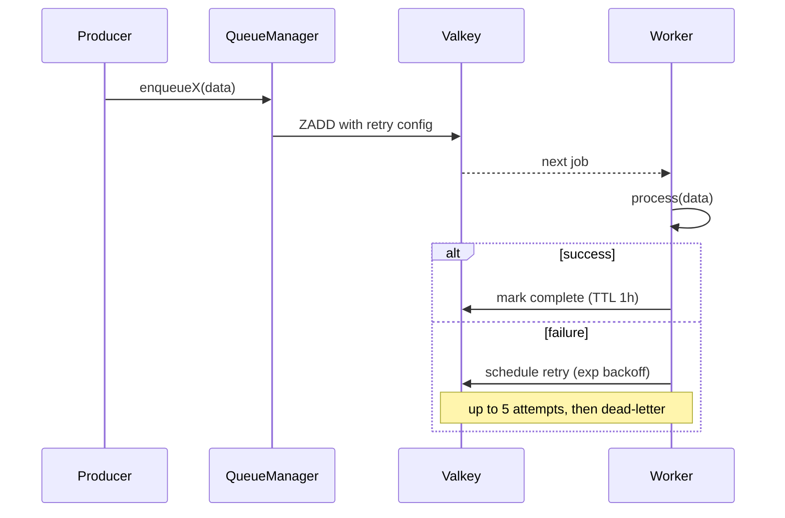

import DocFileTree from "../../../components/DocFileTree";
import FeatureGrid from "../../../components/docs-kit/FeatureGrid";
import PageIntro from "../../../components/docs-kit/PageIntro";

<PageIntro
  eyebrow="Background work that can start inline"
  actions={[
    { label: "Email dispatch", href: "/api/email/" },
    { label: "Infra overlays", href: "/infra/profiles-and-overlays/" },
  ]}
  facts={[
    { value: "BullMQ", label: "job lifecycle" },
    { value: "Valkey", label: "queue backend" },
    { value: "inline", label: "fallback when queues are off" },
  ]}
>
  Background work uses BullMQ over the same Valkey the cache lives on. A single
  QueueManager owns queues and workers, so request handlers dispatch intent
  without knowing whether the work runs inline, locally, or in a worker.
</PageIntro>

The mental model:

- A **queue** is a named work buffer in Valkey.
- A **worker** is a long-lived process that pulls jobs off the queue and runs them.
- A **`QueueManager`** is a process-singleton that owns all queues + workers, so application code only ever talks to one object.

When `QUEUES_ENABLED=false`, every dispatch helper falls back to inline execution. Dev and tests run without a worker process.

## How a job runs

## Design choices

<FeatureGrid
  columns={3}
  items={[
    {
      eyebrow: "manager",
      title: "One QueueManager per process",
      body: "Centralized lifecycle, shutdown, admin stats, and retry defaults.",
    },
    {
      eyebrow: "shape",
      title: "Per-queue directory",
      body: "Constants, queue, worker, setup, and types stay together.",
    },
    {
      eyebrow: "dev",
      title: "Inline fallback",
      body: "When QUEUES_ENABLED=false, dev and tests boot without a worker process.",
    },
    {
      eyebrow: "success",
      title: "Bounded success retention",
      body: "removeOnComplete keeps one hour or the latest 100 successes.",
    },
    {
      eyebrow: "failure",
      title: "Failed jobs remain inspectable",
      body: "removeOnFail is false, so the dashboard can show what broke.",
    },
    {
      eyebrow: "lint",
      title: "Workers are checked",
      body: "The BullMQ lint plugin catches missing failed handlers and retry config.",
    },
  ]}
/>

## The shape of a queue

Every queue is a small directory under `src/queues/<name>/`:

<DocFileTree
  root="src/queues/email-delivery/"
  title="Queue anatomy"
  caption="producer and consumer share one contract"
  nodes={[
    {
      name: "email-delivery.constants.ts",
      detail: "Queue name, job name, and retry defaults",
    },
    {
      name: "email-delivery.types.ts",
      detail: "JSON-serializable job-data type",
    },
    { name: "email-delivery.queue.ts", detail: "BullMQ Queue factory" },
    {
      name: "email-delivery.worker.ts",
      detail: "Worker plus structured-logged event handlers",
    },
    {
      name: "email-delivery.setup.ts",
      detail: "Boot wiring for queue + worker",
    },
  ]}
/>

The reference implementation is `email-delivery`; it's the simplest worker that exists (render a template, hand off to the email provider), so it's a good copy-target.

## QueueManager is the seam

Application code never imports `Queue` directly. It calls `manager.enqueueX(...)`. Why:

- One place to enforce retry/cleanup defaults across queues.
- Graceful shutdown: `manager.close()` shuts every worker + queue in parallel; signal handlers only know about the manager.
- Admin observability: `getStats()` returns waiting/active/completed/failed/delayed/paused counts for every managed queue.

A new queue therefore needs four additions to `QueueManager`: the constructor input, an `enqueue<Name>()` method, an entry in `getStats()`, and a `close()` line. The lint plugin catches workers that omit a `failed` handler or skip retry config.

## Idempotency

BullMQ retries on failure. If a worker dies after writing to the database but before marking the job complete, the same job runs again. Workers must be idempotent. Three patterns:

- Natural keys. "Send verification email for `userId=X`, `token=Y`" is idempotent: re-sending the same token is harmless.
- UNIQUE constraints plus catch. A second `INSERT` of the same audit row fails on the constraint; the worker treats unique-violation as success.
- Check-then-do, transactional. Read state, decide if work is still needed, write atomically.

Using BullMQ's `jobId` for deduplication only protects against simultaneous duplicate enqueues; not retries.

## Adding a queue

1. Create `src/queues/<name>/` following the per-queue directory pattern (constants, types, queue, worker, setup).
2. Add it to `QueueManager`'s constructor, an `enqueue<Name>()` method, `getStats()`, and `close()`.
3. Call `manager.enqueue<Name>(...)` from the producer.

## Dashboard

`WITH_BULLMQ=1` in the infra stack brings up [Bull-board](https://github.com/felixmosh/bull-board) at `http://bullmq.localhost`; jobs by state, retry timelines, manual retry/discard. Dev-only; not exposed in the prod profile. See [Profiles & overlays](/infra/profiles-and-overlays/).

## Lint coverage

[`@boring-stack-pkg/eslint-plugin-bullmq`](https://www.npmjs.com/package/@boring-stack-pkg/eslint-plugin-bullmq) catches the common foot-guns: workers that don't handle `failed`, jobs that mutate shared state without idempotency, missing retry config.

## Source

[`src/queues/`](https://github.com/boringstack-xyz/api-template/tree/main/src/queues) on GitHub. [`src/config/setup-queues.ts`](https://github.com/boringstack-xyz/api-template/blob/main/src/config/setup-queues.ts) wires the manager into boot.

## Related

- [Email](/api/email/); the producer side; `sendTemplate()` goes through `email-delivery` when queues are on.
- [Lint as the contract](/architecture/lint-as-contract/); why machine-checked queue patterns matter.
