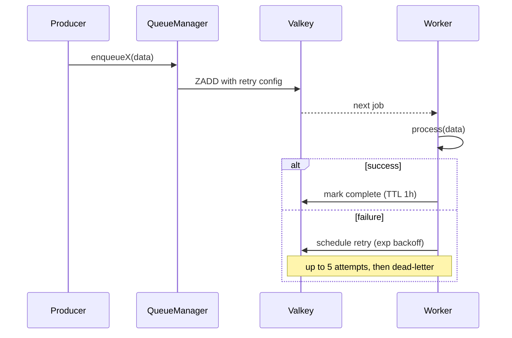

Background work uses BullMQ over the same Valkey the cache lives on. A single QueueManager owns queues and workers, so request handlers dispatch intent without knowing whether the work runs inline, locally, or in a worker.

A queue is a named work buffer in Valkey. A worker is a long-lived process that pulls jobs off the queue and runs them. QueueManager is a process-singleton that owns all queues and workers, so application code only ever talks to one object. When `QUEUES_ENABLED=false`, every dispatch helper falls back to inline execution. Dev and tests run without a worker process.

## How a job runs

## Design

One QueueManager per process provides centralized lifecycle, shutdown, admin stats, and retry defaults. Per-queue directories keep constants, queue, worker, setup, and types together. When `QUEUES_ENABLED=false`, dev and tests boot without a worker process. Success jobs are retained for one hour or the latest 100 (removeOnComplete). Failed jobs remain inspectable; removeOnFail is false so the dashboard can show what broke. The BullMQ lint plugin catches missing failed handlers and retry config.

## Queue anatomy

Every queue is a small directory under `src/queues/<name>/`:

- `<name>.constants.ts`: Queue name, job name, and retry defaults
- `<name>.types.ts`: JSON-serializable job-data type
- `<name>.queue.ts`: BullMQ Queue factory
- `<name>.worker.ts`: Worker plus structured-logged event handlers
- `<name>.setup.ts`: Boot wiring for queue and worker

The reference implementation is `email-delivery` (render a template, hand off to the email provider), so it's a good copy-target.

## QueueManager is the seam

Application code never imports `Queue` directly; it calls `manager.enqueueX(...)`. This provides one place to enforce retry/cleanup defaults across queues. Graceful shutdown works via `manager.close()`, which shuts every worker and queue in parallel; signal handlers only know about the manager. Admin observability comes from `getStats()`, which returns waiting/active/completed/failed/delayed/paused counts for every managed queue.

A new queue needs four additions to `QueueManager`: the constructor input, an `enqueue<Name>()` method, an entry in `getStats()`, and a `close()` line. The lint plugin catches workers that omit a `failed` handler or skip retry config.

## Idempotency

BullMQ retries on failure. If a worker dies after writing to the database but before marking the job complete, the same job runs again. Workers must be idempotent. Three patterns:

- Natural keys. "Send verification email for `userId=X`, `token=Y`" is idempotent: re-sending the same token is harmless.
- UNIQUE constraints plus catch. A second `INSERT` of the same audit row fails on the constraint; the worker treats unique-violation as success.
- Check-then-do, transactional. Read state, decide if work is still needed, write atomically.

Using BullMQ's `jobId` for deduplication only protects against simultaneous duplicate enqueues; not retries.

## Adding a queue

1. Create `src/queues/<name>/` following the per-queue directory pattern (constants, types, queue, worker, setup).
2. Add it to `QueueManager`'s constructor, an `enqueue<Name>()` method, `getStats()`, and `close()`.
3. Call `manager.enqueue<Name>(...)` from the producer.

## Dashboard and monitoring

`WITH_BULLMQ=1` in the infra stack brings up [Bull-board](https://github.com/felixmosh/bull-board) at `http://bullmq.localhost`. Jobs by state, retry timelines, manual retry/discard. Dev-only; not exposed in the prod profile. See [Profiles & overlays](/infra/profiles-and-overlays/).

## Source

[`src/queues/`](https://github.com/boringstack-xyz/boringstack/tree/main/apps/api/src/queues) and [`src/config/setup-queues.ts`](https://github.com/boringstack-xyz/boringstack/blob/main/apps/api/src/config/setup-queues.ts) wire the manager into boot.

## Related

- [Email](/api/email/); the producer side; `sendTemplate()` goes through `email-delivery` when queues are on.
- [Lint as the contract](/architecture/lint-as-contract/); why machine-checked queue patterns matter.
