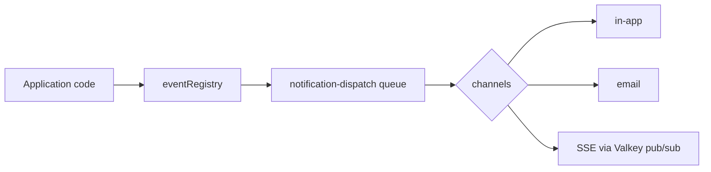

import PageIntro from "../../../components/docs-kit/PageIntro";
import SignalGrid from "../../../components/docs-kit/SignalGrid";
import FaqGroup from "../../../components/FaqGroup.tsx";
import FaqItem from "../../../components/FaqItem.tsx";

<PageIntro
  eyebrow="Background jobs"
  actions={[
    { label: "What ships", href: "#what-ships" },
    { label: "Notifications flow", href: "#notifications-flow" },
  ]}
  facts={[
    { value: "BullMQ", label: "queue engine" },
    { value: "Valkey", label: "queue backend" },
    { value: "Inline", label: "fallback when off" },
  ]}
>
  Products need work off the HTTP critical path: email, notifications, retries. BoringStack puts that work in the API with BullMQ on Valkey, shared queue patterns, and dispatch helpers. You ship events and mail without standing up a separate job platform first.
</PageIntro>

## What ships

<SignalGrid
  columns={3}
  items={[
    {
      label: "Queues",
      title: "BullMQ + QueueManager",
      body: "Named queues and workers; centralized lifecycle, retries, and shutdown. See Queues.",
    },
    {
      label: "Email",
      title: "Pluggable providers",
      body: "Precompiled templates, queue-aware sendTemplate(). Cloudflare, Resend, SendGrid, SMTP, or noop.",
    },
    {
      label: "Notifications",
      title: "Event registry",
      body: "Typed events, dispatch job, channels, dedup, preferences, and SSE pub/sub via Valkey.",
    },
  ]}
/>

## Notifications flow

Notification flow: application code emits typed events through the <code>eventRegistry</code>; the <code>notification-dispatch</code> queue resolves channels; dispatched events fan out to three sinks: an in-app row in Postgres, an email template through the email provider, and a live SSE push via Valkey pub/sub.

1. **Define an event.** `defineNotificationEvent` registers type, payload shape, and which channels apply.
2. **Emit.** Application code triggers the event; preferences and dedup run before enqueue.
3. **Dispatch job.** The `notification-dispatch` worker resolves channels and delivers (in-app row, email template, live SSE to connected clients).
4. **Maintenance.** A separate maintenance queue handles retention and housekeeping.

Extension lives under `src/lib/notifications/` (`events/`, `dispatch/`, `channels/`, `preferences/`, `pubsub/`, `dedup.service.ts`). Add an event with the scaffold script, register channels, enqueue through the dispatcher. Mail follows the same pattern via [email-delivery](/api/queues/).

## Email and audit

[Email](/api/email/) uses the same queue-or-inline pattern: precompiled Handlebars JSON, then the configured provider (Cloudflare, Resend, SendGrid, SMTP, noop).

[Audit log](/api/audit-log/) appends security-relevant events to a dedicated Postgres schema (`audit` namespace). Fire-and-forget from the API; query and retention are yours to extend.

## When to extract a piece

In-process is the default. Move work to a dedicated worker or service when:

- Dispatch or send rate needs isolation from API request latency.
- Another group owns delivery infrastructure.
- Background work needs its own scaling, deploy, or failure domain.
- Data or processing must run in a segregated environment.

Keep job shapes and contracts stable (payload types, idempotency rules) so API producers change little. BullMQ job names, channel interfaces, and OpenAPI-facing behavior stay the same; only where the worker runs changes.

## Related

- [Queues](/api/queues/)
- [Why BoringStack](/architecture/why-boringstack/)
- [Lint as the contract](/architecture/lint-as-contract/)
