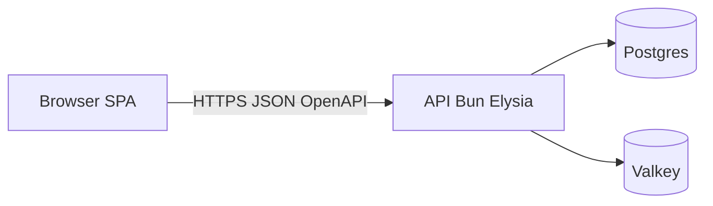

import PageIntro from "../../../components/docs-kit/PageIntro";
import SignalGrid from "../../../components/docs-kit/SignalGrid";
import FeatureGrid from "../../../components/docs-kit/FeatureGrid";

<PageIntro
  eyebrow="Layer boundaries"
  actions={[
    { label: "Why BoringStack", href: "/architecture/why-boringstack/" },
    { label: "Repository layout", href: "/architecture/three-repos/" },
  ]}
  facts={[
    { value: "3", label: "isolated layers" },
    { value: "OpenAPI", label: "type contract" },
    { value: "0", label: "runtime bleeding" },
  ]}
>
  BoringStack splits the runtime into three layers. Each layer has one job, owns its own deployment pipeline, and talks to the others through typed boundaries.
</PageIntro>

## What each layer delivers

<SignalGrid
  columns={3}
  items={[
    {
      label: "API",
      title: "api-template",
      body: "Owns security, databases, sessions, JWT cookies, background queues (BullMQ), email delivery, and the audit log trail.",
    },
    {
      label: "UI",
      title: "ui-template",
      body: "Owns the browser experience, local client states, i18n, queries, and routing via Vite and React 19.",
    },
    {
      label: "INFRA",
      title: "infra-template",
      body: "Owns Traefik TLS routing, VPS setups via OpenTofu, container provisioning, backups, and metrics overlays.",
    },
  ]}
/>

## How the layers connect

Left to right: a browser SPA calls the Bun + Elysia API over HTTPS using a typed OpenAPI contract; the API alone talks to Postgres for durable state and to Valkey for cache and queue work. No browser-to-database path exists.

The API publishes OpenAPI at `/swagger/json`. The UI runs `pnpm generate:api` to refresh `schema.d.ts`. `openapi-fetch` rejects invalid paths and bodies at compile time. See [OpenAPI client](/ui/openapi-client/) and [Repository layout](/architecture/three-repos/) for wiring.

In production, Traefik serves the SPA and API on one apex host (`/` and `/api/*`). That simplifies TLS and cookies. The repositories and Docker images stay separate.

## What you gain

<FeatureGrid
  columns={2}
  items={[
    {
      eyebrow: "independency",
      title: "Independent Deploys",
      body: "Change the UI codebase without rebuilding or redeploying the API image. Tweak styling or text with absolute isolation.",
    },
    {
      eyebrow: "fast-feedback",
      title: "Optimized Runtimes",
      body: "Vite + React keep local UI feedback instant, while Elysia + Bun keep API endpoints and queue processing fast.",
    },
    {
      eyebrow: "security",
      title: "Hardened Boundaries",
      body: "Auth, database access, and environment variables stay locked in the API container. No credentials ever bleed to the browser.",
    },
    {
      eyebrow: "focus",
      title: "Focused Workspaces",
      body: "Load only the repository you are actively working on. Teammates and agents stay bounded by their specific layer rules.",
    },
  ]}
/>

## Related

- [Why BoringStack](/architecture/why-boringstack/)
- [Repository layout](/architecture/three-repos/)
- [Background work](/architecture/background-work/)

