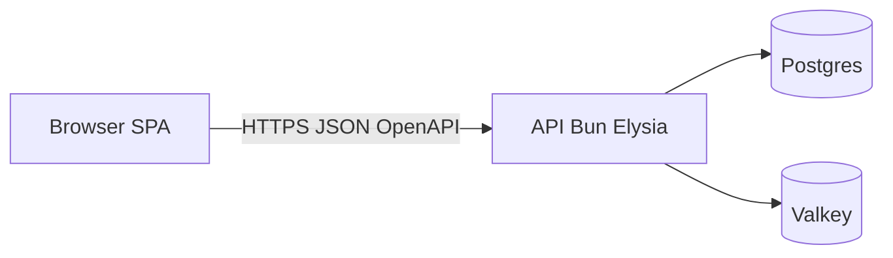

BoringStack splits the runtime into three layers. Each layer has one job, owns its own deployment pipeline, and talks to the others through typed boundaries.

## What each layer delivers

- **API (apps/api).** Owns security, databases, sessions, JWT cookies, background queues (BullMQ), email delivery, and the audit log trail.
- **UI (apps/ui).** Owns the browser experience, local client states, i18n, queries, and routing via Vite and React 19.
- **Infra (infra-template).** Owns Traefik TLS routing, VPS setups via OpenTofu, container provisioning, backups, and metrics overlays.

## How the layers connect

Left to right: a browser SPA calls the Bun + Elysia API over HTTPS using a typed OpenAPI contract; the API alone talks to Postgres for durable state and to Valkey for cache and queue work. No browser-to-database path exists.

The API publishes OpenAPI at `/swagger/json`. The UI runs `bun run generate:api` to refresh `schema.d.ts`. `openapi-fetch` rejects invalid paths and bodies at compile time. See [OpenAPI client](/ui/openapi-client/) and [Repository layout](/architecture/monorepo-layout/) for wiring.

In production, Traefik serves the SPA and API on one apex host (`/` and `/api/*`). That simplifies TLS and cookies. The app workspaces stay isolated, and the Docker images stay separate.

## What you gain

- **Independent Deploys.** Change the UI codebase without rebuilding or redeploying the API image. Tweak styling or text with absolute isolation.
- **Optimized Runtimes.** Vite + React keep local UI feedback instant, while Elysia + Bun keep API endpoints and queue processing fast.
- **Hardened Boundaries.** Auth, database access, and environment variables stay locked in the API container. No credentials ever bleed to the browser.
- **Focused Workspaces.** Load only the repository you are actively working on. Teammates and agents stay bounded by their specific layer rules.

## Related

- [Why BoringStack](/architecture/why-boringstack/)
- [Repository layout](/architecture/monorepo-layout/)
- [Background work](/architecture/background-work/)
