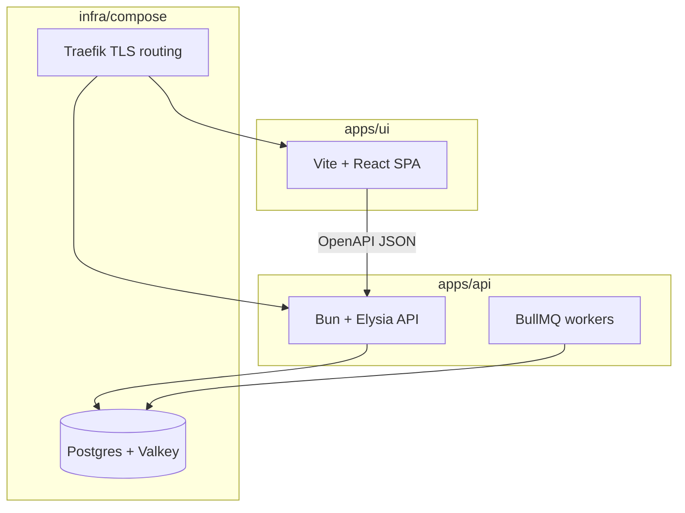

import CostCalculator from "../../../components/landing/CostCalculator.tsx";
import DocCallout from "../../../components/DocCallout.tsx";
import FeatureGrid from "../../../components/docs-kit/FeatureGrid";
import PageIntro from "../../../components/docs-kit/PageIntro";
import SignalGrid from "../../../components/docs-kit/SignalGrid";

<PageIntro
  eyebrow="Architecture"
  actions={[
    { label: "Quickstart", href: "/quickstart/" },
    { label: "Lint contract", href: "/architecture/lint-as-contract/" },
  ]}
  facts={[
    { value: "auth", label: "sessions, OAuth, verification" },
    { value: "ops", label: "deploys, logs, backups" },
    { value: "lint", label: "ESLint plugins + validate" },
  ]}
>
  The MIT templates compose the full stack: apps/api (Bun, Elysia, Drizzle),
  apps/ui (Vite, React, generated OpenAPI client), infra/compose
  (Postgres, Valkey, Traefik), and optional infra/bootstrap for VPS bootstrap.
  Auth, billing, queues, email, env validation, and deploy scripts are wired and documented;
  custom ESLint plugins enforce folder and contract shape in CI.
</PageIntro>

<SignalGrid
  columns={3}
  items={[
    {
      label: "First clone",
      title: "Accounts, API, UI, and Compose boot together.",
      body: "The first clone includes multi-tenant schema, Stripe webhooks, BullMQ on Valkey, Mailpit overlay, and compose/dev.sh for local Postgres + api-dev + ui-dev.",
    },
    {
      label: "OpenAPI",
      title: "bun run generate:api fails on schema drift.",
      body: "TypeBox routes emit /openapi.json; apps/ui regenerates src/lib/api/schema.d.ts. Drift fails typecheck before review.",
    },
    {
      label: "Lint",
      title: "validate is the merge gate.",
      body: "Custom @boring-stack-pkg/eslint-plugin-* rules encode route, service, env, and queue layout. AGENTS.md states intent; ESLint enforces it.",
    },
  ]}
/>

## Fit check

| BoringStack is a good fit if...                                                                         | It is probably the wrong fit if...                                                              |
| ------------------------------------------------------------------------------------------------------- | ----------------------------------------------------------------------------------------------- |
| You need accounts, auth, billing, email, and background jobs with Postgres + Valkey on your own VPS. | You only need a static site or a no-code prototype with no custom backend.                     |
| You want Postgres, Valkey, Traefik, and Docker Compose under your control.                   | You want a serverless-first Vercel/Netlify path where the platform owns runtime decisions. |
| You want API and UI as separate deployable apps with an OpenAPI contract between them.                             | You prefer a single full-stack framework with one app boundary.      |
| You want ESLint rules and validate CI to enforce architecture, including agent edits.       | You rely on conventions, README prose, and review alone.          |
| You want Compose on one VPS now, with an optional path to managed Postgres or Kubernetes later.        | You need Kubernetes, multi-region, or managed-everything infrastructure on day one.             |

## Problems it solves

<FeatureGrid
  columns={3}
  items={[
    {
      eyebrow: "apps/api",
      title: "Auth, queues, and billing hooks in src/api/.",
      body: "Auth, sessions, OAuth, email, env validation, audit log, billing hooks, and queues are wired and documented.",
    },
    {
      eyebrow: "contract",
      title: "OpenAPI at /swagger/json.",
      body: "OpenAPI at /swagger/json feeds the generated UI client; contract drift fails typecheck instead of shipping.",
      href: "/ui/openapi-client/",
    },
    {
      eyebrow: "lint",
      title: "Custom ESLint plugins in validate.",
      body: "Custom ESLint plugins encode route, service, env, and queue shape. validate is the merge gate.",
      href: "/architecture/lint-as-contract/",
    },
    {
      eyebrow: "infra",
      title: "compose/prod.sh and Traefik TLS.",
      body: "Compose, Traefik TLS, optional OpenTofu, observability, logs, and backups already have a home.",
      href: "/topics/deployment/",
    },
    {
      eyebrow: "queues",
      title: "BullMQ workers on Valkey.",
      body: "Notification events, dispatch jobs, email, and queues live in the API instead of ad-hoc frontend retries.",
      href: "/architecture/background-work/",
    },
    {
      eyebrow: "cost",
      title: "Postgres + Valkey on one VPS.",
      body: "Postgres, Valkey, workers, and web traffic can start on one capable VPS before you buy managed services.",
    },
  ]}
/>

## What “boring” means

The name is deliberate. Boring means proven primitives wired with explicit boundaries.

Postgres, HTTP APIs, browsers, Docker Compose, TLS, Redis-protocol queues: pieces with long production track records. They are linked in a layout you can operate: compose/dev.sh locally, compose/prod.sh on a VPS, OpenTofu optional for first boot.

The inventory of choices is on [Stack at a glance](/architecture/stack/). This page explains repo boundaries and default trade-offs.

## COGS-first by default

Many starters defer infra cost until traffic grows. BoringStack defaults to self-hosted Postgres, Valkey, and Traefik so monthly COGS stays tied to VPS size, not platform usage meters.

The core runtime is open source and self-hostable:

- Data plane: Postgres + Valkey.
- Edge and deploy: Docker Compose + Traefik on a VPS.
- Background work: BullMQ on Valkey.
- Observability: Prometheus, Grafana, Loki, Promtail, and Alertmanager as an opt-in overlay.
- Error tracking: hosted Sentry if you want it, self-hosted GlitchTip if margin matters.
- Email development: Mailpit locally; Cloudflare Email, SMTP, Resend, or SendGrid in production.
- Provisioning: OpenTofu instead of click-by-click cloud setup.

That does not mean "never use SaaS." Stripe, Cloudflare, Sentry, Resend, SendGrid, Neon, Supabase, and other managed services can all make sense. BoringStack does not force your core application onto a platform meter before you have revenue. You can start nearly free on one capable VPS, then buy managed services only where the trade-off is worth it.

<CostCalculator client:load />

## Compared with common alternatives

| Decision point            | BoringStack                                           | Typical Vercel/serverless starter              | Hosted backend starter                         | One-off SaaS boilerplate                |
| ------------------------- | ----------------------------------------------------- | ---------------------------------------------- | ---------------------------------------------- | --------------------------------------- |
| Deployment path           | Single-host VPS first; optional OpenTofu bootstrap    | Platform-first; VPS path is usually DIY        | Hosted service first                           | Varies by vendor                        |
| Core data plane           | Postgres + Valkey under your control                  | Usually external services                      | Hosted database/auth/storage                   | Varies                                  |
| COGS posture              | Open-source core; one VPS can carry the whole app     | Usage-based platform bill grows with traffic   | Vendor pricing becomes part of the app shape   | Varies                                  |
| API/UI contract           | OpenAPI generated client                              | Often framework-coupled or hand-rolled         | SDK/client generated by provider               | Varies                                  |
| Auth/billing/queues/email | Wired as product infrastructure                       | Mostly app-specific assembly                   | Auth often built in; queues/billing/email vary | Often included, quality varies          |
| Architecture enforcement  | Custom lint plugins and `validate` gates              | Mostly conventions                             | Mostly provider boundaries                     | Usually prose and examples              |
| Best for                  | Teams that self-host Postgres/Valkey and want OpenAPI + lint gates | Fast frontend-heavy apps on a managed platform | Apps that fit the provider SDK and hosted DB model               | Buying a finished opinionated app shell |

The choice is not moral. BoringStack is intentionally biased toward ownership, explicit boundaries, low recurring infra cost, and code that remains understandable after many human and agent edits.

## The three layers

Three stacked layers: the apps/ui SPA sits above the apps/api (HTTP server plus BullMQ workers), which sits on the infra layer (Traefik routing in front of Postgres and Valkey). The SPA reaches the API over a typed OpenAPI contract; both the API and the workers read and write the same data plane.

### API

Security, validation, persistence, background jobs, secrets, audit trail. The system of record lives here.

### UI

Rendering, interaction, client state, i18n. Vite keeps local feedback fast. The UI calls the API through a generated, typed client.

### Infra

TLS, routing, databases, queue store, optional metrics and logs. In production, same-origin path routing (`/` for the SPA, `/api/*` for the API) keeps browser security simple. The code boundaries stay separate.

[Separation of concerns](/architecture/separation-of-concerns/) goes deeper on what each layer delivers and how releases stay independent.

## Judgment baked in

The templates come from codebases that have been in production for many years. File layout, feature anatomy, env discipline, queue patterns, and deploy defaults are decisions you would otherwise make again on every project. You extend what ships. You do not reinvent the spine.

## Lint as load-bearing architecture

`AGENTS.md`, `CLAUDE.md`, and `AGENT_CONTRACT.md` explain intent. Custom ESLint plugins enforce it. Machine-checked rules survive refactors, new teammates, and agent-generated diffs. They cover where routes live, how env is read, and how queues are shaped. When lint fails, the fix is specific.

Architecture lives in tooling. Prose is context. Read [Lint as the contract](/architecture/lint-as-contract/).

<DocCallout
  variant="tip"
  title="Working in one repo at a time"
  eyebrow="Repo layout"
>
  The monorepo keeps each layer in a focused workspace. Edit a route, a page, or a
  compose overlay without pretending the layers are the same application.
</DocCallout>

## Room to grow

Email, notifications, and other background work already have a home in the API. When volume, team boundaries, or compliance need a dedicated process, you extract a piece and keep the same job contracts. See [Background work](/architecture/background-work/).

## Related

- [Quickstart](/quickstart/)
- [Repository layout](/architecture/monorepo-layout/)
- [Lint as the contract](/architecture/lint-as-contract/)
