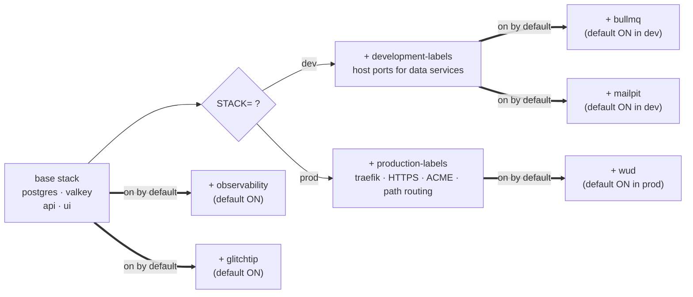

import { Aside } from "@astrojs/starlight/components";

The default stack runs Postgres, Valkey, your apps, plus observability (Prometheus + Grafana + Loki + Promtail) and GlitchTip error tracking. In dev you also get Bull-board (the BullMQ dashboard) and Mailpit (local SMTP catcher) on by default, so every queue job and every transactional email is inspectable from the first boot. WUD (the image-update daemon that powers `git push` deploys) is on by default in prod and off in dev. Traefik runs in prod only; dev uses Vite's proxy. Composition happens in `dev.sh`, which reads `STACK=` and `WITH_*` env vars to assemble the docker-compose command.

## How a stack is assembled



The result is a single `docker compose -f ... -f ... --profile ...` command. `dev.sh` is plain bash; you can read exactly what gets merged.

## Design choices

- **Observability, GlitchTip, and WUD default ON in prod.** Observability and GlitchTip default ON in dev too, so you build muscle memory before prod day-one; WUD only makes sense once you have a registry to pull from, so it's prod-only. Together they cover the three things a `push to main` deploy needs: dashboards, error visibility, and the daemon that actually pulls and recreates the container. Defaults that hide any of these contradict the "deploy and it just works" promise.
- **Dev gets everything on, even the dev-only tools.** Bull-board and Mailpit default ON in dev because the goal is to exercise every feature locally before shipping. Bull-board has no auth (the env validator rejects it in prod), so it stays dev-only by design. Mailpit catches mail locally so dev never sends to real addresses.
- **Separate dev / prod overlays for labels.** HTTPS, ACME, and security headers live in prod-only files.
- **Profiles plus overlay files (not one giant file).** `docker compose config` stays readable; overlays can be skipped cleanly.

## On by default

These run unless you explicitly turn them off. They're the surface a `push to main` deploy actually needs.

| Env var | Services | Default | Off switch |
|---|---|---|---|
| `WITH_OBSERVABILITY` | Prometheus, Grafana, Loki, Promtail, Alertmanager, postgres-exporter, node-exporter | ON (dev + prod) | `WITH_OBSERVABILITY=0` |
| `WITH_GLITCHTIP` | Sentry-compatible error tracking | ON (dev + prod) | `WITH_GLITCHTIP=0` |
| `WITH_WUD` | What's Up Docker image-update daemon | ON in prod, OFF in dev | `WITH_WUD=0 STACK=prod ./scripts/compose-up.sh` |
| `WITH_BULLMQ` | Bull-board queue UI | ON in dev only | `WITH_BULLMQ=0 ./dev.sh up -d` |
| `WITH_MAILPIT` | Local SMTP catcher (`:8025` web UI) | ON in dev only | `WITH_MAILPIT=0 ./dev.sh up -d` |

WUD is what makes `git push origin main` deploy. It polls GHCR, pulls new app image tags, and recreates the container. See [Image updates](/runbooks/image-updates/) for the hybrid policy (app images auto-deploy, base images notify-only).

Bull-board and Mailpit are dev-only by design: Bull-board has no authentication (the env validator rejects `WITH_BULLMQ=1` in prod), and Mailpit catches mail locally so dev never sends to real addresses. Having both on in dev means every BullMQ job and every transactional email is inspectable from the first boot.

## Opt-in

There are no opt-in overlays in the current stack; everything you might want to enable in dev is on by default. Add an overlay file under `infra/compose/compose/docker-compose.<name>.yml` and a `WITH_<NAME>=1` clause in `dev.sh` to introduce one (see [Adding an overlay](#adding-an-overlay) below).

Minimal stack: `WITH_OBSERVABILITY=0 WITH_GLITCHTIP=0 WITH_BULLMQ=0 WITH_MAILPIT=0 ./scripts/compose-up.sh` boots just Postgres + Valkey + apps. Useful on a constrained host or when you're debugging the base stack itself.

<Aside type="caution" title="Security: BullMQ in production">
Never run WITH_BULLMQ=1 in a public production environment. The BullMQ dashboard has no authentication.
</Aside>

## STACK=dev vs STACK=prod

- **API + UI.** Dev: bind-mounted source, hot reload. Prod: pre-built images pulled from GHCR.
- **Traefik.** Dev: not started; Vite dev-server proxies `/api/*` directly. Prod: terminates TLS, path-routes `/api/*` and `/health` to the api container, everything else to ui.
- **Host(s).** Dev: `http://localhost:7331`. Prod: `https://${PUBLIC_UI_HOST}` (one domain, same-origin).
- **TLS.** Dev: none. Prod: Let's Encrypt ACME via Traefik.
- **Data ports.** Dev: Postgres on `:5432`, Valkey on `:6379` published to host. Prod: internal-only, not published.

`STACK=prod` adds Traefik and path-routing on top of the same data plane (Postgres + Valkey). No CORS in either profile.

## Reading what's running

Check the merged compose config:

```bash
STACK=dev ./dev.sh config | less
```

Check service status:

```bash
./dev.sh ps
```

`./dev.sh` forwards every argument to `docker compose` with the merged file list, so any standard compose command works: `logs`, `exec`, `top`, `stats`, etc.

## Adding an overlay

1. Write a new `docker-compose.<name>.yml` with the additional services.
2. Add a `WITH_<NAME>=1` clause in `dev.sh` mirroring the existing ones.
3. Document the flag in `compose/.env.example`.
4. Update the [Commands cheatsheet](/reference/commands/).

Overlays are independent files, so you can ship one without touching the base.

## Source

[`compose/dev.sh`](https://github.com/boringstack-xyz/boringstack/blob/main/infra/compose/compose/dev.sh); the orchestrator. [`compose/docker-compose.*.yml`](https://github.com/boringstack-xyz/boringstack/tree/main/infra/compose/compose); the base + overlays.

## Related

- [Infra overview](/infra/overview/); service inventory.
- [Resource limits](/infra/resource-limits/); sizing per service.
- [Commands cheatsheet](/reference/commands/); every flag in one place.
