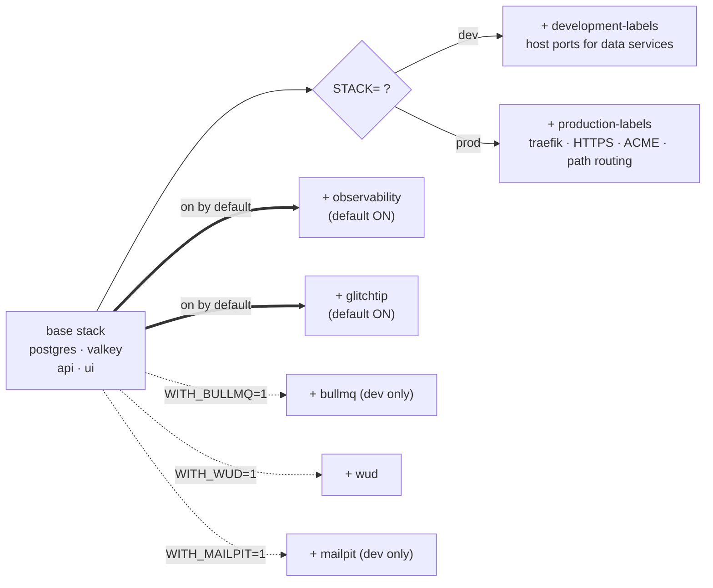

import PageIntro from "../../../components/docs-kit/PageIntro";
import CommandRun from "../../../components/docs-kit/CommandRun";
import DocCallout from "../../../components/DocCallout.tsx";
import FaqGroup from "../../../components/FaqGroup.tsx";
import FaqItem from "../../../components/FaqItem.tsx";

<PageIntro
  eyebrow="Compose overlays"
  actions={[
    { label: "Design Choices", href: "#design-choices" },
    { label: "Overlay Matrix", href: "#the-full-overlay-matrix" },
  ]}
  facts={[
    { value: "1", label: "base compose stack" },
    { value: "2", label: "default-on overlays" },
    { value: "3", label: "opt-in overlays" },
  ]}
>
  The default stack runs Postgres, Valkey, your apps, **plus the full
  observability stack (Prometheus + Grafana + Loki + exporters) and GlitchTip
  error tracking** — so you build muscle memory for the dashboards in dev
  before you ever face them in prod. Niche overlays (BullMQ dashboard, WUD,
  Mailpit) stay opt-in. Traefik runs in the prod profile only; dev uses Vite's
  dev-server proxy for same-origin DX. Composition happens in `dev.sh`, which
  assembles the `docker-compose` invocation based on env vars.
</PageIntro>

## How a stack is assembled

The result is a single `docker compose -f ... -f ... --profile ...` command. `dev.sh` is plain bash; you can read exactly what gets merged.

## Design choices

<FaqGroup>
  <FaqItem title="Observability + GlitchTip default ON" open>
    The whole point of a "production stack" claim is that the operator has seen
    the dashboards and triaged real errors before prod day-one. Defaults that
    hide observability contradict the marketing. Opt out with
    `WITH_OBSERVABILITY=0` / `WITH_GLITCHTIP=0` if you genuinely don't want
    them.
  </FaqItem>
  <FaqItem title="Niche overlays stay opt-in">
    Bull-board (no auth), WUD (image-update detection), and Mailpit (local
    SMTP) are tools you turn on for a specific reason, not surface area
    everyone needs.
  </FaqItem>
  <FaqItem title="Separate dev / prod overlays for labels">
    HTTPS, ACME, and security headers live in prod-only files.
  </FaqItem>
  <FaqItem title="WITH_BULLMQ only valid in dev">
    Bull-board has no auth and no place in production.
  </FaqItem>
  <FaqItem title="Profiles + overlay files (not one giant file)">
    `docker compose config` stays readable; overlays can be skipped cleanly.
  </FaqItem>
</FaqGroup>

## The full overlay matrix

<FaqGroup>
  <FaqItem title="Observability (default ON)" open>
    Prometheus, Grafana, Loki, Promtail, Alertmanager, postgres-exporter,
    node-exporter. Grafana on host port 3010. Disable with `WITH_OBSERVABILITY=0`.
  </FaqItem>
  <FaqItem title="GlitchTip (default ON)">
    Sentry-compatible error tracking; reuses base Postgres (separate
    `glitchtip` DB) + Valkey (DB 1). In dev, `dev.sh` seeds a dev-only secret
    so first clone boots without setup. In prod, requires
    `GLITCHTIP_SECRET_KEY` / `GLITCHTIP_PUBLIC_HOST` /
    `GLITCHTIP_BASIC_AUTH_USERS`. Disable with `WITH_GLITCHTIP=0`.
  </FaqItem>
  <FaqItem title="WITH_BULLMQ=1">
    Bull-board UI at `bullmq.localhost`; dev only.
  </FaqItem>
  <FaqItem title="WITH_WUD=1">
    WUD watches container images. Default ON in prod, OFF in dev. In prod, app
    images (`api`, `ui`) are auto-deployed while base images remain
    notify-only; Discord/Slack webhooks are optional.
  </FaqItem>
  <FaqItem title="WITH_MAILPIT=1">
    Mailpit SMTP catcher at `:8025`; dev only.
  </FaqItem>
</FaqGroup>

Opt-out combinations: `WITH_OBSERVABILITY=0 WITH_GLITCHTIP=0 ./scripts/compose-up.sh` boots a minimal stack with just Postgres + Valkey + your apps (e.g. on a constrained laptop).

<DocCallout
  variant="caution"
  title="Production security constraint"
  eyebrow="Overlay safety"
>
  Do **NOT** run the `WITH_BULLMQ` overlay in a public production environment.
  The BullMQ dashboard has no auth; exposing it puts your queues on the public
  web.
</DocCallout>

## STACK=dev vs STACK=prod

<FaqGroup>
  <FaqItem title="API + UI" open>
    **dev:** bind-mounted source, hot reload. **prod:** pre-built images pulled
    from GHCR.
  </FaqItem>
  <FaqItem title="Traefik">
    **dev:** not started; Vite dev-server proxies `/api/*` directly. **prod:**
    started; terminates TLS, path-routes `/api/*` and `/health` to api,
    everything else to ui.
  </FaqItem>
  <FaqItem title="Host(s)">
    **dev:** `http://localhost:7331`. **prod:** `https://${PUBLIC_UI_HOST}` (one
    domain, same-origin).
  </FaqItem>
  <FaqItem title="TLS">
    **dev:** none. **prod:** Let's Encrypt ACME via Traefik.
  </FaqItem>
  <FaqItem title="Data ports">
    **dev:** Postgres on `:5432`, Valkey on `:6379` published to host. **prod:**
    internal-only, not published.
  </FaqItem>
</FaqGroup>

`STACK=prod` adds Traefik and path-routing on top of the same data plane (Postgres + Valkey). No CORS in either profile.

## Reading what's running

<CommandRun
  title="Read Live Config & Status"
  caption="check composed Docker configuration or service status"
  command={[
    "STACK=dev ./dev.sh config | less",
    "./dev.sh ps",
  ]}
  output={[
    {
      tone: "info",
      text: "docker-compose.yml merged with docker-compose.observability.yml",
    },
    { tone: "ok", text: "postgres-dev is up on 5432" },
    { tone: "ok", text: "valkey-dev is up on 6379" },
    { tone: "ok", text: "api-dev is up on 7330" },
    { tone: "ok", text: "ui-dev is up on 7331" },
  ]}
/>

`./dev.sh` forwards every argument to `docker compose` with the merged file list; so any compose command works (`logs`, `exec`, `top`, etc.).

## Adding an overlay

1. Write a new `docker-compose.<name>.yml` with the additional services.
2. Add a `WITH_<NAME>=1` clause in `dev.sh` mirroring the existing ones.
3. Document the flag in `compose/.env.example`.
4. Update the [Commands cheatsheet](/reference/commands/).

Overlays are independent files, so you can ship one without touching the base.

## Source

[`compose/dev.sh`](https://github.com/boringstack-xyz/boringstack/blob/main/infra/compose/compose/dev.sh); the orchestrator. [`compose/docker-compose.*.yml`](https://github.com/boringstack-xyz/boringstack/tree/main/infra/compose/compose); the base + overlays.

## Related

- [Infra overview](/infra/overview/); service inventory.
- [Resource limits](/infra/resource-limits/); sizing per service.
- [Commands cheatsheet](/reference/commands/); every flag in one place.
