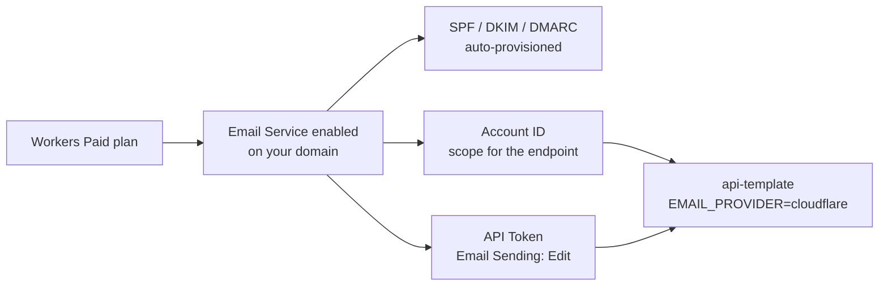

import PageIntro from "../../../components/docs-kit/PageIntro";
import CommandRun from "../../../components/docs-kit/CommandRun";
import DocCallout from "../../../components/DocCallout.tsx";
import { Steps } from "@astrojs/starlight/components";

<PageIntro
  eyebrow="Cloudflare email"
  actions={[
    { label: "Prerequisites", href: "#prerequisites" },
    { label: "Step-by-Step Setup", href: "#setup" },
  ]}
  facts={[
    { value: "Paid", label: "Workers plan needed" },
    { value: "Zero", label: "DNS hand-edits" },
    { value: "Bearer", label: "auth header" },
  ]}
>
  From a fresh Cloudflare account to sending mail via Cloudflare Email Service.
  One-time setup; later rotations are step 4 only.
</PageIntro>

For _why_ Cloudflare is the default, see [Cloudflare Email Service](/topics/cloudflare-email/).

## Prerequisites

- A Cloudflare account that owns (or proxies) the domain you'll send from.
- Admin access to that account.
- A real email address for the API token's audit trail.

## How the pieces fit

  Cloudflare Email setup chain: a Workers Paid plan unlocks the Email Service;
  enabling it on your domain auto-provisions SPF, DKIM, and DMARC; from there
  you capture the Account ID (used in the endpoint URL) and a scoped API token
  (used in the bearer header). The api-template reads both via{" "}
  <code>EMAIL_PROVIDER=cloudflare</code>.

You need both the account ID (in the endpoint URL) and the API token (in the bearer header). Lose either and sends fail.

## Setup

<Steps>

1. Enable Workers Paid. Cloudflare dashboard → Workers & Pages → Plans → upgrade to Workers Paid. Email Service is bundled into this plan; there's no separate billing line. ([Current pricing](https://www.cloudflare.com/plans/developer-platform/).)

2. Enable Email Service on your domain. Dashboard → Email → Email Routing or Email Sending → enable for the domain. Cloudflare auto-provisions the required DNS records (SPF, DKIM, DMARC) because the zone is on Cloudflare. That removes the usual hand-edited DNS step, where most transactional-email setups go wrong. Wait for the dashboard to show all three records as Active (usually under a minute).

3. Capture the Account ID. Dashboard → any domain → right sidebar → "Account ID". 32 hex characters. Drop it into `compose/.env`:

   <CommandRun
     title="Configure Account ID"
     caption="inject the account ID into compose/.env"
     command={[
       "echo 'CLOUDFLARE_ACCOUNT_ID=your_32_hex_account_id' >> compose/.env",
     ]}
   />

4. Scope an API token. Dashboard → My Profile → API Tokens → Create Token → Custom Token with:
   - Permissions: `Email Sending: Edit` only, scoped to this account.
   - Account resources: include the specific account.
   - TTL: indefinite for now; rotate quarterly or after any staff change.

   Copy the token (you can't view it again). Drop it into `compose/.env`:

   <CommandRun
     title="Configure API Token"
     caption="inject the scoped API token into compose/.env"
     command={[
       "echo 'CLOUDFLARE_EMAIL_API_TOKEN=your_scoped_api_token' >> compose/.env",
     ]}
   />

5. Set the sender + provider.

   <CommandRun
     title="Configure Outbound Sender & Provider"
     caption="configure the email provider and verified sender domain"
     command={[
       "echo 'EMAIL_PROVIDER=cloudflare' >> compose/.env",
       "echo 'EMAIL_FROM=noreply@yourdomain.com' >> compose/.env",
     ]}
   />

   `EMAIL_FROM` must be on a domain you've enabled Email Service for. Sending from a domain that isn't enabled returns a 403.

6. Smoke-test.

   <CommandRun
     title="Smoke-Test Outbound Delivery"
     caption="restart the API container and monitor sending telemetry"
     command={["./dev.sh restart api", "./dev.sh logs -f api | grep email"]}
     output={[
       { tone: "ok", text: "api restarted successfully" },
       { tone: "info", text: "Streaming api logs matching 'email'..." },
       {
         tone: "ok",
         text: 'event="email_sent" provider="cloudflare" to="user@example.com"',
       },
     ]}
   />

   Success looks like `event="email_sent" provider="cloudflare"`. Failure logs the response body; usually an unverified-domain error or a permission-scope mistake.

</Steps>

<DocCallout
  eyebrow="Verification gotcha"
  title="New-Account Verified Senders lock"
  variant="caution"
>
  Brand-new Cloudflare accounts have a sender-verification lock: you can only
  send to addresses you've verified, until the account is approved for
  unrestricted sending. The check is usually automatic within a few days for
  legitimate use. If you need to ship before then: - **Verify recipient
  addresses:** In the dashboard under Email → verify recipient. - **Fast-track
  approval:** Contact Cloudflare support explaining your use case.
</DocCallout>

## Validating SPF / DKIM / DMARC

Once the dashboard shows the records active, verify them from your terminal:

<CommandRun
  title="Validate DNS Records"
  caption="query DNS to confirm SPF, DKIM, and DMARC TXT entries"
  command={[
    "dig +short TXT yourdomain.com | grep 'v=spf1'",
    "dig +short TXT cf-xxxx._domainkey.yourdomain.com",
    "dig +short TXT _dmarc.yourdomain.com",
  ]}
  output={[
    { tone: "ok", text: '"v=spf1 include:cloudflare.net ~all"' },
    {
      tone: "ok",
      text: '"v=DKIM1; k=rsa; p=MIIBIjANBgkqhkiG9w0BAQEFAAOCAQ8AMIIBCgKCAQ..."',
    },
    { tone: "ok", text: '"v=DMARC1; p=quarantine; pct=100;"' },
  ]}
/>

All three should return a value. If any are empty, the Cloudflare auto-provision didn't complete; re-toggle Email Service in the dashboard.

## Rotation

Every quarter, or after any staff change:

1. Create a new API token with the same scope.
2. Update `CLOUDFLARE_EMAIL_API_TOKEN` in `compose/.env`.
3. `./dev.sh restart api`.
4. Confirm a send works with the new token.
5. Revoke the old token in the dashboard.

## Switching to Resend / SendGrid

The api-template is provider-agnostic. Swapping is one env var:

<CommandRun
  title="Switch Provider to Resend"
  caption="change the provider flag and provide the vendor API key"
  command={[
    "echo 'EMAIL_PROVIDER=resend' >> compose/.env",
    "echo 'RESEND_API_KEY=re_your_resend_api_key' >> compose/.env",
  ]}
/>

The env validator refuses to boot in production if the matching key is missing. See [Email](/api/email/) and [Cloudflare Email Service](/topics/cloudflare-email/) for the abstraction.

## Source

- Provider implementation: [`src/lib/email/providers/cloudflare.ts`](https://github.com/boringstack-xyz/api-template/blob/main/src/lib/email/providers/cloudflare.ts) in the api-template.
- Cloudflare's own docs: [developers.cloudflare.com/email-service](https://developers.cloudflare.com/email-service/).

## Related

- [Cloudflare Email Service](/topics/cloudflare-email/); why it's the default and how it compares.
- [Email](/api/email/); the pluggable provider abstraction behind every backend.
- [Email in development](/topics/email-in-dev/); Mailpit when you don't want to hit a real provider.
- [Env validator](/api/env-validator/); the boot-time check that catches a missing token before prod.
