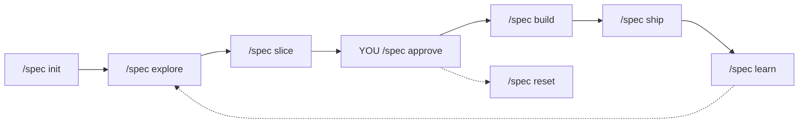

import CommandRun from "../../../components/docs-kit/CommandRun";
import DataMatrix from "../../../components/docs-kit/DataMatrix";
import PageIntro from "../../../components/docs-kit/PageIntro";
import SignalGrid from "../../../components/docs-kit/SignalGrid";

<PageIntro
  eyebrow="Agent workflow"
  actions={[
    { label: "Turn it on", href: "#turn-it-on" },
    { label: "The five verbs", href: "#the-five-verbs" },
  ]}
  facts={[
    { value: "1 file", label: ".specs/next.md" },
    { value: "1 gate", label: "tools/spec-loop/hooks/gate.ts" },
    { value: "opt-in", label: "bun run spec:init" },
  ]}
>
  Solo Spec Loop is BoringStack's discipline for working with an agent. One
  living spec, one explicit approval, one pre-tool-use hook that blocks source
  writes until you approve the slice. Vendored at `tools/spec-loop/`; wired with
  one command.
</PageIntro>

## Why

The failure mode of every coding agent is the same: you ask for a
small thing, get a 12-file refactor, an ADR forest, and 800 lines
that don't quite do what you wanted. Reviewing is slower than writing
it yourself.

The spec loop forces a checkpoint. The agent **cannot** write source
files until you've sliced the problem small enough to fit in
`.specs/next.md` and put `status: approved` in its frontmatter. The
gate is enforced by a PreToolUse hook — not a guideline the agent can
ignore.

It's opt-in. Skip `bun run spec:init` and your fork behaves exactly
like before; nothing in the template forces this workflow on you.

## Turn it on

<CommandRun
  title="One command, four files"
  caption="from repo root"
  command={["bun run spec:init"]}
  output={[
    { tone: "ok", text: "wrote .specs/next.md" },
    { tone: "ok", text: "wrote .claude/commands/spec.md" },
    { tone: "ok", text: "wrote .claude/settings.json" },
    { tone: "ok", text: "wrote .cursor/hooks.json" },
  ]}
/>

What each file does:

<DataMatrix
  caption="Wired by bun run spec:init"
  columns={["File", "Role", "Purpose"]}
  rows={[
    {
      cells: [
        ".specs/next.md",
        "The living spec",
        "Frontmatter (`status`, `slice`, `approved_at`) + Problem, Slice, Verification contract. One file per project; this is the only living spec in the loop.",
      ],
    },
    {
      cells: [
        ".claude/commands/spec.md",
        "Slash command",
        "Defines `/spec init`, `/spec explore`, `/spec slice`, `/spec approve`, `/spec build`, `/spec ship`, `/spec learn`, `/spec status`, `/spec reset`.",
      ],
    },
    {
      cells: [
        ".claude/settings.json",
        "Claude Code PreToolUse hook",
        "Runs `bun tools/spec-loop/hooks/gate.ts` before every `Write` / `Edit` / `MultiEdit`. Merges with existing settings; never clobbers.",
      ],
    },
    {
      cells: [
        ".cursor/hooks.json",
        "Cursor preToolUse hook",
        "Same gate, same TypeScript file. Cursor and Claude Code share one enforcement point.",
      ],
    },
  ]}
/>

Re-running `bun run spec:init` is idempotent: each file is skipped
with a one-line notice if it already exists. Pass `--force` to
overwrite.

## The five verbs

<SignalGrid
  columns={3}
  items={[
    {
      label: "explore",
      title: "Sketch the slice",
      body: "Agent reads enough repo context to avoid nonsense, then drafts Problem, Slice, Design decisions, and Verification contract in `.specs/next.md`. No source files touched. Asks at most 5 questions — only ones that change behavior.",
    },
    {
      label: "slice",
      title: "Sharpen + shrink",
      body: "Agent runs the spec-smell pass (vague, kitchen sink, lossy, immortal ticket, PRD-as-spec) and shrinks scope until the slice fits in ~90 lines and one focused session.",
    },
    {
      label: "approve",
      title: "You, not the agent",
      body: "Set `status: approved` in the frontmatter. Until you do this, the gate blocks source writes. The agent's `/spec approve` only fires if you've explicitly approved the slice's content; vibe-approval doesn't count.",
    },
    {
      label: "build",
      title: "Implement the approved slice",
      body: "Tests first (the Verification contract), then code. The agent will not expand beyond the slice; ambiguity stops it instead of triggering scope creep.",
    },
    {
      label: "ship",
      title: "Re-run the acceptance check",
      body: "Runs the runnable acceptance command from the Verification contract verbatim. Pass → ready to commit. Fail → stop and surface the output; nothing else changes.",
    },
    {
      label: "learn",
      title: "Update what reality taught you",
      body: "After ship, edit Build notes / Design decisions / Assumptions with discoveries. Tag late-breaking changes (requirement | design | wording) so the next slice doesn't repeat them.",
    },
  ]}
/>

## What the gate enforces

Reading `.specs/next.md` and emitting JSON `{decision: "approve" | "block"}`
on stdout, `tools/spec-loop/hooks/gate.ts` allows:

- **Non-source files always**: `.specs/`, `.claude/`, `.cursor/`,
  `docs/`, `README*`, `CHANGELOG*`, `CLAUDE.md`, `AGENTS.md`,
  `GEMINI.md`. Edit the spec without approving the spec.
- **Test files always**: anything matching `tests?/`, `__tests__/`,
  `e2e/`, `*.test.*`, `*.spec.*`. Write the failing test first.
- **Source files only when approved**: `.ts`, `.tsx`, `.js`, `.jsx`,
  and every other production extension are blocked unless
  `.specs/next.md` has `status: approved`.

The gate refuses to over-engineer too:

- **No `.specs/next.md` at all → silent allow.** Forks that don't want
  the loop pay nothing.
- **Spec > 140 lines → block.** Slice is too big; shrink the cut.
- **Approval must be on its own frontmatter line.** A `status: approved`
  inside body prose or a code fence does not flip the gate.

## How it composes with `add-full-feature` and `/build-feature`

The lifted root skill at `.claude/skills/add-full-feature.md` and the
per-app `/build-feature` skills both check `.specs/next.md` at
Checkpoint 1:

- **Approved spec present** → skill reads Problem / Slice / Design
  decisions / Verification contract and skips the interview.
- **Draft spec present** → skill stops and tells the user to run
  `/spec slice` and `/spec approve` first.
- **No spec at all** → skill falls through to the original interview.

So the workflows compose naturally: once the spec is approved, `/spec
build` dispatches to `add-full-feature` (cross-app), `apps/api`
`/build-feature`, or `apps/ui` `/build-feature` depending on what the
spec describes. You don't have to think about which skill to run.

## Acceptance contract idioms

Tight, runnable, outcome-oriented:

<DataMatrix
  caption="One-line acceptance commands you can drop into Verification contract"
  columns={["Slice shape", "Example", "Command"]}
  rows={[
    {
      cells: [
        "Pure unit logic",
        "New util in `apps/api/src/lib/<x>/`",
        "`cd apps/api && bun test src/lib/<x>`",
      ],
    },
    {
      cells: [
        "API endpoint",
        "New `*.routes.ts` + service",
        '`cd apps/api && bun test src/api/<x> --test-name-pattern "creates the resource"`',
      ],
    },
    {
      cells: [
        "UI feature",
        "New page + queries",
        "`cd apps/ui && bun test src/features/<x>`",
      ],
    },
    {
      cells: [
        "Contract change",
        "API schema affects UI types",
        "`bun run regen && bun run check` (from repo root)",
      ],
    },
    {
      cells: [
        "Full vertical slice",
        "Cross-app slice",
        "`bun run check:full` (heavy; use sparingly)",
      ],
    },
  ]}
/>

Keep one command in the acceptance check. Put regen / build-step
commands in **Build notes** or **Design decisions** when the slice
includes a contract change.

## When to skip the loop

The spec loop is opinionated and adds one approval step per slice.
Skip it when:

- The change is a one-line fix (typo, copy tweak, lint suppress) where
  even a 90-line spec is more ceremony than the fix is worth.
- You're exploring something throwaway in a feature branch you intend
  to delete.
- You're following an external recipe step-by-step and don't need to
  document intent.

For everything else — especially anything that touches auth, billing,
multi-tenant data, or cross-app contracts — the loop pays for itself
the first time it stops a "while you're in there" rewrite from
landing.

## Upstream

This is a vendored copy of [`agjs/solo-spec-loop`](https://github.com/agjs/solo-spec-loop)
(MIT). Updates flow in via `tools/spec-loop/UPSTREAM.md`'s sync
procedure. The tool itself is project-agnostic; the BoringStack
flavoring lives in this page and in the templates shipped under
`tools/spec-loop/templates/`.

## Related

- [Quickstart](/quickstart/) — Step 4 picks Path A or Path B.
- [First feature in 10 minutes](/skills/first-feature-tutorial/) — Path A walkthrough.
- [Skills overview](/skills/) — every agent-facing skill BoringStack ships.
