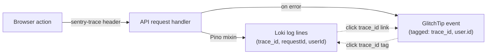
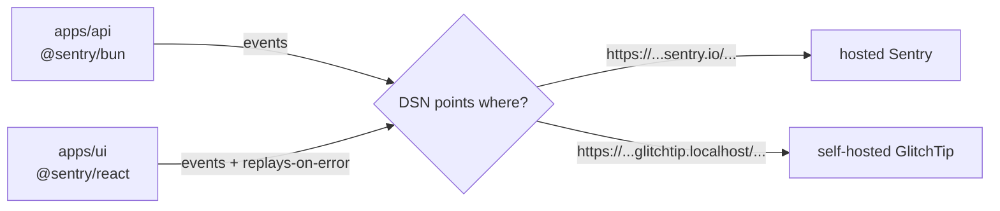

import { Aside } from "@astrojs/starlight/components";

Both `apps/api` and `apps/ui` ship Sentry SDKs configured for minimal overhead. The same SDK connects to two backends: self-hosted GlitchTip (on by default in the compose stack, Sentry-API-compatible, zero per-event cost) or hosted Sentry (if you'd rather pay for managed). The SDKs don't know which backend they talk to. Choosing between them is a one-env-var change.


## Correlation: GlitchTip, Loki, and requestId

Errors are useful only if you can quickly reach the context around them. The stack wires a single chain of IDs across browser, API, log store, and error tracker so any one surface takes you to the other three.



**What flows automatically:**

- `trace_id` and `span_id`: the UI's Sentry SDK adds `sentry-trace` and `traceparent` headers to every `/api/*` fetch via `browserTracingIntegration`. The API's Sentry init reads them. The Pino logger's mixin injects them on every log record. Promtail promotes them to Loki structured metadata.
- `userId`: the API's auth plugin calls `Sentry.setUser({id, email})` on every authenticated request. The Pino mixin reads `userId` from the Sentry scope and emits it on each log line. The UI's `SentryUserSync` provider mirrors the same call after login, MFA verify, account switch, or page reload (anywhere `useMe` resolves).
- `requestId`: a UUID assigned by the API's request-logger middleware, returned as the `x-request-id` header and present on every log line for that request.

**Where the click-through lives:**

- **Grafana to GlitchTip**: the "BoringStack API logs" dashboard defines clickable data links on `trace_id` and `userId` in the live log panel. Expand any log line, click the field to open GlitchTip filtered to that trace or user in a new tab. Dashboard variables `$glitchtip_url` and `$glitchtip_org` configure the target (defaults fit the bundled GlitchTip; edit once per environment).
- **Grafana to Grafana**: `requestId` link opens Explore with a Loki query pre-filtered to that request's lines.
- **GlitchTip to Grafana**: configure once in GlitchTip's project settings (UI, not code) with a `tags.trace_id` external link template pointing at Grafana Explore with `{compose_service="api-dev"} | json | trace_id="<value>"`. Each event detail then shows a "View logs" link.

## How it's wired



Both `apps/api` (@sentry/bun) and `apps/ui` (@sentry/react) emit events to the same Sentry-compatible wire protocol. The DSN env var picks the destination: a `sentry.io` hostname for hosted Sentry, or a `glitchtip.localhost` hostname for the self-hosted overlay. The SDKs don't know which backend they're talking to.

**API side:** Sentry initializes once at boot. If `SENTRY_DSN` is empty, init is a no-op. The shared `captureError` helper wires into unhandled-rejection and uncaught-exception handlers, so anything that escapes the request loop reaches the backend.

**UI side:** Sentry initializes once at app mount when `VITE_SENTRY_DSN` is set. Replays-on-error capture the error context. Full-session replays are off to avoid capturing video of every session.

Sentry transactions are off by default (`SENTRY_TRACES_SAMPLE_RATE=0` on the API, `tracesSampleRate: 0` on the UI). OpenTelemetry is the single tracer that ships spans to Tempo. Error events still pick up `trace_id` from the shared context so the GlitchTip to Tempo pivot works. See [Distributed tracing](/topics/tracing/) for why.

## Self-hosting with GlitchTip

GlitchTip is Apache-licensed and Sentry-API-compatible. It runs as part of the default compose stack:

```bash
./dev.sh up -d                   # GlitchTip is on by default
WITH_GLITCHTIP=0 ./dev.sh up -d  # opt out if you'd rather not run it
```

First boot bootstraps a superuser (`admin@localhost` / `admin123456`), a default org, and two projects (`API` and `Frontend`). The `dev.sh up -d` command then runs `scripts/glitchtip-fetch-dsn.sh` in the background. It pulls the DSNs from GlitchTip's Django ORM, writes them into `compose/.env` as `SENTRY_DSN` and `VITE_SENTRY_DSN`, and restarts `api-dev` and `ui-dev`. Visit `http://glitchtip.localhost` to browse events. The manual DSN paste step is gone.

The overlay reuses the base stack's Postgres (in a separate `glitchtip` database) and Valkey (DB 1). Adding GlitchTip costs two extra containers, not a separate database server.

For production hardening (Basic Auth, HTTPS, real SMTP), see the [GlitchTip docs under `infra/compose`](https://github.com/boringstack-xyz/boringstack/blob/main/infra/compose/docs/glitchtip.md).

## Switching backends

Change only the DSN. No SDK changes. The infrastructure is the variable, not the code.

### Sentry (hosted)

- API: `SENTRY_DSN=https://...@sentry.io/...`
- UI: `VITE_SENTRY_DSN=https://...@sentry.io/...`

### GlitchTip (self-hosted)

- API: `SENTRY_DSN=https://...@glitchtip.example.com/...`
- UI: `VITE_SENTRY_DSN=https://...@glitchtip.example.com/...`

<Aside type="tip" title="When to use Sentry vs GlitchTip">
**Hosted Sentry:** best if you'd rather delegate operations and pay a monthly subscription fee after the free tier expires. **GlitchTip:** best if you're already running your own self-hosted stack and another container's overhead is essentially free. The developer experience is identical on both paths because they use the same SDK.
</Aside>

## Source

- API init: [`src/config/sentry.ts`](https://github.com/boringstack-xyz/boringstack/blob/main/apps/api/src/config/sentry.ts) + [`src/config/error-handlers.ts`](https://github.com/boringstack-xyz/boringstack/blob/main/apps/api/src/config/error-handlers.ts).
- UI init: [`src/app/main.tsx`](https://github.com/boringstack-xyz/boringstack/blob/main/apps/ui/src/app/main.tsx).
- GlitchTip overlay: [`compose/docker-compose.glitchtip.yml`](https://github.com/boringstack-xyz/boringstack/blob/main/infra/compose/compose/docker-compose.glitchtip.yml).

## Related

- [Observability](/topics/observability/); metrics and logs that sit alongside error events.
- [Profiles & overlays](/infra/profiles-and-overlays/); how GlitchTip composes onto the stack and how to opt out.
- [Security pipeline](/topics/security/); the broader telemetry surface this fits into.
- [Notifications](/api/notifications/); how user-facing errors are surfaced back into the app.
