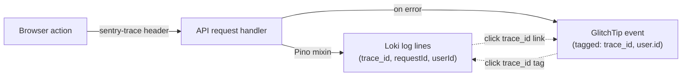
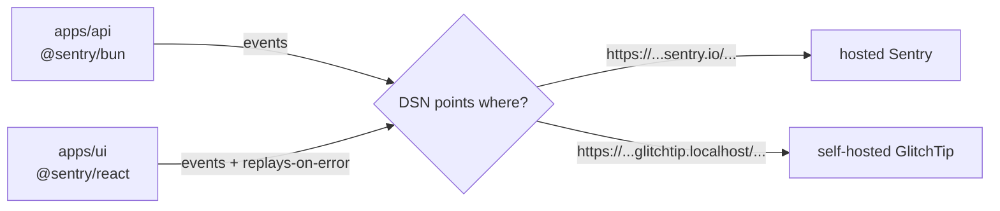

import PageIntro from "../../../components/docs-kit/PageIntro";
import CommandRun from "../../../components/docs-kit/CommandRun";
import DocCallout from "../../../components/DocCallout.tsx";
import FaqGroup from "../../../components/FaqGroup.tsx";
import FaqItem from "../../../components/FaqItem.tsx";

<PageIntro
  eyebrow="Error tracking"
  actions={[
    { label: "GlitchTip", href: "#self-hosting-with-glitchtip" },
    { label: "Design choices", href: "#design-choices" },
  ]}
  facts={[
    { value: "Sentry API", label: "Protocol" },
    { value: "Self-host", label: "Opt-in" },
    { value: "1", label: "unified SDK" },
  ]}
>
  Both `apps/api` and `apps/ui` ship Sentry SDKs configured for zero
  overhead. Swap between Hosted Sentry and self-hosted GlitchTip with a single
  DSN key.
</PageIntro>

Both `apps/api` and `apps/ui` ship a Sentry SDK. The same SDK talks to:

- **Self-hosted [GlitchTip](https://glitchtip.com)**, on by default in the compose stack. Sentry-API-compatible, zero per-event cost.
- **Hosted [Sentry](https://sentry.io)**; same SDK, different DSN. Fastest if you'd rather pay for managed.

The SDKs don't know which one they're talking to. Choosing is a one-env-var change.

## Design choices

<FaqGroup>
  <FaqItem title="Sentry SDK on both sides (not a custom shim)" open>
    Same SDK interface and error format across both services.
  </FaqItem>
  <FaqItem title="GlitchTip as the self-host option, on by default">
    Wire-compatible with Sentry; runs on the same Postgres + Valkey the
    app already uses. `WITH_GLITCHTIP=0` opts out.
  </FaqItem>
  <FaqItem title="Empty DSN: SDK is a no-op">
    Tests do not ship error reports. The dev stack auto-wires
    `SENTRY_DSN` and `VITE_SENTRY_DSN` from the bundled GlitchTip
    (`scripts/glitchtip-fetch-dsn.sh`, called by `dev.sh up -d`), so
    first boot lands ready-to-ship; pre-set values are left alone so
    you can point at hosted Sentry instead.
  </FaqItem>
  <FaqItem title="Replay-on-error on, full-session replays off">
    Captures the broken flow without storing healthy sessions.
  </FaqItem>
  <FaqItem title="Single env var per side: SENTRY_DSN (API), VITE_SENTRY_DSN (UI)">
    Same protocol regardless of backend; swap is one redeploy.
  </FaqItem>
  <FaqItem title="Events carry user.id + trace_id automatically">
    The API's auth plugin calls `Sentry.setUser({id, email})` once it
    resolves a session; the UI's `SentryUserSync` does the same after
    every `useMe` change. Errors land in GlitchTip tagged with the
    user that hit them. See "Correlation" below for the full pivot
    surface.
  </FaqItem>
</FaqGroup>

## Correlation: GlitchTip ↔ Loki ↔ requestId

Errors are useful in proportion to how easily you can reach the
context around them. The stack wires a single chain of IDs across
browser, API, log store, and error tracker so any one of them
takes you to the other three.



**What flows automatically:**

- `trace_id` + `span_id`: the UI's Sentry SDK adds `sentry-trace` /
  `traceparent` headers to every `/api/*` fetch via
  `browserTracingIntegration`; the API's Sentry init reads them; the
  Pino logger's mixin injects them on every log record; Promtail
  promotes them to Loki structured metadata.
- `userId`: the API's auth plugin calls `Sentry.setUser({id, email})`
  on every authenticated request. The Pino mixin reads `userId` from
  the Sentry scope and emits it on each log line. The UI's
  `SentryUserSync` provider mirrors the same call after login, MFA
  verify, account switch, page reload — anywhere `useMe` resolves.
- `requestId`: a UUID assigned by the API's request-logger middleware,
  returned as the `x-request-id` header and present on every log line
  for that request.

**Where the click-through lives:**

- **Grafana → GlitchTip** — the "BoringStack — API logs" dashboard
  defines clickable data links on `trace_id` and `userId` in the live
  log panel. Expand any log line, click the field → opens GlitchTip
  filtered to that trace / user in a new tab. The dashboard variables
  `$glitchtip_url` and `$glitchtip_org` configure the target (defaults
  fit the bundled GlitchTip; edit once per environment).
- **Grafana → Grafana** — `requestId` link opens Explore with a Loki
  query pre-filtered to that one request's lines.
- **GlitchTip → Grafana** — configure once in GlitchTip's project
  settings (UI, not code): a `tags.trace_id` external link template
  pointing at Grafana Explore with `{compose_service="api-dev"} | json | trace_id="<value>"`.
  Each event detail then shows a "View logs" link.

## How it's wired



<p class="bs-diagram-caption">
  Both apps/api (@sentry/bun) and apps/ui (@sentry/react) emit events to
  the same Sentry-compatible wire protocol. The DSN env var picks the
  destination: a <code>sentry.io</code> hostname for hosted Sentry, or a{" "}
  <code>glitchtip.localhost</code> hostname for the self-hosted overlay. The
  SDKs don't know which one they're talking to.
</p>

API side: Sentry initialises once at boot. If `SENTRY_DSN` is empty, init is a no-op. The shared `captureError` helper is wired into unhandled-rejection and uncaught-exception handlers, so anything that escapes the request loop reaches the backend.

UI side: Sentry initialises once at app mount when `VITE_SENTRY_DSN` is set. Replays-on-error capture the error context; full-session replays are off to avoid capturing video of every session.

Sentry transactions are off by default (`SENTRY_TRACES_SAMPLE_RATE=0` on the API, `tracesSampleRate: 0` on the UI). OpenTelemetry is the single tracer that ships spans to Tempo; error events still pick up `trace_id` from the shared context so the GlitchTip → Tempo pivot works. See [Distributed tracing](/topics/tracing/) for the why.

## Self-hosting with GlitchTip

GlitchTip is Apache-licensed and Sentry-API-compatible. It runs as part of the default compose stack:

```bash
./dev.sh up -d                 # GlitchTip is on by default
WITH_GLITCHTIP=0 ./dev.sh up -d  # opt out if you'd rather not run it
```

First boot bootstraps a superuser (`admin@localhost` / `admin123456`), a default org, and two projects (`API` and `Frontend`). `dev.sh up -d` then runs `scripts/glitchtip-fetch-dsn.sh` in the background — it pulls the DSNs out of GlitchTip's Django ORM, writes them into `compose/.env` as `SENTRY_DSN` / `VITE_SENTRY_DSN`, and restarts `api-dev` + `ui-dev`. Visit `http://glitchtip.localhost` to browse events; the DSN paste step is gone.

The overlay reuses the base stack's Postgres (in a separate `glitchtip` database) and Valkey (DB 1). Adding GlitchTip costs two extra containers, not a separate database server.

For production hardening (Basic Auth, HTTPS, real SMTP), see the [GlitchTip docs under `infra/compose`](https://github.com/boringstack-xyz/boringstack/blob/main/infra/compose/docs/glitchtip.md).

## Switching backends

Change only the DSN:

<FaqGroup>
  <FaqItem title="Sentry (hosted)" open>
    API: `SENTRY_DSN=https://...@sentry.io/...`. UI:
    `VITE_SENTRY_DSN=https://...@sentry.io/...`.
  </FaqItem>
  <FaqItem title="GlitchTip (self-hosted)">
    API: `SENTRY_DSN=https://...@glitchtip.example.com/...`. UI:
    `VITE_SENTRY_DSN=https://...@glitchtip.example.com/...`.
  </FaqItem>
</FaqGroup>

No SDK changes. The infrastructure is the variable, not the code.

<DocCallout
  eyebrow="Decision matrix"
  title="When to use Sentry vs GlitchTip"
  variant="tip"
>
  **Hosted Sentry:** Best if you'd rather delegate the operations and pay a
  monthly subscription fee past the free tier. **GlitchTip:** Best if you are
  already running your own self-hosted stack and another container overhead is
  essentially free. The developer experience is identical on both paths because
  they use the same SDK.
</DocCallout>

## Source

- API init: [`src/config/sentry.ts`](https://github.com/boringstack-xyz/boringstack/blob/main/apps/api/src/config/sentry.ts) + [`src/config/error-handlers.ts`](https://github.com/boringstack-xyz/boringstack/blob/main/apps/api/src/config/error-handlers.ts).
- UI init: [`src/app/main.tsx`](https://github.com/boringstack-xyz/boringstack/blob/main/apps/ui/src/app/main.tsx).
- GlitchTip overlay: [`compose/docker-compose.glitchtip.yml`](https://github.com/boringstack-xyz/boringstack/blob/main/infra/compose/compose/docker-compose.glitchtip.yml).

## Related

- [Observability](/topics/observability/); metrics and logs that sit alongside error events.
- [Profiles & overlays](/infra/profiles-and-overlays/); how GlitchTip composes onto the stack and how to opt out.
- [Security pipeline](/topics/security/); the broader telemetry surface this fits into.
- [Notifications](/api/notifications/); how user-facing errors are surfaced back into the app.
