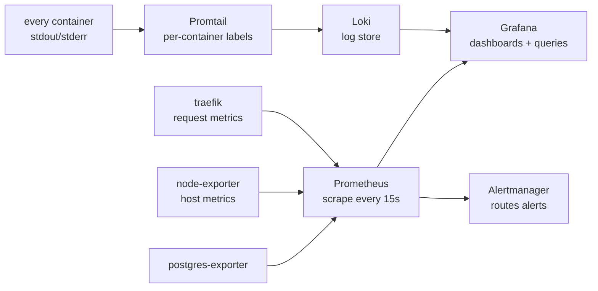

import PageIntro from "../../../components/docs-kit/PageIntro";
import FaqGroup from "../../../components/FaqGroup.tsx";
import FaqItem from "../../../components/FaqItem.tsx";

<PageIntro
  eyebrow="Observability"
  actions={[
    { label: "What ships", href: "#what-ships-out-of-the-box" },
    { label: "What you wire", href: "#what-you-still-need-to-wire" },
  ]}
  facts={[
    { value: "0", label: "Per-event cost" },
    { value: "Grafana", label: "Dashboard hub" },
    { value: "Loki", label: "Log store" },
  ]}
>
  The full metrics-and-logs stack is **on by default** for dev and prod.
  Host and infra metrics flow out of the box; application metrics and
  dashboards are scaffolded but unopinionated. Opt out with
  `WITH_OBSERVABILITY=0`.
</PageIntro>

Prometheus, Grafana, Loki, Promtail, and exporters ship with the default
compose stack. They run on the same host as the app; no SaaS, no per-event
billing. The premise: you can't build muscle memory for a dashboard you've
never seen until prod day-one, so dev runs the same surface as prod.

## How signals flow



## What ships out of the box

<FaqGroup>
  <FaqItem title="Grafana" open>
    Host `:3010`. Default admin / change-me (override via env). Datasources
    for Prometheus and Loki auto-provisioned.
  </FaqItem>
  <FaqItem title="Prometheus">
    Internal. Scrapes itself, Alertmanager, Traefik (prod profile),
    postgres-exporter, node-exporter. Configurable retention.
  </FaqItem>
  <FaqItem title="Loki">
    Internal. Per-container labels; configurable retention.
  </FaqItem>
  <FaqItem title="Promtail">
    Sidecar. Tails `/var/lib/docker/containers/*.log` so every container's
    stdout is queryable as labeled logs.
  </FaqItem>
  <FaqItem title="node-exporter">
    Host metrics: CPU, memory, disk, network.
  </FaqItem>
  <FaqItem title="postgres-exporter">
    Postgres metrics: connections, transactions, table sizes.
  </FaqItem>
  <FaqItem title="Alertmanager">
    Internal. Receivers are not wired by default, paging strategy is
    project-specific, so the template ships the plumbing and you add the
    routes.
  </FaqItem>
</FaqGroup>

## Application metrics

`apps/api` exposes Prometheus exposition format at `/metrics` via
`prom-client`. Out of the box:

- Node.js runtime metrics, event loop lag, GC, heap, FDs, process
  CPU/memory (via `collectDefaultMetrics`).
- `http_requests_total{method,route,status}`, counter per route.
- `http_request_duration_seconds{...}`, histogram with buckets from
  50 ms to 10 s.

The `metrics-observer` middleware folds dynamic path params to the
matched route (`/api/v1/users/:id`, not `/api/v1/users/abc-123`) to
keep cardinality bounded. Add new domain metrics by creating
`src/lib/metrics/<domain>-metrics.ts`, registering them on the shared
`metricsRegistry`, and updating them from your service code.

Prometheus scrapes the api on the `boringstack-api` job (dev profile
hits `api-dev:7330`, prod profile hits `api:7330`); each target is
labelled with its `profile`.

## Default dashboard

`compose/grafana/dashboards/boringstack-api.json` ships with the
overlay and auto-loads via the provisioning provider. Panels:

- Request rate per route
- Request latency p95 per route
- 5xx error rate (stat)
- Memory (RSS + heap used)
- Event-loop lag (p50, p99)
- Process CPU
- Requests by status (stacked)

Drop additional dashboards into the same directory and Grafana picks
them up within 30 s. Good community starting points: Node Exporter
Full (id `1860`), PostgreSQL exporter quickstart (id `9628`).

## Design choices

<FaqGroup>
  <FaqItem title="Self-hosted, not SaaS" open>
    Zero per-event cost; data stays on your infra.
  </FaqItem>
  <FaqItem title="Prometheus + Loki, not OpenTelemetry collector">
    Two well-known projects beat one unfamiliar abstraction. The stack
    can grow into OTel later without re-platforming.
  </FaqItem>
  <FaqItem title="Promtail labels logs per container">
    "Show me api-prod errors in the last hour" is one filter, not a
    regex against a giant text blob.
  </FaqItem>
  <FaqItem title="Grafana auto-provisions datasources">
    Stack boots usable; no manual wiring after `up -d`. Adding a
    dashboard is a file drop, not a UI click-through.
  </FaqItem>
  <FaqItem title="Alertmanager included but not wired by default">
    Pager strategy is project-specific; the plumbing is there when you
    need it.
  </FaqItem>
</FaqGroup>

## Querying

**Metrics (Prometheus, PromQL).** Examples below assume you've added the
`/metrics` endpoint and a corresponding scrape job. Out of the box, only
node, postgres, and traefik metrics return rows:

```bash
# Host CPU usage
100 - (avg by (instance) (rate(node_cpu_seconds_total{mode="idle"}[5m])) * 100)

# Postgres connection count
pg_stat_database_numbackends{datname="app"}

# Once you wire /metrics on apps/api:
rate(http_requests_total[5m]) by (route)
```

**Logs (Loki, LogQL).** These work today, every container streams to
Loki:

```bash
# All API errors in the last hour
{container=~"ai-starter-.*-api-dev-1"} |= "level=ERROR"

# Worker jobs by status
{container=~"ai-starter-.*-api-.*"} | json | event="email_delivery_completed"
```

## Adding an alert

1. Drop a rule file in `compose/prometheus/rules/` (e.g. `api-error-rate.yml`).
2. Configure routing in `compose/alertmanager/alertmanager.yml`.
3. `docker compose restart prometheus alertmanager`.

Alertmanager can route to Slack, email, PagerDuty, or a webhook. The
template ships the structure; you fill in your receiver.

## Cost

The overlay is light on memory at the default sizing; see
[Resource limits](/infra/resource-limits/) for the per-service knobs.
Disk grows with retention windows; tune them in
`compose/prometheus/prometheus.yml` and
`compose/docker-compose.observability.yml` if storage matters.

## Source

[`compose/docker-compose.observability.yml`](https://github.com/boringstack-xyz/boringstack/blob/main/infra/compose/compose/docker-compose.observability.yml) ·
[`compose/prometheus/`](https://github.com/boringstack-xyz/boringstack/tree/main/infra/compose/compose/prometheus) ·
[`compose/grafana/`](https://github.com/boringstack-xyz/boringstack/tree/main/infra/compose/compose/grafana) ·
[`compose/promtail/`](https://github.com/boringstack-xyz/boringstack/tree/main/infra/compose/compose/promtail).

## Related

- [Error tracking](/topics/error-tracking/): Sentry/GlitchTip for
  exceptions specifically.
- [Resource limits](/infra/resource-limits/): what you'll watch with
  these dashboards.
