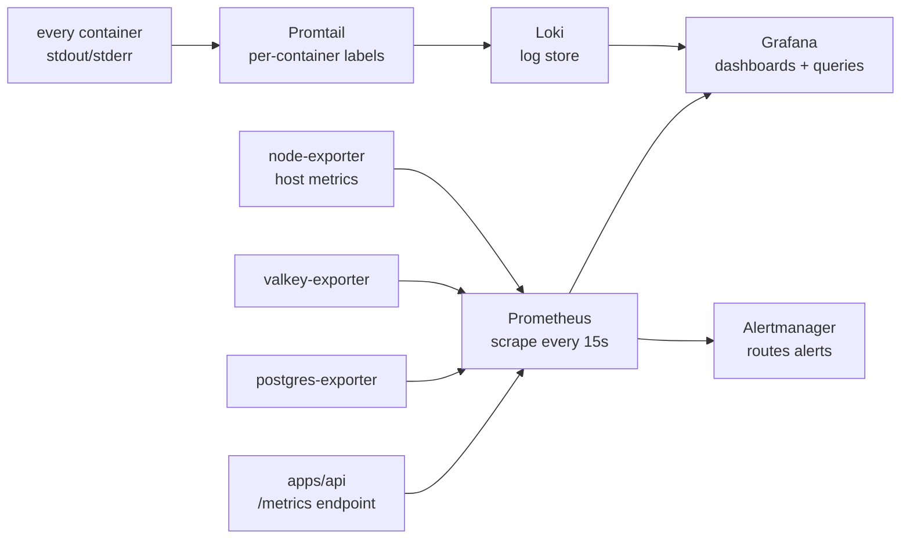

import PageIntro from "../../../components/docs-kit/PageIntro";
import CommandRun from "../../../components/docs-kit/CommandRun";
import FaqGroup from "../../../components/FaqGroup.tsx";
import FaqItem from "../../../components/FaqItem.tsx";

<PageIntro
  eyebrow="Observability"
  actions={[
    { label: "Design choices", href: "#design-choices" },
    { label: "Metrics & Logs", href: "#what-you-get-out-of-the-box" },
  ]}
  facts={[
    { value: "0", label: "Per-event cost" },
    { value: "Grafana", label: "Dashboard Hub" },
    { value: "Loki", label: "Log Storage" },
  ]}
>
  `WITH_OBSERVABILITY=1` drops a complete metrics-and-logs stack into your local
  environment. System, API, Postgres, and Valkey telemetry run on the same host.
</PageIntro>

`WITH_OBSERVABILITY=1` adds a full metrics-and-logs stack to the infra. It runs on the same host as the app; no SaaS, no per-event billing.

The default configuration covers debugging production incidents: app metrics, system metrics, container metrics, and all container logs queryable in one Grafana.

## How signals flow



## Design choices

<FaqGroup>
  <FaqItem title="Self-hosted, not SaaS" open>
    Zero per-event cost; data stays on your infra.
  </FaqItem>
  <FaqItem title="Prometheus + Loki, not OpenTelemetry collector">
    Two well-known projects beat one unfamiliar abstraction.
  </FaqItem>
  <FaqItem title="Promtail labels logs per container">
    "Show me api-prod errors in the last hour" is one filter, not a regex.
  </FaqItem>
  <FaqItem title="Grafana auto-provisions datasources">
    Stack boots usable; no manual wiring after `up -d`.
  </FaqItem>
  <FaqItem title="Alertmanager included but not wired by default">
    Pager strategy is project-specific; the plumbing is there when you need it.
  </FaqItem>
  <FaqItem title="Bundled exporters: node, postgres, valkey">
    Standard metrics for incident response.
  </FaqItem>
</FaqGroup>

## What you get out of the box

<FaqGroup>
  <FaqItem title="Grafana" open>
    Host `:3010`. Default admin / change-me (override via env).
  </FaqItem>
  <FaqItem title="Prometheus">
    Internal. Configurable retention (see `compose/prometheus/prometheus.yml`).
  </FaqItem>
  <FaqItem title="Loki">
    Internal. Per-container labels; configurable retention.
  </FaqItem>
  <FaqItem title="Promtail">
    Sidecar. Scrapes `/var/lib/docker/containers/*.log`.
  </FaqItem>
  <FaqItem title="node-exporter">
    Host metrics: CPU, memory, disk, network.
  </FaqItem>
  <FaqItem title="postgres-exporter">
    Postgres metrics: connections, transactions, table sizes.
  </FaqItem>
  <FaqItem title="valkey-exporter">
    Valkey metrics: hit ratio, evictions, memory.
  </FaqItem>
  <FaqItem title="Alertmanager">
    Internal. Routes defined in `alertmanager/`.
  </FaqItem>
</FaqGroup>

Drop dashboard JSON exports into `compose/grafana/dashboards/` and Grafana auto-loads them within 30s. Datasources and the dashboard provider are already wired in `compose/grafana/provisioning/`.

## Querying

**Metrics (Prometheus, PromQL):**

```bash
# 5-minute API request rate by route
rate(http_requests_total[5m]) by (route)

# Postgres connection count
pg_stat_database_numbackends{datname="app"}

# Worker job throughput
rate(bullmq_jobs_completed_total[1m])
```

See the [`infra/compose` PromQL cheatsheet](https://github.com/boringstack-xyz/boringstack/blob/main/infra/compose/docs/promql-cheatsheet.md) for more.

**Logs (Loki, LogQL):**

```bash
# All API errors in the last hour
{container="api-prod"} |= "level=error"

# Worker jobs by status
{container=~"api.*"} | json | event="email_delivery_completed"
```

See the [LogQL cheatsheet](https://github.com/boringstack-xyz/boringstack/blob/main/infra/compose/docs/logql-cheatsheet.md).

## Adding an alert

1. Drop a rule file in `compose/prometheus/rules/` (e.g. `api-error-rate.yml`).
2. Configure routing in `compose/alertmanager/alertmanager.yml`.
3. `docker compose restart prometheus alertmanager`.

Alertmanager can route to Slack, email, PagerDuty, or a webhook. The template ships the structure; you fill in your receiver.

## Adding a custom app metric

The API app's `/metrics` endpoint uses the standard Prometheus client library. Define a counter / gauge / histogram in `src/lib/metrics/`, increment it from your code, and Prometheus picks it up on the next scrape. The convention is one file per metric domain (`http-metrics.ts`, `queue-metrics.ts`).

## Cost

The overlay is light on memory at the default sizing; see [Resource limits](/infra/resource-limits/) for the per-service knobs. Disk grows with retention windows; tune them in `compose/prometheus/prometheus.yml` and `compose/docker-compose.observability.yml` if storage matters.

## Source

[`compose/docker-compose.observability.yml`](https://github.com/boringstack-xyz/boringstack/blob/main/infra/compose/compose/docker-compose.observability.yml) · [`compose/prometheus/`](https://github.com/boringstack-xyz/boringstack/tree/main/infra/compose/compose/prometheus) · [`compose/grafana/`](https://github.com/boringstack-xyz/boringstack/tree/main/infra/compose/compose/grafana) · [`compose/promtail/`](https://github.com/boringstack-xyz/boringstack/tree/main/infra/compose/compose/promtail).

## Related

- [Error tracking](/topics/error-tracking/); Sentry/GlitchTip for exceptions specifically.
- [Resource limits](/infra/resource-limits/); what you'll watch with these dashboards.
