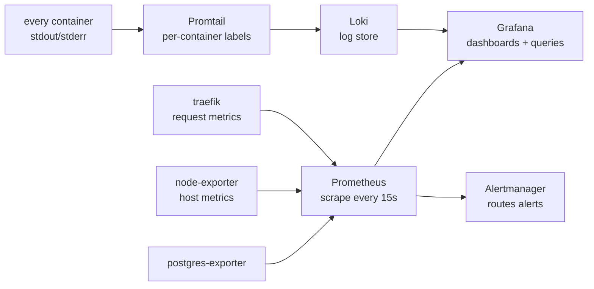

import PageIntro from "../../../components/docs-kit/PageIntro";
import FaqGroup from "../../../components/FaqGroup.tsx";
import FaqItem from "../../../components/FaqItem.tsx";

<PageIntro
  eyebrow="Observability"
  actions={[
    { label: "What ships", href: "#what-ships-out-of-the-box" },
    { label: "What you wire", href: "#what-you-still-need-to-wire" },
  ]}
  facts={[
    { value: "0", label: "Per-event cost" },
    { value: "Grafana", label: "Dashboard hub" },
    { value: "Loki", label: "Log store" },
  ]}
>
  The full metrics-and-logs stack is **on by default** for dev and prod.
  Host and infra metrics flow out of the box; application metrics and
  dashboards are scaffolded but unopinionated. Opt out with
  `WITH_OBSERVABILITY=0`.
</PageIntro>

Prometheus, Grafana, Loki, Promtail, and exporters ship with the default
compose stack. They run on the same host as the app; no SaaS, no per-event
billing. The premise: you can't build muscle memory for a dashboard you've
never seen until prod day-one, so dev runs the same surface as prod.

## How signals flow



## What ships out of the box

<FaqGroup>
  <FaqItem title="Grafana" open>
    Host `:3010`. Default admin / change-me (override via env). Datasources
    for Prometheus and Loki auto-provisioned. Five baseline dashboards
    auto-load — see the "Default dashboards" section below.
  </FaqItem>
  <FaqItem title="Prometheus">
    Internal. Scrapes itself, Alertmanager, Traefik (prod profile),
    postgres-exporter, node-exporter, and `apps/api` `/metrics`. 14
    bundled alert rules (API errors/latency, Postgres health, host
    disk/memory/CPU, edge); see [Alerts](/topics/alerts/) for tuning.
  </FaqItem>
  <FaqItem title="Loki">
    Internal. Per-container labels; configurable retention. The api
    containers' Pino JSON is parsed into structured fields by Promtail's
    Pino pipeline, so log filtering by `level` and pivoting by `trace_id`
    / `requestId` / `userId` are first-class.
  </FaqItem>
  <FaqItem title="Promtail">
    Sidecar. Two pipelines: a plain pipeline labels everything by
    `compose_service`; a Pino-aware pipeline on the api containers
    parses JSON, promotes `level` (lowercased) as a Loki label, and
    surfaces `requestId` / `trace_id` / `span_id` / `userId` as
    structured metadata — so Grafana auto-colours by level and the
    correlation IDs are clickable.
  </FaqItem>
  <FaqItem title="node-exporter">
    Host metrics: CPU, memory, disk, network.
  </FaqItem>
  <FaqItem title="postgres-exporter">
    Postgres metrics: connections, transactions, table sizes.
  </FaqItem>
  <FaqItem title="Alertmanager">
    Wired with env-driven Slack/Discord/webhook receivers. Set
    `ALERTMANAGER_SLACK_WEBHOOK_URL` (Slack-format — works for Discord
    too with the `/slack` suffix) and/or `ALERTMANAGER_WEBHOOK_URL`
    (Alertmanager JSON) in `compose/.env`. Without either set, alerts
    still fire into the Alertmanager UI at `:9093` only. Walkthrough:
    [Alerts](/topics/alerts/).
  </FaqItem>
  <FaqItem title="Tempo">
    Distributed-trace storage. The API ships OTLP/HTTP spans here
    automatically (HTTP in/out, fetch, ioredis, queue handlers); spans
    carry the same `trace_id` already promoted to Loki labels, so log
    lines pivot to traces with one click. Single-binary mode, 24h
    retention by default. Walkthrough: [Distributed tracing](/topics/tracing/).
  </FaqItem>
</FaqGroup>

## Application metrics

`apps/api` exposes Prometheus exposition format at `/metrics` via
`prom-client`. Out of the box:

- Node.js runtime metrics, event loop lag, GC, heap, FDs, process
  CPU/memory (via `collectDefaultMetrics`).
- `http_requests_total{method,route,status}`, counter per route.
- `http_request_duration_seconds{...}`, histogram with buckets from
  50 ms to 10 s.

The `metrics-observer` middleware folds dynamic path params to the
matched route (`/api/v1/users/:id`, not `/api/v1/users/abc-123`) to
keep cardinality bounded. Add new domain metrics by creating
`src/lib/metrics/<domain>-metrics.ts`, registering them on the shared
`metricsRegistry`, and updating them from your service code.

Prometheus scrapes the api on the `boringstack-api` job (dev profile
hits `api-dev:7330`, prod profile hits `api:7330`); each target is
labelled with its `profile`.

## Default dashboards

Five dashboards auto-load from `compose/grafana/dashboards/` via the
provisioning provider. Open them at `http://localhost:3010` (admin /
change-me by default) under the BoringStack folder.

<FaqGroup>
  <FaqItem title="BoringStack — API" open>
    RED panels per route: request rate, p95 latency, 5xx rate, requests
    by status. Plus Node.js runtime: heap, RSS, event-loop lag p50/p99,
    process CPU. First place to look for "is the API hot?"
  </FaqItem>
  <FaqItem title="BoringStack — API logs">
    Error / warn / info / total counts (stats), log volume per minute
    stacked by level (colour-coded), top error/warn events aggregated
    by Pino `event` field, top routes producing errors, plus two live
    log streams — application events (Drizzle SQL filtered out) and
    raw database queries (Drizzle stdout). Structured-metadata fields
    on each line are clickable: trace_id and userId open GlitchTip
    search, requestId opens a Loki Explore pre-filtered to that
    request's lines.
  </FaqItem>
  <FaqItem title="BoringStack — UI logs">
    Vite + nginx output. Substring-matched error count (heuristic since
    Vite isn't structured), HMR / reload activity, per-container log
    volume, per-minute error timeseries, plus a live filterable stream.
  </FaqItem>
  <FaqItem title="BoringStack — Postgres">
    Connections vs `max_connections`, cache hit ratio (target >95%),
    transactions per second (commits + rollbacks), database size,
    longest-running transaction, deadlocks per minute. "Is the DB hot?"
  </FaqItem>
  <FaqItem title="BoringStack — Host">
    CPU by mode (user / system / iowait / ...), iowait stat (red when
    sustained — usually means disk-bound), memory used / cached /
    available, filesystem % per mount (red at >85%), network rx/tx.
    "Is the box itself the problem?"
  </FaqItem>
</FaqGroup>

Drop additional dashboards into `compose/grafana/dashboards/` and
Grafana picks them up within 30 seconds. Heavier community starters
to pair with the defaults: Node Exporter Full (id `1860`), PostgreSQL
exporter quickstart (id `9628`), Loki Logs (id `13186`).

## Design choices

<FaqGroup>
  <FaqItem title="Self-hosted, not SaaS" open>
    Zero per-event cost; data stays on your infra.
  </FaqItem>
  <FaqItem title="On by default in dev and prod">
    The whole point of running the stack in dev is so you've already
    used Grafana before prod day-one. Disabling it (`WITH_OBSERVABILITY=0`)
    is supported but reintroduces the "first time I open this dashboard
    is during an incident" anti-pattern.
  </FaqItem>
  <FaqItem title="Promtail labels logs per container, parses Pino on the API">
    "Show me api-prod errors in the last hour" is one label filter, not
    a regex against a giant text blob. Grafana auto-colours each line
    by `level` because Promtail's Pino pipeline emits it as a label.
  </FaqItem>
  <FaqItem title="trace_id flows browser → API → Loki">
    The Sentry SDK (browser + API) propagates `sentry-trace` /
    `traceparent` headers on every `/api/*` request. The API logger's
    Pino mixin injects the active span's `trace_id` + `span_id` on
    every log record. Result: one trace ID stitches together the
    browser action, the API request handler, the DB queries it
    triggered, and the GlitchTip event if anything failed.
  </FaqItem>
  <FaqItem title="Grafana auto-provisions datasources + dashboards">
    Stack boots usable; no manual wiring after `up -d`. Adding a
    dashboard is a file drop, not a UI click-through.
  </FaqItem>
  <FaqItem title="Alertmanager is env-driven, not stub-empty">
    Set one env var (`ALERTMANAGER_SLACK_WEBHOOK_URL`) and alerts
    deliver. Discord works through the same env via Slack-format
    compatibility. No receiver set → alerts surface in the
    Alertmanager UI only. Full walkthrough in
    [Alerts](/topics/alerts/).
  </FaqItem>
</FaqGroup>

## Querying

**Metrics (Prometheus, PromQL).** Examples below assume you've added the
`/metrics` endpoint and a corresponding scrape job. Out of the box, only
node, postgres, and traefik metrics return rows:

```bash
# Host CPU usage
100 - (avg by (instance) (rate(node_cpu_seconds_total{mode="idle"}[5m])) * 100)

# Postgres connection count
pg_stat_database_numbackends{datname="app"}

# Once you wire /metrics on apps/api:
rate(http_requests_total[5m]) by (route)
```

**Logs (Loki, LogQL).** The api containers' Pino JSON is parsed by
Promtail, so common queries don't need `| json` re-parsing:

```bash
# All API errors in the last hour (level is a Loki label)
{compose_service=~"api-dev|api", level="error"}

# Worker jobs by status — fall back to | json for non-label fields
{compose_service=~"api-dev|api"} | json | event="email_delivery_completed"

# Every log line for a specific trace (correlation across requests)
{compose_service=~"api-dev|api"} | json | trace_id="abc123..."

# All activity by a specific user
{compose_service=~"api-dev|api"} | json | userId="user-uuid..."
```

## Adding an alert

1. Edit `compose/prometheus/rules.yml` (single bundled file; 14 rules
   ship by default). Add a new entry under one of the existing
   `groups:` or create a new group.
2. Hot-reload Prometheus: `curl -X POST http://localhost:9090/-/reload`
   (or full restart: `docker compose restart prometheus`).
3. Set a receiver if you haven't: see [Alerts](/topics/alerts/).

## Cost

The overlay is light on memory at the default sizing; see
[Resource limits](/infra/resource-limits/) for the per-service knobs.
Disk grows with retention windows; tune them in
`compose/prometheus/prometheus.yml` and
`compose/docker-compose.observability.yml` if storage matters.

## Source

[`compose/docker-compose.observability.yml`](https://github.com/boringstack-xyz/boringstack/blob/main/infra/compose/compose/docker-compose.observability.yml) ·
[`compose/prometheus/`](https://github.com/boringstack-xyz/boringstack/tree/main/infra/compose/compose/prometheus) ·
[`compose/grafana/`](https://github.com/boringstack-xyz/boringstack/tree/main/infra/compose/compose/grafana) ·
[`compose/promtail/`](https://github.com/boringstack-xyz/boringstack/tree/main/infra/compose/compose/promtail).

## Related

- [Error tracking](/topics/error-tracking/): Sentry/GlitchTip for
  exceptions specifically.
- [Resource limits](/infra/resource-limits/): what you'll watch with
  these dashboards.
