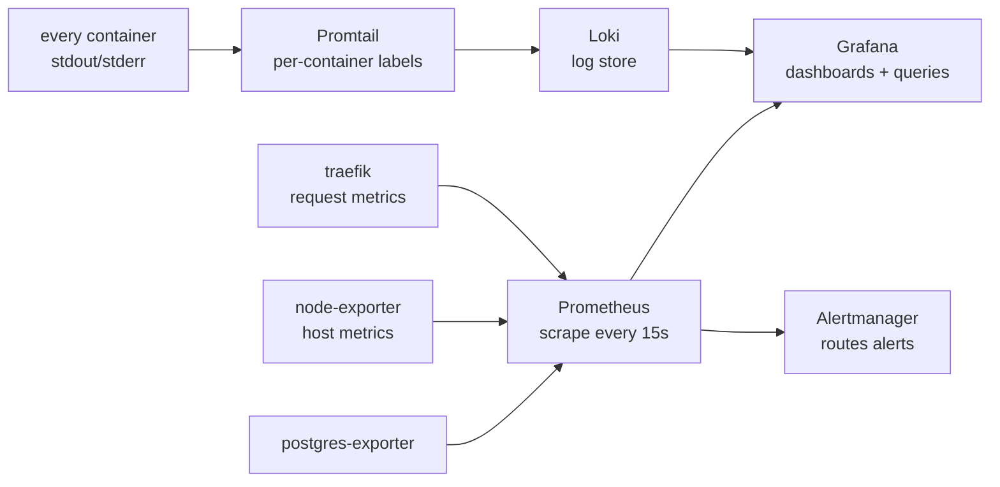

The full metrics-and-logs stack is on by default for dev and prod. Prometheus, Grafana, Loki, Promtail, and exporters run on the same host as the app. No SaaS, no per-event billing. The premise is simple: you can't build confidence in a dashboard you've never seen until prod day-one, so dev runs the same observability surface as prod. Opt out with `WITH_OBSERVABILITY=0`.

## How signals flow



## What ships by default

### Grafana

Host `:3010`. Default credentials: admin / change-me (override via env). Datasources for Prometheus and Loki are auto-provisioned. Five baseline dashboards auto-load (see "Default dashboards" section below).

**Verify:** Open `http://localhost:3010`. You should see the BoringStack folder with the five dashboards listed.

### Prometheus

Internal service. Scrapes itself, Alertmanager, Traefik (prod profile), postgres-exporter, node-exporter, and the API's `/metrics` endpoint. Sixteen bundled alert rules cover API errors, latency, Postgres health, host disk/memory/CPU, and edge failures. See [Alerts](/topics/alerts/) for tuning thresholds.

**Verify:** `curl http://localhost:9090/api/v1/targets` and check that all job targets are marked "up".

### Loki

Internal service. Stores logs per-container with configurable retention. The API container's Pino JSON is parsed into structured fields by Promtail's Pino pipeline. Log filtering by `level` and pivoting by `trace_id`, `requestId`, and `userId` work as label queries.

**Verify:** Open Grafana, go to Explore, select Loki, and run `{compose_service="api-dev"}`. You should see log lines streaming in.

### Promtail

Sidecar service. Two pipelines: a generic pipeline labels everything by `compose_service`. A Pino-aware pipeline on the API containers parses JSON, promotes `level` as a Loki label, and surfaces `requestId`, `trace_id`, `span_id`, and `userId` as structured metadata. This means Grafana auto-colours by log level and correlation IDs are clickable.

**Verify:** In Grafana Loki Explore, filter by `{compose_service="api-dev", level="error"}`. You should see only error lines.

### node-exporter

Exports host metrics: CPU, memory, disk, network. Prometheus scrapes every 15 seconds.

**Verify:** In Grafana, open the "BoringStack Host" dashboard. The CPU, memory, and disk panels should show data.

### postgres-exporter

Exports Postgres metrics: connections, transactions, table sizes, cache hit ratio, replication lag. Prometheus scrapes every 15 seconds.

**Verify:** In Grafana, open the "BoringStack Postgres" dashboard. The connections and cache-hit-ratio panels should show data.

### Alertmanager

Wires with env-driven Slack/Discord/webhook receivers. Set `ALERTMANAGER_SLACK_WEBHOOK_URL` (Slack-format, also works for Discord with the `/slack` suffix) and/or `ALERTMANAGER_WEBHOOK_URL` (Alertmanager JSON) in `compose/.env`. Without either set, alerts still fire into the Alertmanager UI at `:9093` only. See [Alerts](/topics/alerts/) for the full walkthrough.

**Verify:** Trigger a test alert: `curl -XPOST http://localhost:9093/api/v2/alerts -H 'Content-Type: application/json' -d '[{"labels":{"alertname":"TestPing","severity":"warn"},"annotations":{"summary":"Test"}}]'`. Check the Alertmanager UI at `:9093` or your configured receiver.

### Tempo

Distributed-trace storage. The API ships OTLP/HTTP spans automatically (HTTP in/out, fetch, ioredis, queue handlers). Spans carry the same `trace_id` already promoted to Loki labels, so log lines pivot to traces with one click. Single-binary mode with 24-hour retention by default. See [Distributed tracing](/topics/tracing/) for details.

**Verify:** In Grafana, go to Explore and select Tempo. Click on any trace to view its waterfall diagram.

## Application metrics

`apps/api` exposes Prometheus exposition format at `/metrics` via
`prom-client`. Out of the box:

- Node.js runtime metrics, event loop lag, GC, heap, FDs, process
  CPU/memory (via `collectDefaultMetrics`).
- `nodejs_eventloop_utilization` (custom gauge, 0.0–1.0). Computed from `perf_hooks.performance.eventLoopUtilization()`. Shows how saturated the loop is, the leading indicator for Node performance. CPU and memory don't tell you whether the loop can dispatch callbacks. See the API dashboard's top stat row.
- `http_requests_total{method,route,status}`, counter per route.
- `http_request_duration_seconds{...}`, histogram with buckets from
  50 ms to 10 s.

The `metrics-observer` middleware folds dynamic path params to the
matched route (`/api/v1/users/:id`, not `/api/v1/users/abc-123`) to
keep cardinality bounded. Add new domain metrics by creating
`src/lib/metrics/<domain>-metrics.ts`, registering them on the shared
`metricsRegistry`, and updating them from your service code.

Event loop lag and ELU rank above CPU/memory as Node health signals because Node's runtime is single-threaded for JavaScript. The event loop can be blocked by a sync FS call, large `JSON.parse`, regex catastrophe, or CPU-bound work that should be in a worker thread, while CPU shows 30% and memory shows 200MB. Looks healthy, but isn't. Three alert rules cover the failure modes: `NodeEventLoopLagging` (warn, p99 > 200ms), `NodeEventLoopBlocked` (page, p99 > 1s), and `NodeEventLoopSaturated` (warn, ELU > 90% sustained). See [Alerts](/topics/alerts/) for the full table.

Prometheus scrapes the api on the `boringstack-api` job (dev profile
hits `api-dev:7330`, prod profile hits `api:7330`); each target is
labelled with its `profile`.

## Default dashboards

Five dashboards auto-load from `compose/grafana/dashboards/` via the provisioning provider. Open them at `http://localhost:3010` under the BoringStack folder.

### BoringStack API

Top row shows "is-Node-healthy-right-now" stats: ELU current, event-loop lag p99, 5xx rate, total req/s. These are colour-coded so a glance answers the question. Below: per-route request rate and p95 latency, a dedicated event-loop row (lag p50/p99 timeseries and ELU over time), then memory (RSS and heap), CPU, and requests by status. Every panel includes a WHAT/WHY/WATCH-FOR description in the info tooltip.

### BoringStack API logs

Error, warn, and info counts (stats). Log volume per minute stacked by level (colour-coded). Top error/warn events aggregated by Pino `event` field. Top routes producing errors. Two live log streams: application events (Drizzle SQL filtered out) and raw database queries. Structured-metadata fields on each line are clickable: `trace_id` and `userId` open GlitchTip search, `requestId` opens Loki Explore pre-filtered to that request's lines.

### BoringStack UI logs

Vite and nginx output. Substring-matched error count (heuristic, since Vite isn't structured). HMR and reload activity. Per-container log volume. Per-minute error timeseries. Live filterable stream.

### BoringStack Postgres

Connections vs `max_connections`. Cache hit ratio (target >95%). Transactions per second (commits and rollbacks). Database size. Longest-running transaction. Deadlocks per minute. Quick answer: "Is the DB hot?"

### BoringStack Host

CPU by mode (user, system, iowait, etc.). iowait stat (red when sustained indicates disk-bound). Memory used, cached, available. Filesystem percentage per mount (red at >85%). Network rx/tx. Quick answer: "Is the box itself the problem?"

Drop additional dashboards into `compose/grafana/dashboards/` and Grafana picks them up within 30 seconds. Community starters to pair with the defaults: Node Exporter Full (id `1860`), PostgreSQL exporter quickstart (id `9628`), Loki Logs (id `13186`).


## Querying

**Metrics (Prometheus, PromQL).** Out of the box, node, postgres, and traefik metrics return data. Once you add the `/metrics` endpoint and its scrape job:

```bash
# Host CPU usage
100 - (avg by (instance) (rate(node_cpu_seconds_total{mode="idle"}[5m])) * 100)

# Postgres connection count
pg_stat_database_numbackends{datname="app"}

# Once you wire /metrics on apps/api:
rate(http_requests_total[5m]) by (route)
```

**Logs (Loki, LogQL).** The api containers' Pino JSON is parsed by
Promtail, so common queries don't need `| json` re-parsing:

```bash
# All API errors in the last hour (level is a Loki label)
{compose_service=~"api-dev|api", level="error"}

# Worker jobs by status, fall back to | json for non-label fields
{compose_service=~"api-dev|api"} | json | event="email_delivery_completed"

# Every log line for a specific trace (correlation across requests)
{compose_service=~"api-dev|api"} | json | trace_id="abc123..."

# All activity by a specific user
{compose_service=~"api-dev|api"} | json | userId="user-uuid..."
```

## Adding an alert

1. Edit `compose/prometheus/rules.yml` (single bundled file; 14 rules
   ship by default). Add a new entry under one of the existing
   `groups:` or create a new group.
2. Hot-reload Prometheus: `curl -X POST http://localhost:9090/-/reload`
   (or full restart: `docker compose restart prometheus`).
3. Set a receiver if you haven't: see [Alerts](/topics/alerts/).

## Cost

The overlay is light on memory at the default sizing; see
[Resource limits](/infra/resource-limits/) for the per-service knobs.
Disk grows with retention windows; tune them in
`compose/prometheus/prometheus.yml` and
`compose/docker-compose.observability.yml` if storage matters.

## Source

[`compose/docker-compose.observability.yml`](https://github.com/boringstack-xyz/boringstack/blob/main/infra/compose/compose/docker-compose.observability.yml) ·
[`compose/prometheus/`](https://github.com/boringstack-xyz/boringstack/tree/main/infra/compose/compose/prometheus) ·
[`compose/grafana/`](https://github.com/boringstack-xyz/boringstack/tree/main/infra/compose/compose/grafana) ·
[`compose/promtail/`](https://github.com/boringstack-xyz/boringstack/tree/main/infra/compose/compose/promtail).

## Related

- [Error tracking](/topics/error-tracking/): Sentry/GlitchTip for
  exceptions specifically.
- [Resource limits](/infra/resource-limits/): what you'll watch with
  these dashboards.
