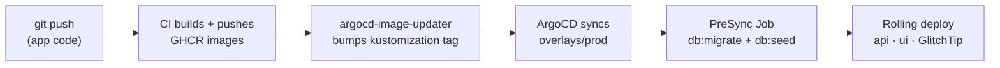

import { Aside } from "@astrojs/starlight/components";

The cluster deployment path. Where [OpenTofu](/topics/provisioning-with-tofu/)
gives you a single VPS running docker-compose, this gives you a GitOps loop on a
Kubernetes cluster you already run: push code → CI publishes GHCR images →
argocd-image-updater bumps the tag → ArgoCD syncs. HA, autoscaling, and TLS come
with it.

Source lives in [`infra/k3s`](https://github.com/boringstack-xyz/boringstack/tree/main/infra/k3s).

<Aside type="note" title="One target among three">
  BoringStack is Compose-first. Use this only if you already operate a
  Kubernetes cluster and want GitOps. For a first VPS, the
  [OpenTofu path](/topics/provisioning-with-tofu/) or
  [manual deployment](/topics/deployment/) is simpler.
</Aside>

## Prerequisites

A k3s/Kubernetes cluster with these operators installed:

- **ArgoCD** + **argocd-image-updater** (with its `argocd/image-updater-git-creds` write-back secret)
- **CloudNativePG** operator
- **cert-manager** + a DNS-01-capable `ClusterIssuer`
- **Traefik** (ships with k3s) exposing `web` + `websecure` entrypoints
- a default/persistent **StorageClass**
- *optional:* **kube-prometheus-stack** (metrics + dashboards), and a secrets
  backend — **Vault + VSO** (default), or the **SealedSecrets** controller

You'll also need CI that builds and pushes `ghcr.io/<owner>/<project>-api` and
`-ui` images — the same pipeline the Compose/WUD path uses.

## 1. Rebrand & set the knobs

From your fork's root:

```bash
./scripts/rename-project.sh <project> <ghcr-owner> <domain>
```

That rewrites every `boringstack*` token across the repo, including the k3s
manifests. Then edit the handful of cluster-specific values (all listed in
`infra/k3s/README.md`):

- the domain in `overlays/prod/ingress.yaml`, `certificate.yaml`, `glitchtip/`
- the `ClusterIssuer` name in `overlays/prod/certificate.yaml`
- the `StorageClass` in `base/postgres/cluster.yaml` + `base/valkey/statefulset.yaml` (optional; defaults to the cluster default)
- `source.repoURL` in `argocd/boringstack-prod.yaml`

## 2. Seed secrets

Pick a backend in `overlays/prod/secrets/` (default Vault). For Vault, populate
the KV-v2 paths and bind a role — see
[Secrets backends](/runbooks/vault-secrets-operator/). The app's secret keys are
listed in `infra/k3s/README.md` (`DATABASE_URL` is injected by CloudNativePG, so
it's not among them).

Add your fork to ArgoCD as a repo credential (an SSH deploy key for a private
repo).

## 3. Register the app with ArgoCD

Either apply the Application directly:

```bash
kubectl apply -f infra/k3s/argocd/boringstack-prod.yaml
```

…or, if your cluster is an [app-of-apps](https://argo-cd.readthedocs.io/en/stable/operator-manual/cluster-bootstrapping/),
drop `infra/k3s/argocd/app-of-apps-registration.example.yaml` into your
app-of-apps repo (it points ArgoCD at your fork's `infra/k3s/argocd` directory).

## How it works



ArgoCD renders the prod overlay (base + secrets component + HA patches), runs the
PreSync migration Job, then rolls out the Deployments. CloudNativePG manages
Postgres; cert-manager issues the TLS cert; the Vault Secrets Operator (or your
chosen backend) materializes the app secrets.

## 4. Verify

```bash
kubectl -n boringstack-prod get pods            # all Running/Ready
curl -sI https://<domain>/health                 # 200 from the api
curl -sI https://<domain>/                        # 200 from the ui (SPA)
```

In ArgoCD the Application should be **Synced / Healthy**, and a new commit's
image should auto-roll within an image-updater poll interval.

## What stays manual / out of scope

- Provisioning the cluster itself — bring your own k3s.
- In-cluster Prometheus/Grafana/Loki — you integrate with the existing stack.

## Related

- [Kubernetes (k3s) infra reference](/infra/kubernetes/)
- [ArgoCD image updater](/runbooks/argocd-image-updater/)
- [Secrets backends](/runbooks/vault-secrets-operator/)
- [Postgres backups (CNPG)](/runbooks/cnpg-backups/)
