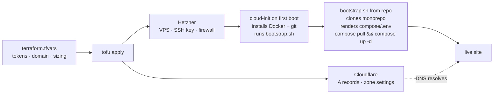

One declarative `tofu apply` provisions a Hetzner VPS, configures Cloudflare DNS and a Hetzner firewall scoped to Cloudflare IP ranges, installs Docker runtime, and bootstraps your full-stack docker-compose environment. Minutes later, the site is live at `https://<your-domain>` with HTTPS valid and optional superuser seeded.

BoringStack's [Deployment](/topics/deployment/) path is manual: SSH into a VPS, install Docker, clone the monorepo, then `compose pull && compose up -d`. Some operators prefer this flow. The OpenTofu stack is the alternative for teams who'd rather drive the same outcome from a single declarative apply. Source lives in [`infra/bootstrap`](https://github.com/boringstack-xyz/boringstack/tree/main/infra/bootstrap).

## Prerequisites

You'll need the following before starting:

- **Domain on Cloudflare**: Registered at Cloudflare Registrar, or nameserver-pointed to Cloudflare.
- **Hetzner Cloud account**: Sign up at [Hetzner Cloud](https://www.hetzner.com). Payment method on file.
- **Hetzner API token**: Hetzner Cloud Console, your project, Security, API Tokens. Scope: Read and Write.
- **Cloudflare API token**: Cloudflare, My Profile, API Tokens, Custom Token. Scope: `Zone:DNS:Edit`, `Zone:Zone Settings:Edit`, `Zone:Rulesets:Edit` on the target zone.
- **Cloudflare zone ID**: Zone overview page in the dashboard, right sidebar.
- **SSH key**: Run `ssh-keygen -t ed25519` if you don't have one. You'll paste the `.pub` contents.
- **OpenTofu binary**: `brew install opentofu` on macOS. See [install docs](https://opentofu.org/docs/intro/install/) for other OSes.

## Apply

Four commands to provision:

```bash
git clone https://github.com/boringstack-xyz/boringstack
cd boringstack/infra/bootstrap
cp terraform.tfvars.example terraform.tfvars
# Edit terraform.tfvars: fill in your domain, tokens, SSH key, VPS size, and stack secrets
```

Then apply:

```bash
tofu init
tofu validate
tofu apply -auto-approve
```

Apply itself finishes in a minute or two. The Hetzner server is up, but cloud-init is still bootstrapping the stack in the background. Watch the bootstrap status:

```bash
ssh root@$(tofu output -raw vps_ipv4) 'cloud-init status --wait'
```

When it returns `status: done`, test connectivity:

```bash
curl -sI $(tofu output -raw site_url)/health
```

Expect HTTP/2 200 from Cloudflare.

## How it works



## What stays manual

OpenTofu cannot automate what cloud providers do not expose APIs for. These steps require manual setup:

- **Add the domain to Cloudflare**: you have to own it via registrar transfer or nameserver change.
- **Upgrade Cloudflare to Workers Paid**: a billing decision, no API to flip it.
- **Create OAuth apps at Google, GitHub, or LinkedIn**: no provider APIs for OAuth client registration.
- **Create Stripe products and prices**: a Terraform provider exists but is beta; most teams click through the UI.
- **Enable Cloudflare Email Service**: still beta; some toggles are not in the Cloudflare provider.

Each is one-time per project and documented in its own runbook (for example [Cloudflare Email setup](/runbooks/cloudflare-email-setup/)). Once you have the credentials, paste them into `terraform.tfvars` and run `tofu apply` again. Cloud-init re-renders `compose/.env` and restarts the API.

## terraform.tfvars shape

One file holds every configuration knob:

```hcl
# Required
hetzner_api_token    = "..."
cloudflare_api_token = "..."
cloudflare_zone_id   = "..."
domain               = "boringstack.example"

# VPS sizing, Hetzner-native names
vps_type     = "cx32"          # 4 vCPU / 8 GB
vps_location = "fsn1"

# Stack secrets
jwt_secret        = "..."  # 32+ chars
postgres_password = "..."
valkey_password   = "..."
acme_email        = "ops@example.com"

# Optional integrations, leave empty to skip
email_provider             = "cloudflare"
cloudflare_email_api_token = ""
google_oauth_client_id     = ""
stripe_secret_key          = ""
# ... etc
```

Everything in `terraform.tfvars.example` ships with comments explaining what it's for and which features it enables.

## Repo layout

- **main.tf**: top-level composition. Wires modules to variables and declares outputs.
- **variables.tf**: input variable declarations with type and description.
- **outputs.tf**: VPS IP, DNS records, ready-to-paste SSH command, site URL.
- **terraform.tfvars.example**: all knobs with comments. Copy to `terraform.tfvars` and fill in.
- **modules/hetzner/**: VPS, SSH key, firewall, cloud-init injection.
- **modules/cloudflare/**: DNS records, sane zone setting defaults, redirect rules, and edge security/performance — a bot/scanner WAF block rule, an auth rate-limit rule, an asset cache rule, and DNSSEC.
- **modules/bootstrap/**: cloud-init template that installs Docker plus git, then runs `bootstrap.sh`.
- **bootstrap.sh**: versioned shell script. Clones the monorepo, renders `compose/.env`, runs `compose pull && compose up -d`.

## State management

For a single operator: state file is local and gitignored (default config).

For a team: point the OpenTofu backend at S3 (or any S3-compatible store like Cloudflare R2, Backblaze B2, or Hetzner Object Storage). Add one block to `main.tf`:

```hcl
terraform {
  backend "s3" {
    bucket = "boringstack-tofu-state"
    key    = "boringstack/terraform.tfstate"
    region = "..."
  }
}
```

The state file contains secrets (cloud-init renders with sensitive values). Encrypt at rest and restrict bucket access. Same security posture as everywhere else in BoringStack.

## Updating

OpenTofu owns the infrastructure. GHCR and the monorepo own the running code.

Code updates land via release workflows. Push to `main` on `apps/api` or `apps/ui`, a new image tag appears on GHCR, and WUD on the VPS auto-deploys app containers.

Base-image updates remain manual. Apply them on the VPS when ready:

```bash
ssh root@$(tofu output -raw vps_ipv4)
cd /opt/boringstack/infra
docker compose pull
docker compose up -d
```

For infra YAML or env-var changes: `git pull` the monorepo on the VPS, then re-run `compose up -d`. For infrastructure changes (VPS resize, DNS, firewall rule): edit `terraform.tfvars` or the modules, then run `tofu apply`.

## Scaling up

When single-host stops working, the upgrade path stays inside OpenTofu without rewrites:

- **Bigger VPS**: bump `vps_type`, apply. Cloud-init re-runs.
- **Move Postgres to managed** (Neon, Crunchy, RDS): drop the Postgres service from compose, add the managed-DB module.
- **Multiple API replicas behind Hetzner Load Balancer**: adds `modules/loadbalancer/` and parameterizes VPS count.
- **Multi-region**: that's when the planned Kubernetes template earns its place.

The progression is vertical, managed data, horizontal stateless, cluster. Each step is additive, not a rewrite.

## Swapping the cloud provider

The `bootstrap` module talks to cloud-init, which every major cloud accepts. Swapping Hetzner for DigitalOcean, OVH, or Linode means replacing `module "vps"` in `main.tf` with the matching module. The rest of the graph (Cloudflare, bootstrap, outputs) doesn't change. Per-provider modules ship as they prove themselves.

## Destroying

```bash
tofu destroy
```

This wipes the Hetzner server, removes Cloudflare records, deletes the firewall and SSH key, and reverts Cloudflare zone settings to defaults. The state file remains. Run `rm terraform.tfstate*` for full cleanup.

## Troubleshooting

- **apply fails on a Hetzner resource**: check Hetzner API status and token scope (must be Read and Write).
- **apply fails on a Cloudflare resource**: verify token scope (`Zone:DNS:Edit`, etc.) and that zone ID matches the domain.
- **apply succeeds but site is unreachable**: run `ssh ... 'cloud-init status'`. Bootstrap may still be running.
- **Site returns 522 from Cloudflare**: origin not responding. Check `docker compose logs traefik api` on the server.
- **Site returns 525 from Cloudflare on first apply**: expected for the first 2-5 minutes. Traefik needs DNS to propagate globally before Let's Encrypt can complete the HTTP-01 challenge. Until the cert lands, Cloudflare can't validate the origin and serves 525. Traefik retries on its own. Confirm with `docker compose logs traefik | grep -i acme`. If it's still failing past 10 minutes, check that the apex A/AAAA records resolve publicly: `dig +short @1.1.1.1 <domain>`.
- **Unexpected attribute errors in the editor**: stale OpenTofu language-server cache. Run `tofu init` once and re-open.
- **Cron backups do not run**: run `rclone config` on the server. The cron entry references a remote that must be configured.

## When to skip OpenTofu

- You like the SSH-and-edit flow and don't see the benefit.
- You're already on a different IaC tool (Pulumi, AWS CDK, Crossplane).
- You're deploying to a managed platform (Vercel, Render, Fly) that handles provisioning.

The runtime repos work fine without this one. It's a convenience layer, not a dependency.

## Design choices

- **OpenTofu, not Terraform**: Terraform is BUSL-licensed. OpenTofu is the MPL-licensed fork, drop-in compatible. Same `.tf` files work in both.
- **Cloud-init for entry point, bootstrap.sh for the work**: cloud-init installs Docker plus git and runs a single script committed in the repo. Stack-specific logic lives in readable bash: debuggable, testable, versioned.
- **Hetzner module first, others swappable**: Hetzner is the cheapest production-viable VPS. The bootstrap module is provider-agnostic (cloud-init is universal), so replacing the VPS module is all that changes for DigitalOcean, OVH, or Linode.
- **Single vps_type variable using provider-native size names**: `cx32`, `s-2vcpu-4gb`. The same names the provider docs, support, and billing page use.
- **Sane Cloudflare zone defaults**: SSL strict, HSTS 6 months, TLS min 1.2, browser integrity on. Matches what `production-labels.yml` expects. Each setting is one override away.
- **DNS: apex and www only**: one A/AAAA pair on the apex serves both the SPA and `/api/*` via same-origin path routing. `www.` is a CNAME to apex with a redirect rule. No `api.` subdomain. Traefik path-routes `/api/*` on the same host.
- **Edge bot-blocking, on by default**: a single Cloudflare WAF custom rule (`http_request_firewall_custom`) blocks common scanner probes — `/.env`, `/.git/`, `/wp-admin`, `/xmlrpc`, … — at the edge, so they never reach Traefik or the API. Configurable via `bot_block_paths`; disable with `enable_bot_blocking = false`. Works on the Cloudflare Free plan.
- **State stays local by default**: single-operator default. An S3 backend block is one paste away for teams.
- **Secrets in terraform.tfvars (gitignored)**: same pragmatic floor as `compose/.env`. Upgrade to a secret manager when team size demands it.
- **Outputs print, never side-effect**: apply prints the IP, ssh command, and site URL. Never auto-opens anything.
- **Optional bootstrap repo, separate from infra-compose**: same logic as the planned Kubernetes template. Separation lets operators skip the tool entirely.

## Related

- [Deployment](/topics/deployment/): the manual path this automates.
- [Firewall & TLS](/runbooks/firewall-and-tls/): handled by the Hetzner module's firewall rules.
- [Backups](/runbooks/backups/): cron plus rclone, baked into `bootstrap.sh`.
- [Env backup and secrets](/runbooks/env-backup-and-secrets/): password-manager backup for `compose/.env` after provisioning.
- [OAuth provider setup](/runbooks/oauth-provider-setup/): Google, GitHub, LinkedIn console walkthroughs.
- [Cloudflare Email setup](/runbooks/cloudflare-email-setup/): the bit that stays manual after `apply`.
