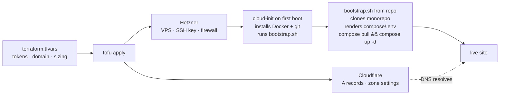

import PageIntro from "../../../components/docs-kit/PageIntro";
import CommandRun from "../../../components/docs-kit/CommandRun";
import DocCallout from "../../../components/DocCallout.tsx";
import FaqGroup from "../../../components/FaqGroup.tsx";
import FaqItem from "../../../components/FaqItem.tsx";

<PageIntro
  eyebrow="VPS Automation"
  actions={[
    { label: "Prerequisites", href: "#prerequisites" },
    { label: "tofu apply", href: "#apply" },
  ]}
  facts={[
    { value: "OpenTofu", label: "IaC Engine" },
    { value: "Hetzner", label: "Default Host" },
    { value: "5 min", label: "Provisioning time" },
  ]}
>
  One declarative `tofu apply` provisions a Hetzner VPS, configures
  Cloudflare DNS and a Hetzner firewall scoped to Cloudflare's IP ranges,
  installs Docker runtime, and bootstraps your full-stack docker-compose
  environment.
</PageIntro>

BoringStack's [Deployment](/topics/deployment/) path is manual: SSH into a VPS, install Docker, clone the monorepo, `compose pull && compose up -d`. Some operators prefer this.

The OpenTofu stack is the alternative for people who'd rather drive the same outcome from a single declarative apply. Source lives in [`infra/bootstrap`](https://github.com/boringstack-xyz/boringstack/tree/main/infra/bootstrap).

## What it does

Starting with a domain on Cloudflare, a Hetzner account, and a filled `terraform.tfvars`:

Run `tofu apply`. Minutes later, the site is live at `https://<your-domain>`: VPS provisioned, DNS configured, HTTPS valid, optional superuser seeded (when `superuser_email` + `superuser_password` are set).

## What one apply does



## Prerequisites

<FaqGroup>
  <FaqItem title="Domain on Cloudflare" open>
    Registered at Cloudflare Registrar, or NS-pointed to Cloudflare.
  </FaqItem>
  <FaqItem title="Hetzner Cloud account">
    Sign up at [Hetzner Cloud](https://www.hetzner.com), payment method on file.
  </FaqItem>
  <FaqItem title="Hetzner API token">
    Hetzner Cloud Console, project, Security, API Tokens, Read and Write.
  </FaqItem>
  <FaqItem title="Cloudflare API token">
    Cloudflare, My Profile, API Tokens, Custom Token. Scope: `Zone:DNS:Edit`,
    `Zone:Zone Settings:Edit`, `Zone:Rulesets:Edit` on the target zone.
  </FaqItem>
  <FaqItem title="Cloudflare zone ID">
    The zone overview page in the dashboard, right sidebar.
  </FaqItem>
  <FaqItem title="SSH key">
    `ssh-keygen -t ed25519` if you do not have one; paste the `.pub` contents.
  </FaqItem>
  <FaqItem title="OpenTofu binary">
    `brew install opentofu` on macOS, [install
    docs](https://opentofu.org/docs/intro/install/) elsewhere.
  </FaqItem>
</FaqGroup>

## Apply

<CommandRun
  title="Provision with OpenTofu"
  caption="Clone the IaC skeleton and run the apply graph"
  command={[
    "git clone https://github.com/boringstack-xyz/boringstack",
    "cd boringstack/infra/bootstrap",
    "cp terraform.tfvars.example terraform.tfvars",
    "tofu init",
    "tofu validate",
    "tofu apply -auto-approve",
  ]}
  output={[
    { tone: "ok", text: "Initializing provider plugins..." },
    { tone: "ok", text: "Success! The configuration is valid." },
    {
      tone: "ok",
      text: "Apply complete! Resources: 9 added, 0 changed, 0 destroyed.",
    },
  ]}
/>

`apply` itself finishes in a minute or two. The Hetzner server is up, but cloud-init is still bootstrapping the stack in the background.

## Wait for cloud-init

Bootstrap (Docker install, monorepo clone, GHCR image pulls, first `compose up -d`) runs in the background after the server boots. A few minutes on first run.

<CommandRun
  title="Watch Bootstrap Status"
  caption="Blocks until cloud-init has finished container orchestration"
  command={["ssh root@$(tofu output -raw vps_ipv4) 'cloud-init status --wait'"]}
  output={[{ tone: "ok", text: "status: done" }]}
/>

<DocCallout type="note" title="`status: done` reflects cloud-init, not bootstrap.sh">
  `cloud-init status` only knows whether its own steps ran — it goes
  `done` even if the bootstrap script underneath failed mid-way (GHCR
  pull error, `compose up` crash, etc.). If `curl /health` doesn't
  return 200 after a few minutes, the real story is in:

  ```bash
  ssh root@$(tofu output -raw vps_ipv4)
  tail -200 /var/log/cloud-init-output.log    # bootstrap.sh stdout/stderr
  docker compose -f /opt/boringstack/infra/compose/compose/docker-compose.yml ps
  docker compose logs traefik api ui          # whichever isn't healthy
  ```
</DocCallout>

## Verify

<CommandRun
  title="Test Connectivity"
  caption="Query Traefik TLS router for application health state"
  command={["curl -sI $(tofu output -raw site_url)/health"]}
  output={[
    { tone: "ok", text: "HTTP/2 200" },
    { tone: "ok", text: "server: cloudflare" },
    { tone: "ok", text: "cf-ray: ..." },
  ]}
/>

## Design choices

<FaqGroup>
  <FaqItem title="OpenTofu, not Terraform" open>
    Terraform is BUSL-licensed; OpenTofu is the MPL-licensed fork, drop-in
    compatible. Same `.tf` files work in both.
  </FaqItem>
  <FaqItem title="Cloud-init for the entry point, bootstrap.sh for the work">
    Cloud-init installs Docker plus git and runs a single script committed in
    the repo. Stack-specific logic lives in readable bash: debuggable, testable,
    versioned.
  </FaqItem>
  <FaqItem title="Hetzner module first, others swappable">
    Hetzner is the cheapest production-viable VPS shop. The bootstrap module is
    provider-agnostic (cloud-init is universal), so replacing the VPS module is
    the only thing that changes for DigitalOcean, OVH, or Linode.
  </FaqItem>
  <FaqItem title="Single vps_type variable using provider-native size names">
    `cx32`, `s-2vcpu-4gb`: the same names the provider docs, support, and
    billing page use.
  </FaqItem>
  <FaqItem title="Opinionated Cloudflare zone defaults">
    SSL strict, HSTS 6mo, TLS min 1.2, browser integrity on. Matches what
    `production-labels.yml` expects; each setting is one override away.
  </FaqItem>
  <FaqItem title="DNS: apex + www only">
    One A/AAAA pair on the apex serves both the SPA and `/api/*` via same-origin
    path routing. `www.` is a CNAME to apex with a redirect rule. No `api.`
    subdomain; Traefik path-routes `/api/*` on the same host.
  </FaqItem>
  <FaqItem title="State stays local by default">
    Single-operator default; an S3 backend block is one paste away for teams.
  </FaqItem>
  <FaqItem title="Secrets in terraform.tfvars (gitignored)">
    Same pragmatic floor as `compose/.env`; upgrade to a secret manager when
    team size demands it.
  </FaqItem>
  <FaqItem title="Outputs print, never side-effect">
    Apply prints the IP, ssh command, and site URL. Never auto-opens anything.
  </FaqItem>
  <FaqItem title="Optional bootstrap repo, separate from infra-compose">
    Same logic as the planned Kubernetes template: separation lets operators
    skip the tool entirely.
  </FaqItem>
</FaqGroup>

## What stays manual

OpenTofu cannot paper over the things providers do not expose APIs for:

<FaqGroup>
  <FaqItem title="Add the domain to Cloudflare" open>
    You have to own it: registrar transfer or NS change.
  </FaqItem>
  <FaqItem title="Upgrade Cloudflare to Workers Paid">
    Billing decision; no API to flip the switch.
  </FaqItem>
  <FaqItem title="Create OAuth apps at Google / GitHub / LinkedIn">
    No provider APIs for OAuth client registration.
  </FaqItem>
  <FaqItem title="Create Stripe products and prices">
    Stripe Terraform provider exists but is beta; most teams click through
    anyway.
  </FaqItem>
  <FaqItem title="Enable Cloudflare Email Service">
    Beta product; some toggles are not in the Cloudflare provider yet.
  </FaqItem>
</FaqGroup>

Each of these is one-time per project and documented in its own runbook (for example [Cloudflare Email setup](/runbooks/cloudflare-email-setup/)).

Once you have the credentials, paste them into `terraform.tfvars` and `tofu apply` again. Cloud-init re-renders `compose/.env` and restarts the API.

## `terraform.tfvars` shape

One file with every knob:

```hcl
# Required
hetzner_api_token    = "..."
cloudflare_api_token = "..."
cloudflare_zone_id   = "..."
domain               = "boringstack.example"

# VPS sizing, Hetzner-native names
vps_type     = "cx32"          # 4 vCPU / 8 GB
vps_location = "fsn1"

# Stack secrets
jwt_secret        = "..."  # 32+ chars
postgres_password = "..."
valkey_password   = "..."
acme_email        = "ops@example.com"

# Optional integrations, leave empty to skip
email_provider             = "cloudflare"
cloudflare_email_api_token = ""
google_oauth_client_id     = ""
stripe_secret_key          = ""
# ... etc
```

Everything in `terraform.tfvars.example` ships with comments explaining what it's for and which features it enables.

## Repo layout

<FaqGroup>
  <FaqItem title="main.tf" open>
    Top-level composition: wires modules to variables, declares outputs.
  </FaqItem>
  <FaqItem title="variables.tf">
    Input variable declarations with type and description.
  </FaqItem>
  <FaqItem title="outputs.tf">
    VPS IP, DNS records, ready-to-paste `ssh` command, site URL.
  </FaqItem>
  <FaqItem title="terraform.tfvars.example">
    All knobs with comments; copy to `terraform.tfvars` and fill in.
  </FaqItem>
  <FaqItem title="modules/hetzner/">
    VPS, SSH key, firewall, cloud-init injection.
  </FaqItem>
  <FaqItem title="modules/cloudflare/">
    DNS records, opinionated zone settings, redirect rules.
  </FaqItem>
  <FaqItem title="modules/bootstrap/">
    Cloud-init template that installs Docker plus git, then runs `bootstrap.sh`.
  </FaqItem>
  <FaqItem title="bootstrap.sh">
    Versioned shell script: clones the monorepo, renders `compose/.env`, runs
    `compose pull && compose up -d`.
  </FaqItem>
</FaqGroup>

## State management

For a single operator: state file is local, gitignored. Default config.

For a team: point the OpenTofu backend at S3 (or any S3-compatible store: Cloudflare R2, Backblaze B2, Hetzner Object Storage). One block in `main.tf`:

```hcl
terraform {
  backend "s3" {
    bucket = "boringstack-tofu-state"
    key    = "boringstack/terraform.tfstate"
    region = "..."
  }
}
```

The state file holds secrets (cloud-init renders with sensitive values). Encrypt at rest; restrict bucket access. Same posture as everywhere else in BoringStack.

## Updating

OpenTofu owns the infrastructure. GHCR + the monorepo own the running code.

Code updates land via the release workflows. Push to `main` on `apps/api`
or `apps/ui`, a new image tag appears on GHCR, and WUD on the VPS
auto-deploys app containers. Base-image updates remain manual, applied on the
VPS when you are ready:

```bash
ssh root@$(tofu output -raw vps_ipv4)
cd /opt/boringstack/infra
docker compose pull
docker compose up -d
```

Infra YAML or env-var changes: `git pull` the monorepo on the VPS, then re-run `compose up -d`. Infrastructure changes (VPS resize, DNS, firewall rule): edit `terraform.tfvars` or the modules, then `tofu apply`.

## Scaling up

When single-host stops being enough, the upgrade path stays inside OpenTofu without rewrites:

<FaqGroup>
  <FaqItem title="Bigger VPS" open>
    Yes: bump `vps_type`, apply, cloud-init re-runs.
  </FaqItem>
  <FaqItem title="Move Postgres to managed (Neon / Crunchy / RDS)">
    Yes: drop the Postgres service from compose, add the managed-DB module.
  </FaqItem>
  <FaqItem title="Multiple API replicas behind Hetzner Load Balancer">
    Yes: adds a `modules/loadbalancer/` and parameterizes VPS count.
  </FaqItem>
  <FaqItem title="Multi-region">
    No: that is when the planned Kubernetes template earns its place.
  </FaqItem>
</FaqGroup>

The progression: vertical, managed data, horizontal stateless, cluster. Each step is additive, not a rewrite.

## Swapping the cloud provider

The `bootstrap` module talks to cloud-init, which every major cloud accepts. Swapping Hetzner for DigitalOcean / OVH / Linode means replacing `module "vps"` in `main.tf` with the matching module; the rest of the graph (Cloudflare, bootstrap, outputs) doesn't change. Per-provider modules ship as they prove themselves.

## Destroying

```bash
tofu destroy
```

Wipes the Hetzner server, removes the Cloudflare records, deletes the firewall and SSH key. Cloudflare zone settings revert to defaults. The state file remains; `rm terraform.tfstate*` for full cleanup.

## Troubleshooting

<FaqGroup>
  <FaqItem title="apply fails on a Hetzner resource" open>
    Hetzner API status plus token scope (must be Read and Write).
  </FaqItem>
  <FaqItem title="apply fails on a Cloudflare resource">
    Token scope (`Zone:DNS:Edit` etc.) plus zone ID matches the domain.
  </FaqItem>
  <FaqItem title="apply succeeds but site is unreachable">
    `ssh ... 'cloud-init status'`: bootstrap may still be running.
  </FaqItem>
  <FaqItem title="Site returns 522 from Cloudflare">
    Origin not responding: check `docker compose logs traefik api` on the
    server.
  </FaqItem>
  <FaqItem title="Site returns 525 from Cloudflare on first apply">
    Expected for the first 2–5 minutes after `apply`. Traefik needs DNS
    to propagate globally before Let's Encrypt can complete the HTTP-01
    challenge; until the cert lands, Cloudflare can't validate the
    origin and serves 525. Traefik retries on its own — confirm with
    `docker compose logs traefik | grep -i acme`. If it's still
    failing past ~10 min, check that the apex A/AAAA records resolve
    publicly (`dig +short @1.1.1.1 <domain>`).
  </FaqItem>
  <FaqItem title="Unexpected attribute errors in the editor">
    Stale OpenTofu language-server cache. Run `tofu init` once and re-open.
  </FaqItem>
  <FaqItem title="Cron backups do not run">
    `rclone config` on the server: the cron entry references a remote that must
    be configured.
  </FaqItem>
</FaqGroup>

## When to skip OpenTofu

- You like the SSH-and-edit flow and don't see the win.
- You're already on a different IaC tool (Pulumi, AWS CDK, Crossplane).
- You're deploying to a managed platform (Vercel, Render, Fly) that handles provisioning itself.

The runtime repos work fine without this one. It's a convenience layer, not a dependency.

## Related

- [Deployment](/topics/deployment/): the manual path this automates.
- [Firewall & TLS](/runbooks/firewall-and-tls/): handled by the Hetzner module's firewall rules.
- [Backups](/runbooks/backups/): cron plus rclone, baked into `bootstrap.sh`.
- [Env backup and secrets](/runbooks/env-backup-and-secrets/): password-manager backup for `compose/.env` after provisioning.
- [OAuth provider setup](/runbooks/oauth-provider-setup/): Google, GitHub, LinkedIn console walkthroughs.
- [Cloudflare Email setup](/runbooks/cloudflare-email-setup/): the bit that stays manual after `apply`.
