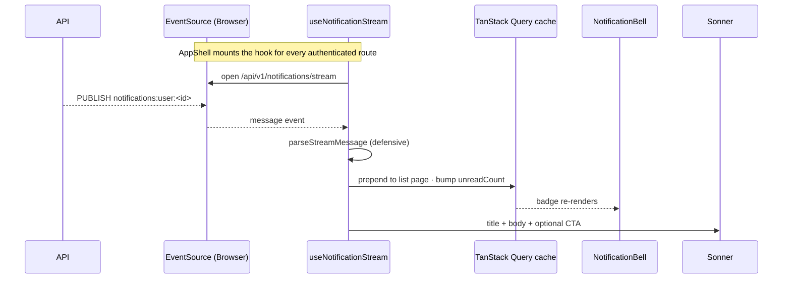

The UI consumes the [API notifications subsystem](/api/notifications/). The feed is a TanStack Query infinite list, mutations are optimistic with rollback, and an optional SSE `EventSource` keeps the cache live while the user is authenticated. The bell and popover mount inside `AppShell`, so every authenticated route includes them.

The backend ships pre-rendered `{ title, body, ctaUrl, ctaLabel }` strings. The UI renders them as plain content with no per-event-type switches.

## Flow

## Folder shape

The notification feature lives in `src/features/notifications/` with queries, mutations, cache helpers, and UI components. Queries and utils live at the feature root; components are in `components/<Name>/` with the standard 8-file layout.

The query surface is split across three files (reads, mutations, preferences) to keep each file under the `max-hooks-per-file` threshold enforced by [`@boring-stack-pkg/eslint-plugin-react-component-architecture`](https://www.npmjs.com/package/@boring-stack-pkg/eslint-plugin-react-component-architecture).

Key files:
- `Notifications.list.queries.ts` - feed and unread count reads
- `Notifications.mutations.ts` - optimistic mark-read/archive operations
- `Notifications.preferences.queries.ts` - preference grid reads and writes
- `Notifications.cache.ts` - cache merge and rollback helpers
- `Notifications.stream-utils.ts` - defensive SSE parsing
- `useNotificationStream.ts` - mounted once from AppShell
- `components/NotificationBell/`, `NotificationCenterPopover/`, `NotificationsPage/`, `NotificationsPreferencesPage/` - UI pieces

## Query semantics

The unread-count hook reads from the list cache when present and falls back to a server query, so the badge stays accurate without an extra round-trip while a tab is hot. Every mutation snapshots the cache, applies the optimistic write via the helpers in `Notifications.cache.ts`, and rolls back if the request fails. `onSettled` invalidates both list and unread-count keys so the UI reconciles with the server even after rollback.

## Realtime

`useNotificationStream` is mounted once in `AppShell.hooks.ts`. It opens a credentialed `EventSource` against `${VITE_API_URL}/api/v1/notifications/stream` only when `capabilities.features.notifications.sse === true` (from `GET /api/v1/capabilities/`). When SSE is disabled on the API (`NOTIFICATIONS_SSE_ENABLED=false`, the default), notifications still work through the paginated feed and mutations, just without live push.

Each arriving message merges into the list cache, bumps the unread count, and surfaces a Sonner toast. If the notification carries a CTA URL, the toast adds an action that navigates to it. Malformed JSON or messages with the wrong shape are dropped with a warn log, never thrown. A misbehaving publisher cannot crash the consumer.

The notifications page and preferences page both mount inside `<AppShell>`, which is what holds the bell, header, logout, and the SSE hook itself.

## Adding a new notification UI

You don't. The backend ships pre-rendered strings; the UI is event-agnostic by design. To add a new event type, the API defines it (see [API notifications](/api/notifications/)) and the bell, page, and toast pick it up with no UI change.

If you ever need a per-event-type visual treatment (badge colour, icon), branch on `notification.eventType` inside `NotificationListItem` only. Don't fork the page.

## Web Push (v1.1)

Browser push notifications via the W3C Push API and VAPID live in `useWebPush.hooks.ts` (under `src/hooks/`) plus a small service worker at `public/sw.js`. The Settings page renders a state-aware "Browser notifications" card that wraps the hook.

**Setup.** Generate VAPID keys on the API (`bun run vapid:generate`) and paste the public key into the UI as `VITE_VAPID_PUBLIC_KEY`. Without it, the Settings card renders "Web Push is not configured for this deploy."

**Service worker.** `public/sw.js` is copied to the dist root by Vite (no plugin needed) so the scope is `/`. Two handlers: `push` calls `showNotification(title, { body, data: { url } })`; `notificationclick` focuses the matching tab if open, otherwise opens the URL. Registered once from `src/app/main.tsx` (gated on `'serviceWorker' in navigator`).

**useWebPush contract.** Returns `{ isSupported, isConfigured, permission, isSubscribed, isPending, subscribe, unsubscribe }`. The Settings card maps that state machine into copy: unsupported / not-configured / blocked / not-subscribed / subscribed. Lives in `src/hooks/` because the `accounts` feature consumes it without owning it.

**Preference grid integration.** `web-push` appears alongside `in-app` and `email` in `PREFERENCE_CHANNEL_COLUMNS`. Toggling it follows the same pattern as other channels: the backend dispatcher reads `notification_preference` rows for `(userId, eventType, channel)`.

## Out of scope (v1)

Cross-tab sync via BroadcastChannel is not implemented. Each tab holds its own SSE connection; the badge converges via cache invalidation.

Notification grouping is not yet in the backend, so the UI doesn't roll up "3 people liked your post" either.

Per-event-type custom rendering is intentionally out of scope. The backend ships pre-rendered strings; the UI stays event-agnostic.

## Related

- [API notifications](/api/notifications/): the dispatcher, channels, and SSE source.
- [OpenAPI client](/ui/openapi-client/): how the typed client surfaces the notifications endpoints.
- [Component anatomy](/ui/architecture-rules/): the 8-file layout these components follow.
