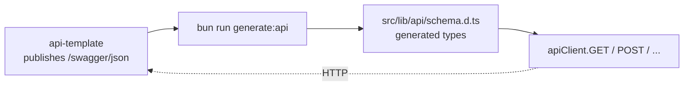

import PageIntro from "../../../components/docs-kit/PageIntro";
import DocCallout from "../../../components/DocCallout.tsx";
import FaqGroup from "../../../components/FaqGroup.tsx";
import FaqItem from "../../../components/FaqItem.tsx";

<PageIntro
  eyebrow="OpenAPI client"
  actions={[
    { label: "Using it", href: "#using-it" },
    { label: "Regenerating", href: "#regenerating" },
  ]}
  facts={[
    { value: "Generated", label: "never hand-edited" },
    { value: "Compile error", label: "on drift" },
    { value: "Silent refresh", label: "on 401" },
  ]}
>
  The UI never hand-writes `fetch(...)`. It calls a generated, typed client that
  knows every path, every request body, and every response shape the API
  exposes. When the API changes, you regenerate; if the UI now calls a path that
  no longer exists, TypeScript tells you before the user does.
</PageIntro>

## How it stays in sync



`bun run generate:api` runs `openapi-typescript` against the live API (or a saved spec) and emits one big `.d.ts` of paths, params, and response components. `openapi-fetch` wraps native `fetch` and uses those types so every call is path- and shape-checked.

## Design choices

<FaqGroup>
  <FaqItem title="Generated, never hand-edited" open>
    Drift between server and client is a compile error, not a runtime 500.
  </FaqItem>
  <FaqItem title="One client module (apiClient); direct fetch/axios is a lint error">
    Single place for base URL, cookie credentials, error mapping, refresh logic.
  </FaqItem>
  <FaqItem title="Throws ApiError on non-2xx">
    TanStack Query `error` is typed and structured; no string parsing.
  </FaqItem>
  <FaqItem title="Silent refresh on 401 with a single in-flight guard">
    Parallel queries do not trigger N refresh storms.
  </FaqItem>
  <FaqItem title="Refresh exempts /auth/refresh + /auth/login themselves">
    No infinite loops when the refresh itself fails.
  </FaqItem>
</FaqGroup>

## Using it

```ts
import { apiClient } from "@/lib/api/client";

const { data } = await apiClient.GET("/api/v1/users/me");
//      ^? typed exactly as the API's response shape
```

A path that doesn't exist in the schema is a compile error. A body that doesn't match is a compile error. `data` is fully typed.

Inside TanStack Query:

```ts
useQuery({
  queryKey: ["users", "me"],
  queryFn: async () => {
    const { data, error } = await apiClient.GET("/api/v1/users/me");
    if (error) throw new ApiError(error);
    return data;
  },
});
```

## The middleware layer

`openapi-fetch` is configured with `credentials: "include"`, so the browser sends `auth_token` and `refresh_token` cookies automatically. The UI never reads a JWT, stores a bearer token, or adds an `Authorization` header.

`openapi-fetch` accepts middleware. The template ships one: on a 401, kick off a single `/auth/refresh` (with a module-level promise guarding against parallel triggers), then retry the original request. Refresh exempts itself + `/auth/login` so a failed refresh never recurses. If the refresh fails, the original 401 propagates and `ProtectedRoute` redirects to `/login`.

<DocCallout
  variant="note"
  title="Why hand-rolled fetch wrappers are banned"
  eyebrow="Lint boundary"
>
  Direct `fetch()`, `axios`, and `XMLHttpRequest` outside `src/lib/api/` fail
  the lint gate because re-implementing 401 refresh in twenty places is how
  token-handling bugs ship.
</DocCallout>

## Regenerating

<FaqGroup>
  <FaqItem title="API spec changed (most common)" open>
    Run `bun run generate:api` against the running dev API.
  </FaqItem>
  <FaqItem title="Working from a committed spec">
    Point `generate:api` at a saved `.json`.
  </FaqItem>
  <FaqItem title="CI consistency check">
    Run `bun run generate:api && git diff --exit-code src/lib/api/schema.d.ts`.
  </FaqItem>
</FaqGroup>

The CI check fails if a developer changed the API but forgot to regenerate; drift gets caught at PR time, not at runtime.

## Adding a call

There's no "adding". If the API exposes a new endpoint, `bun run generate:api` makes it available; you call it the same way you call any other.

## Lint coverage

Direct `fetch()` / `axios` / `XMLHttpRequest` outside `src/lib/api/` fails the lint gate. See [Lint as the contract](/architecture/lint-as-contract/).

## Source

[`src/lib/api/`](https://github.com/boringstack-xyz/ui-template/tree/main/src/lib/api) on GitHub; client, middleware, error mapper, generated schema.

## Related

- [API template overview](/api/overview/); where the OpenAPI spec comes from.
- [Architecture rules](/ui/architecture-rules/); the component layer that consumes the client via queries.
