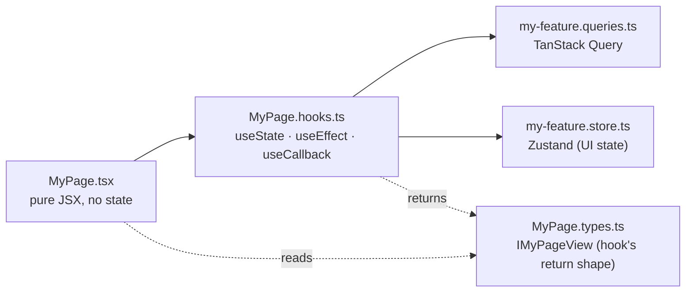

The UI is a Vite + React single-page app with a typed OpenAPI client: fast local feedback and a compile-time contract with the API. Architecture rules keep feature folders small enough for humans and agents to change safely.

A production-shaped SPA. Architecture rules (component anatomy, queries vs stores, OpenAPI client) keep features from turning into 600-line `.tsx` blobs as the codebase grows.

## How a feature is shaped

  Each UI feature folder splits into role-specific files: a pure-JSX{" "}
  <code>.tsx</code> renders what its hook returns; a <code>.hooks.ts</code> owns
  all React hooks plus the calls into TanStack Query and Zustand; a{" "}
  <code>.types.ts</code> declares the view-object shape the component reads.
  Components never touch queries, stores, or env directly.

Components only ever see the [**view object**](/reference/glossary#view-object) from their hook. They never read TanStack Query directly, never read Zustand directly, never read `import.meta.env` directly. That's what makes any component trivially testable.

## Design choices

**Component as a folder.** Each file has one job; `useState` in `.tsx` is a lint error.

**TanStack Query + Zustand.** Server state and client state stay in separate buckets.

**OpenAPI-generated client.** Wrong paths and body shapes fail the typecheck.

**shadcn/ui + Tailwind.** You own UI components in `components/ui` while theme tokens stay centralized.

**E2e against the real stack.** Playwright hits the running API directly; there is no mock layer.

**Lint keeps the surface honest.** The folder anatomy is enforced before review, not remembered by convention.

## Routes & shell

Every authenticated route renders inside `AppShell`: a brand-marked left sidebar (`AppSidebar` with `NavLink` + `aria-[current=page]:` Tailwind active styling), a sticky header (account switcher · notification bell · theme toggle · logout), and the page content. On mobile the sidebar collapses into a `Sheet` drawer triggered from the header.

By default the shell covers the full auth surface (login, signup, verify-email, OAuth callback), the dashboard, the notifications feed and preferences, and the account pages (profile, invitations, settings). `SettingsPage` ships with an explicit "placeholder, fill this in" copy block so a fork knows the page is wired into the nav but the form is yours to write.

## File layout

Under `src/`:
- `app/` - App shell: providers, router, main entry
- `features/` - Vertical feature folders: auth, dashboard, notifications, and yours
- `components/` - `ui/` (shadcn/ui base components), `core/` (composed components), `global/` (app-shell wrappers)
- `lib/` - `api/` (openapi-fetch client + generated schema), `env/` (Zod-validated import.meta.env), `auth/` (OAuth start helper), `logger/` (structured client logs), `i18n/` (react-i18next setup + locales)
- `hooks/` - cross-feature hooks
- `store/` - app-level Zustand stores

A page or component folder always has the same 8-file layout (enforced by the UI lint rules):
- `ComponentName.tsx` - pure JSX
- `ComponentName.hooks.ts` - all React hooks
- `ComponentName.types.ts` - IComponentNameView
- `ComponentName.constants.ts`
- `ComponentName.utils.ts`
- `ComponentName.test.tsx`
- `ComponentName.stories.tsx`
- `index.ts` - re-export

Stories ship 1:1 with the components and run under a global theme decorator (`@storybook/addon-themes` wired in `.storybook/preview.tsx`), so every story has a light/dark toggle in the Storybook toolbar with no per-story plumbing.

`bun run new:component <Name>` writes this anatomy. `bun run new:feature <name>` writes a feature scaffold.

## State, in one decision

**Fetched state (server).** Use `*.queries.ts` with TanStack Query.

**UI state (client).** Use `*.store.ts` with Zustand for modals, drawers, and step indexes.

**Input state (form).** Use `*.hooks.ts` with React Hook Form and Zod.

**Render-derived state (view).** `*.hooks.ts` returns `IXxxView`; no extra store.

If you can't tell which bucket something belongs to, that is almost always a sign the boundary is wrong, not a need for a fifth bucket.

## The typed OpenAPI client

The API publishes `/swagger/json`. `bun run generate:api` reads it and emits the typed client. From there `apiClient.GET("/api/v1/users/me")` autocompletes the path and types the response. Drift between server and client becomes a compile error, not a runtime 500.

See [OpenAPI client](/ui/openapi-client/).

## Testing

**Unit (hooks and utilities).** Vitest + Testing Library for hooks, utilities, and schemas.

**Component (one surface).** Render the component and its hook together, not a mocked UI stub.

**E2e (real stack).** Playwright runs against the API and UI from Compose.

**Visual (snapshot baselines).** Per-platform baselines catch layout drift before release.

See [Testing](/ui/testing/).

## Lint as the contract

The component anatomy is held in place by [`@boring-stack-pkg/eslint-plugin-react-component-architecture`](https://www.npmjs.com/package/@boring-stack-pkg/eslint-plugin-react-component-architecture). TanStack Query cache consistency on `*.queries.ts` is enforced by [`@boring-stack-pkg/eslint-plugin-tanstack-query-cache`](https://www.npmjs.com/package/@boring-stack-pkg/eslint-plugin-tanstack-query-cache); static translation keys by [`@boring-stack-pkg/eslint-plugin-i18n-keys`](https://www.npmjs.com/package/@boring-stack-pkg/eslint-plugin-i18n-keys). Those sit alongside the shared plugin family. See [Lint as the contract](/architecture/lint-as-contract/) for the full inventory.

## Source

[`apps/ui`](https://github.com/boringstack-xyz/boringstack/tree/main/apps/ui) on GitHub. Start in `src/features/` for the feature shape; `src/lib/api/` for the typed client.

## Related

- [Architecture rules](/ui/architecture-rules/); the component anatomy the lint enforces.
- [OpenAPI client](/ui/openapi-client/); how the React app stays in sync with the API.
- [Testing](/ui/testing/); the three test layers and why there's no mock layer.
- [i18n](/ui/i18n/); type-safe translation keys with linted JSX strings.
- [Notifications](/ui/notifications/); the in-app surface for system and user events.
