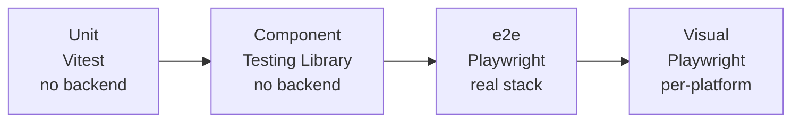

Three test layers, each earning its keep: Vitest for pure logic, Testing Library for component rendering, Playwright for end-to-end against the real Compose stack. No mock service workers. Anything HTTP-shaped is e2e.

  Four test layers in order of cost and scope: Vitest units (no backend) feed
  into Testing Library component tests (no backend), which give way to
  Playwright end-to-end against the real Compose stack, and finally per-platform
  Playwright visual snapshots.

## Design choices

**Three layers, not one.** Unit tests cannot catch routing bugs; e2e cannot catch every hook edge case. Each layer earns its place.

**No MSW.** Hand-written mocks drift from the real backend; HTTP-shaped tests run e2e instead.

**E2e against ./dev.sh.** This catches API-shape drift and integration regressions without any extra scaffolding.

**Playwright with Chromium + WebKit.** Safari behavior bugs surface in CI, not from a user report.

**Visual snapshots per-platform.** macOS vs Linux font rendering differs; baselines are committed per OS.

**Coverage excludes *.stories.tsx, *.types.ts, *.constants.ts.** Numbers only count files you can meaningfully test.

## What lives where

**Unit and component tests.** Location: `src/**/*.test.ts` colocated with source. Run: `bun run test`.

**E2e tests.** Location: `e2e/*.spec.ts`. Run: `bun run e2e` (needs dev stack up).

**Visual baselines.** Location: `e2e/visual.spec.ts-snapshots/`. Run: `bun run e2e:visual:update` to refresh.

**Coverage.** Run via `bun run test:ci`.

## Why no mock layer

Unit and component tests focus on pure logic; anything HTTP-shaped is e2e against the real backend. Three reasons:

- Drift. Hand-written mocks fall behind the real API shape, and tests pass while the real backend drifts.
- Mental tax. Contributors would have to learn the mocking framework and the real API.
- False signal. "Mock tests are green" isn't "the feature works." Only the e2e tier proves the feature.

## Patterns

Component test: render the component, assert on the rendered output. Don't reach into hook internals; hooks have their own test if they're complex enough to need one.

Hook test: `renderHook` from Testing Library; assert on the returned [view object](/reference/glossary#view-object) (the `IXxxView` shape). Standard pattern for testing a component's logic without rendering the UI.

E2E test: navigate, interact, assert. Use Playwright's page-object pattern under `e2e/pages/` for anything reused across specs. Baseline visual diffs live in `e2e/visual.spec.ts-snapshots/`.

## When tests break in CI but pass locally

Usually one of three things:

- Visual baselines: different OS font rendering. The CI workflow stores baselines per-platform; run `bun run e2e:visual:update` on a matching machine, or regenerate baselines in CI itself.
- Flaky timing: Playwright auto-waits, but custom polling loops in app code can race. Look for `setTimeout`-based assumptions.
- API drift: backend changed, `bun run generate:api` wasn't run. CI catches this via the schema diff check.

## Lint coverage

[`@boring-stack-pkg/eslint-plugin-test-conventions`](https://www.npmjs.com/package/@boring-stack-pkg/eslint-plugin-test-conventions) enforces `tests/` mirrors `src/` and that every test file has a real source file behind it. No orphan tests, no source files without tests for the things that need them.

## Source

[`vitest.config.ts`](https://github.com/boringstack-xyz/boringstack/blob/main/apps/ui/vitest.config.ts) · [`playwright.config.ts`](https://github.com/boringstack-xyz/boringstack/blob/main/apps/ui/playwright.config.ts) · [`e2e/`](https://github.com/boringstack-xyz/boringstack/tree/main/apps/ui/e2e) on GitHub.

## Related

- [Architecture rules](/ui/architecture-rules/); the folder anatomy these tests shadow 1:1.
- [UI template overview](/ui/overview/); the SPA shell the tests cover end-to-end.
- [OpenAPI client](/ui/openapi-client/); the typed contract whose drift e2e catches.
- [Lint as the contract](/architecture/lint-as-contract/); the test-conventions plugin enforcing no-orphan tests.
