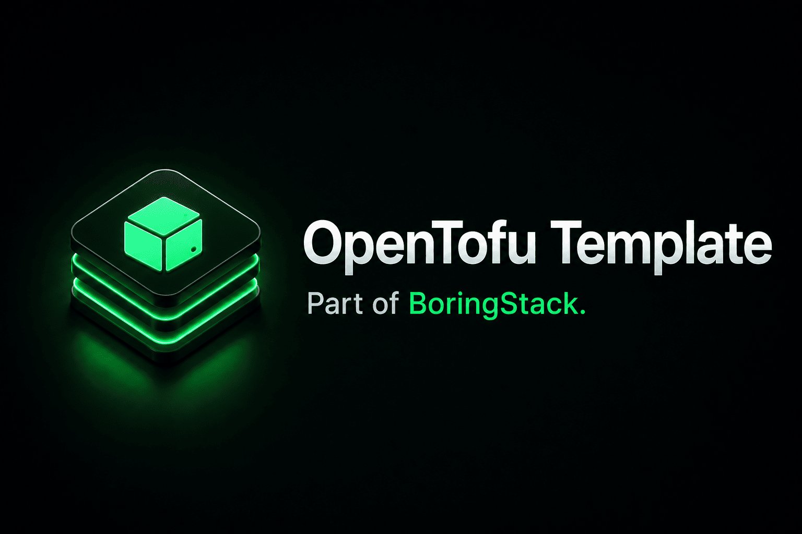

  

  
  
  

  
  
  

# infra-bootstrap-tofu-template

Part of [BoringStack](https://boringstack.xyz).

For documentation on how to run, configure, and extend this template, see the [OpenTofu provisioning docs](https://boringstack.xyz/topics/provisioning-with-tofu/).

## License

MIT
