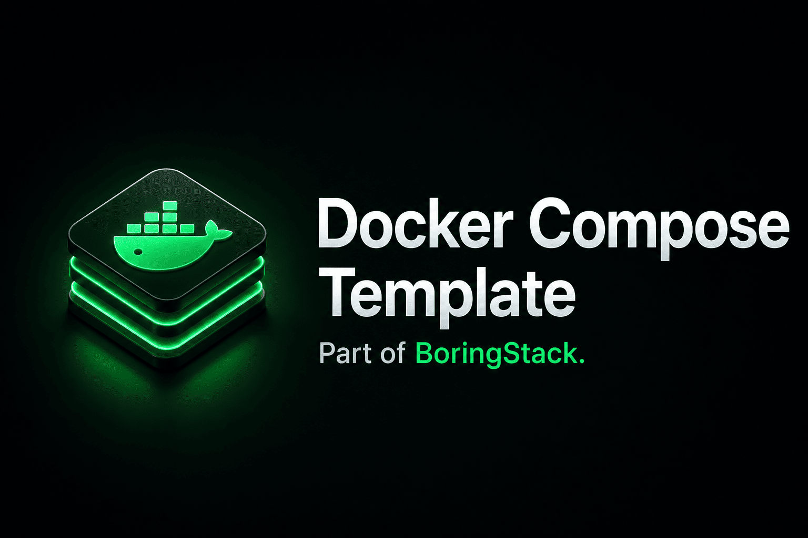

  

  
  
  

  
  
  
  

# infra/compose

Part of [BoringStack](https://boringstack.xyz).

For documentation on how to run, configure, and extend the Compose runtime, see the [Infra docs](https://boringstack.xyz/infra/overview/).

## License

MIT
